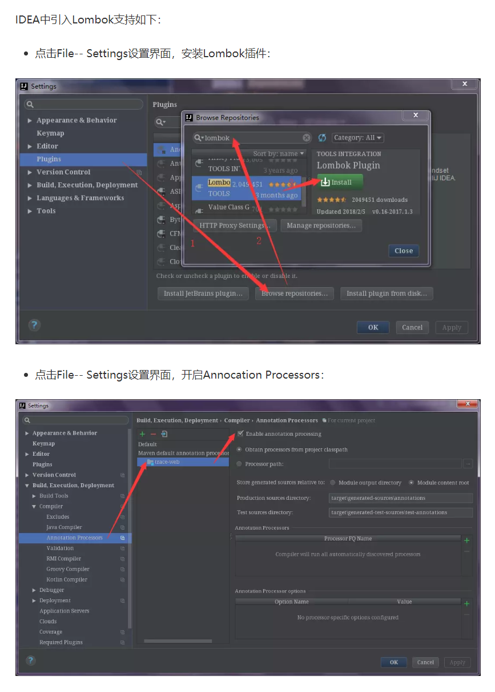
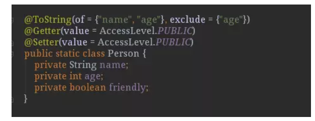
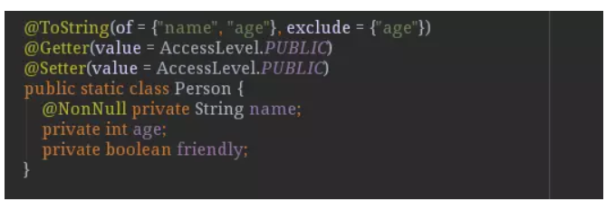
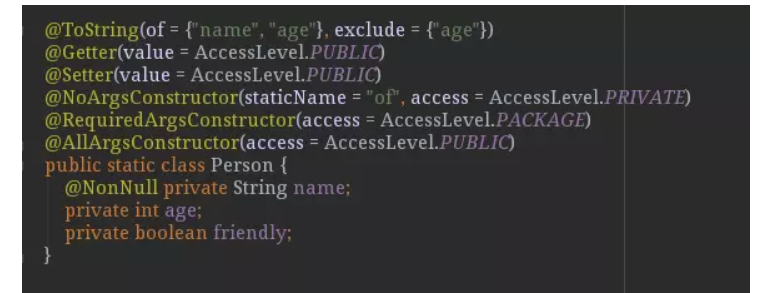
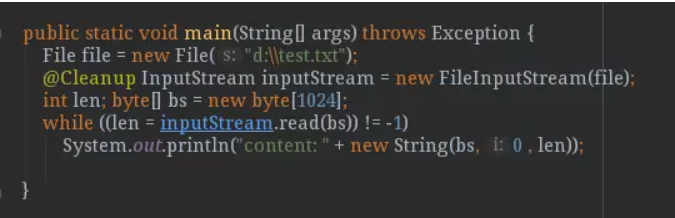
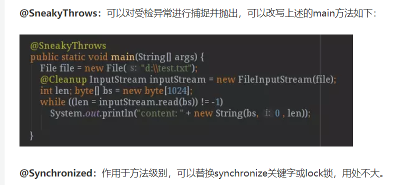

# 1. 使用
## 1.1. 导入maven依赖
```
<dependency>
  <groupId>org.projectlombok</groupId>
  <artifactId>lombok</artifactId>
  <version>1.16.18</version>
  <scope>provided</scope>
</dependency>
```
Lombok的scope=provided，说明它只在编译阶段生效，不需要打入包中。事实正是如此，Lombok在编译期将带Lombok注解的Java文件正确编译为完整的Class文件
## 1.2. 添加IDE工具对Lombok的支持


# 2. Lombok注解的使用
## 2.1. @Getter/@Setter:
作用类上，生成所有成员变量的getter/setter方法；作用于成员变量上，生成该成员变量的getter/setter方法。可以设定访问权限及是否懒加载等

```

import lombok.AccessLevel;
import lombok.Getter;
import lombok.Setter;

/**
 * Created by Trace on 2018/5/19.<br/>
 * DESC: 测试类
 */
@SuppressWarnings("unused")
public class TestClass {

    public static void main(String[] args) {

    }


    @Getter(value = AccessLevel.PUBLIC)
    @Setter(value = AccessLevel.PUBLIC)
    public static class Person {
        private String name;
        private int age;
        private boolean friendly;
    }


    public static class Animal {
        private String name;
        private int age;
        @Getter @Setter private boolean funny;
    }


```

## 2.2. @ToString：
作用于类，覆盖默认的toString()方法，可以通过of属性限定显示某些字段，通过exclude属性排除某些字段


@EqualsAndHashCode：
作用于类，覆盖默认的equals和hashCode

@NonNull：
主要作用于成员变量和参数中，标识不能为空，否则抛出空指针异常

@NoArgsConstructor, @RequiredArgsConstructor, @AllArgsConstructor：作用于类上，用于生成构造函数。有staticName、access等属性。staticName属性一旦设定，将采用静态方法的方式生成实例，access属性可以限定访问权限。
@NoArgsConstructor：生成无参构造器；
@RequiredArgsConstructor：生成包含final和@NonNull注解的成员变量的构造器
@AllArgsConstructor：生成全参构造器。


@Data：作用于类上，是以下注解的集合：@ToString @EqualsAndHashCode @Getter @Setter @RequiredArgsConstructor@Builder：作用于类上，将类转变为建造者模式@Log：作用于类上，生成日志变量。针对不同的日志实现产品，有不同的注解：

@Cleanup：自动关闭资源，针对实现了java.io.Closeable接口的对象有效，如：典型的IO流对象




# 3. lombok总结
@NotNull 作用在方法参数上的注解，用于自动生成空值参数检查。
@Cleanup 作用在局部变量上，在作用域结束时会自动调用close方法释放资源。
@Getter 作用在字段上，会自动生成字段的Getter；作用在类上，会自动生成该类所有非静态字段的Getter，还能控制Getter的访问级别
@Setter 基本同上。
@ToString 类注解，自动生成类的toString方法，可以做一些定制，比如不使用某个字段，不调用Getters等。
@EqualsAndHashCode 类注解，自动生成类中所有非静态非瞬时字段的equals方法和hashCode方法。
@NoArgsConstructor 类注解，自动生成一个无参构造函数。
@AllArgsConstructor 类注解，生成一个初始化所有字段的构造函数。
@RequiredArgsConstructor 类注解，为final字段和标记了@NotNull的字段生成构造函数。
@Data 类注解，相当于同时应用了@Getter、@Setter、@ToString、@EqualsAndHashCode、@RequiredArgsConstructor。如果已经定义了一个构造方法，就不会再自动生成构造方法了。
@Value 类注解，和@Data类似，但是用于不可变类型。生成的类和所有字段都设置为final，所有字段都为private，自动生成Getter但是没有Setter，会生成初始化所有字段的构造函数。相当于同时应用了final @ToString、 @EqualsAndHashCode、 @AllArgsConstructor 、@FieldDefaults(makeFinal = true, level = AccessLevel.PRIVATE)和 @Getter。