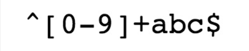
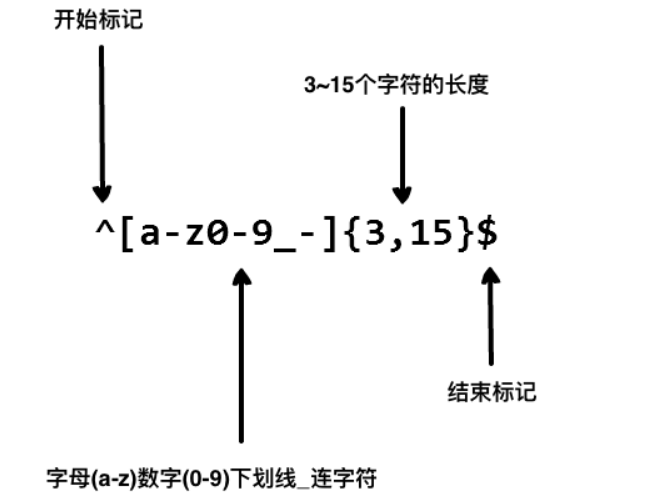
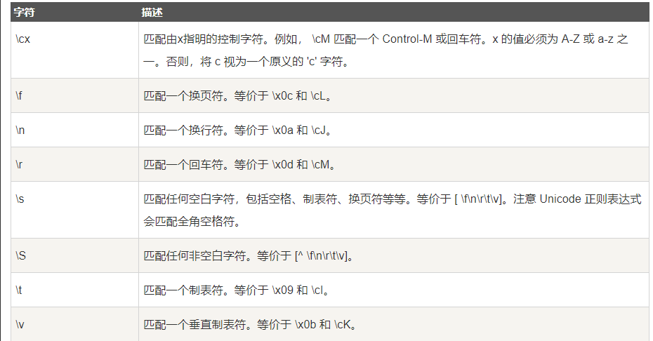
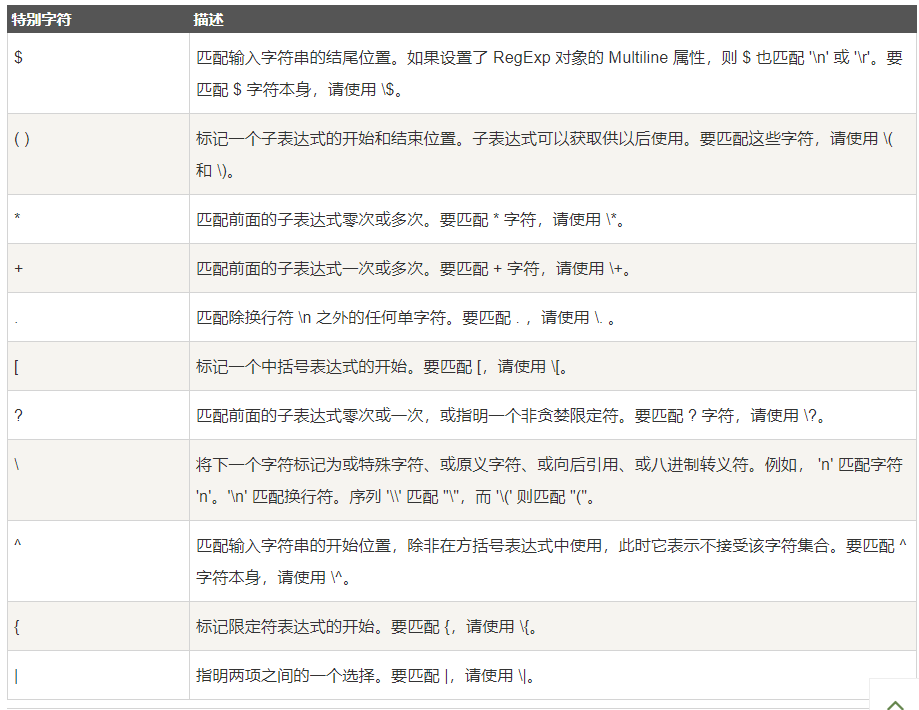
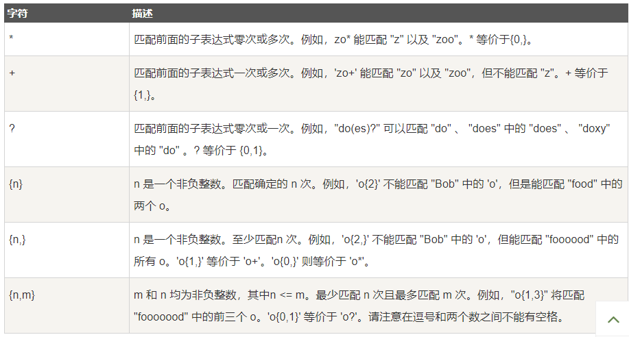
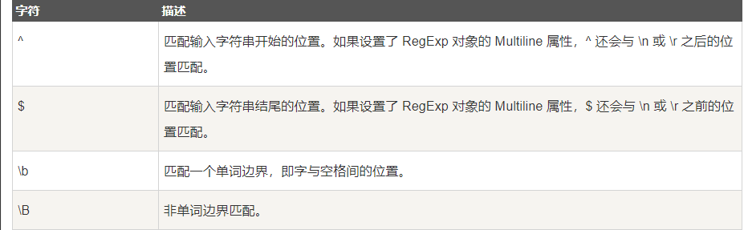
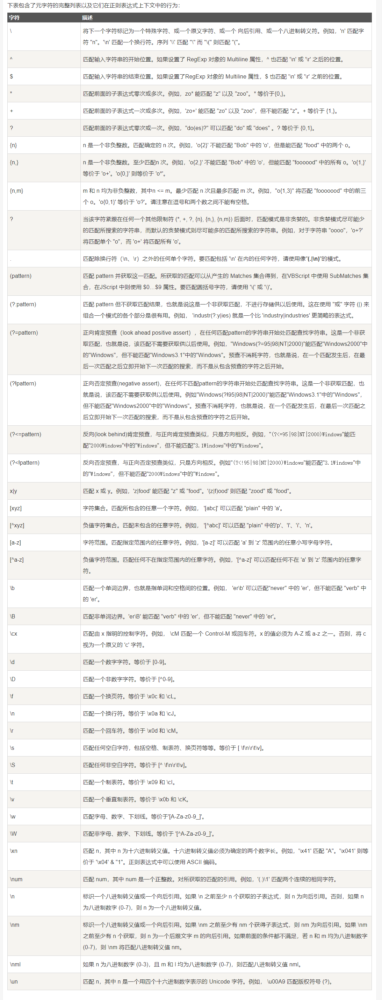
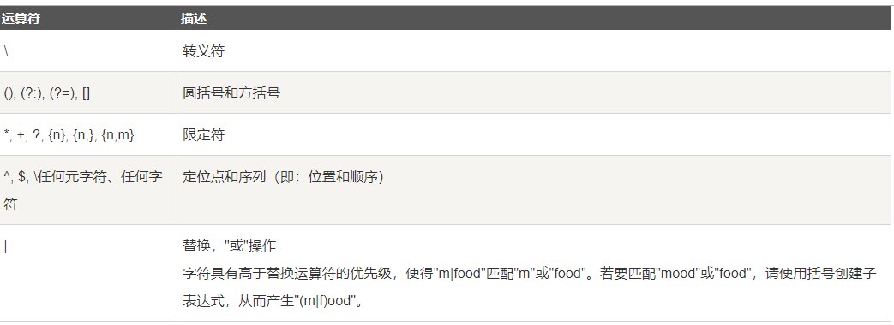
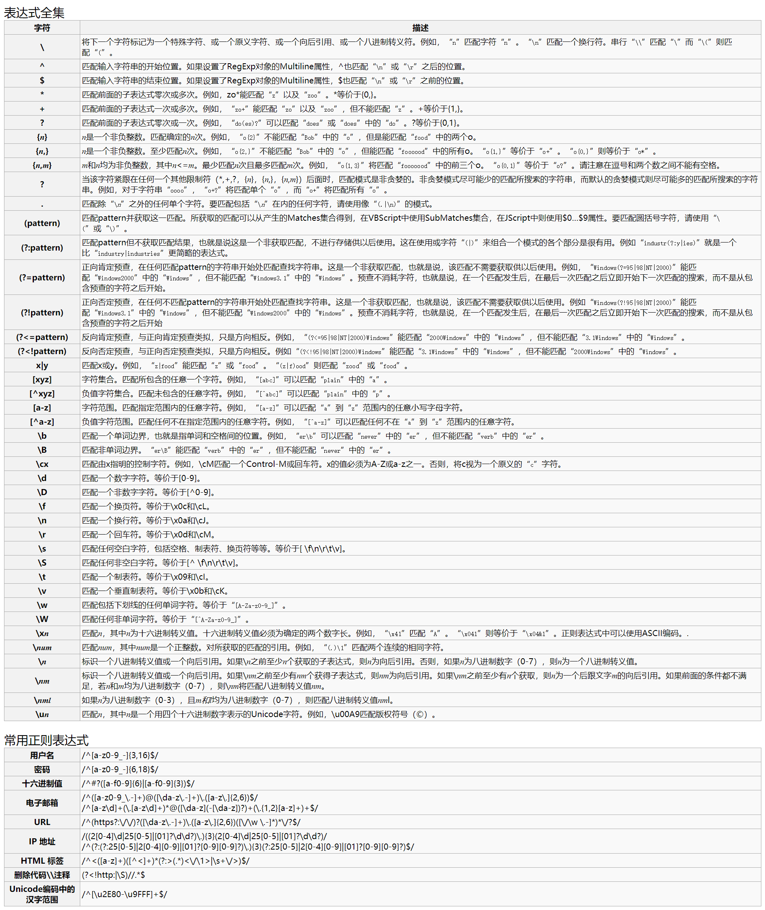

# 1. 例子

^ 为匹配输入字符串的开始位置。

[0-9]+匹配多个数字， [0-9] 匹配单个数字，+ 匹配一个或者多个。

abc$匹配字母 abc 并以 abc 结尾，$ 为匹配输入字符串的结束位置

- 我们在写用户注册表单时，只允许用户名包含字符、数字、下划线和连接字符(-)，并设置用户名的长度，我们就可以使用以下正则表达式来设定。

# 2. 语法

正则表达式(regular expression)描述了一种字符串匹配的模式（pattern），可以用来检查一个串是否含有某种子串、将匹配的子串替换或者从某个串中取出符合某个条件的子串等。
## 2.1. 普通字符
普通字符包括没有显式指定为元字符的所有可打印和不可打印字符。这包括所有大写和小写字母、所有数字、所有标点符号和一些其他符号
## 2.2. 非打印字符

## 2.3. 特殊字符

## 2.4. 限定符

## 2.5. 定位符

# 3. 元字符

# 4. 运算符优先级

# 5. 附录（手册）
