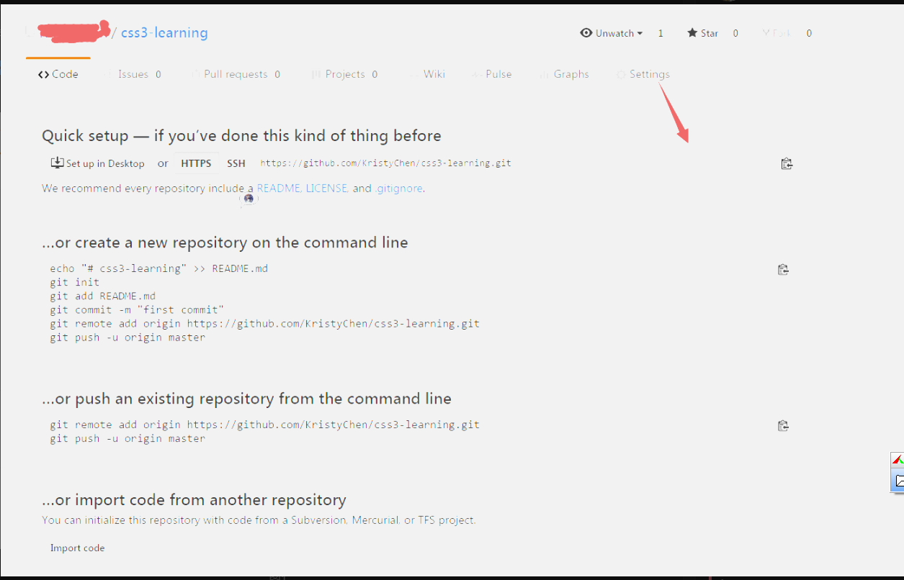
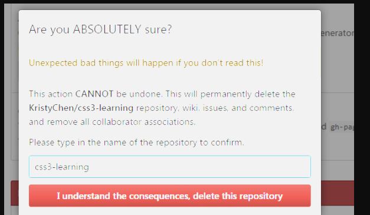

# 1. 基础






假如我们现在在dev分支上，可以用下面命令查看当前分支

```
git branch
```

刚开发完项目，执行了下列命令

```
git  add .
git  commit -m 'dev'
git push -u origin dev
```
然后我们要把dev分支的代码合并到master分支上 该如何？
首先切换到master分支上

```
git  checkout master

```
如果是多人开发的话 需要把远程master上的代码pull下来

```
git pull origin master

```
如果是自己一个开发就没有必要了，为了保险期间还是pull
然后我们把dev分支的代码合并到master上

```
git  merge dev
```

然后查看状态
```

git status
1
On branch master
Your branch is ahead of 'origin/master' by 12 commits.
  (use "git push" to publish your local commits)
nothing to commit, working tree clean
```

上面的意思就是你有12个commit，需要push到远程master上
执行下面命令即可

```
git push origin master
```
