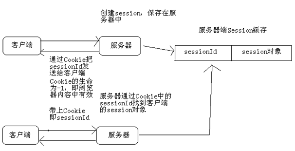
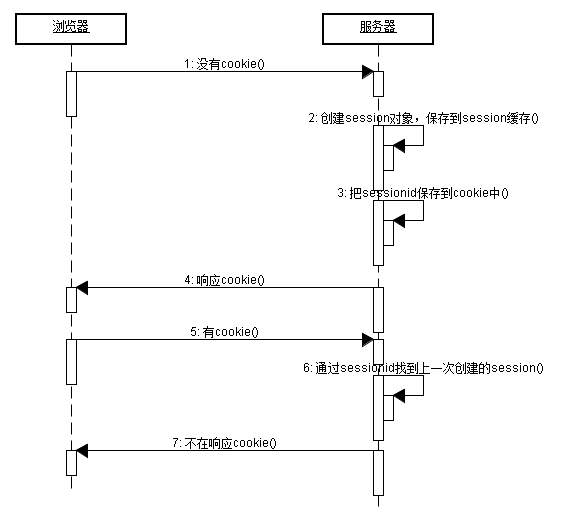

# 1. jsp四大基础语法
## 1.1. jsp注释
<%-- 注释 --%>在HTML的源代码中不能够查看
## 1.2. jsp的声明
<% ! 声明部分%>注意：不能够石宏abstract修饰声明部分的方法
## 1.3. jsp的输出表达式
<% =表达式%>
## 1.4. （4）jsp脚本
<%脚本代码%>注意：脚本不能够使用private，public等访问控制修饰，也不可使用static修饰
# 2. jsp的3个编译指令
## 2.1. page
## 2.2. include
<%@include file=" "%>
## 2.3. taglib
# 3. jsp的7个动作指令
## 3.1. forward:
<jsp:forward page="{relativeURL|<%= expression%>}">
</jsp:forward>
## 3.2. param:
## 3.3. include:
<jsp:include page="" flush="true">
<jsp:param name="" value="">
</jsp:include>
## 3.4. plugin:
## 3.5. useBean:
<jsp:useBeam id="" class="" scope="page|request|session|application">
## 3.6. setProperty:
<jsp:setProperty name="" proterty="" value="">
## 3.7. getProperty:
<jsp:getProperty name="" proterty="" value="">
# 4. 九个内置对象
## 4.1. application:
（1）可以让多个JSP、Servlet共享数据，但是通常是把Web应用的状态数据放入其中
（2）可以获取Web应用配置参数
## 4.2. config:
## 4.3. exception: 
## 4.4. out:
## 4.5. page:
## 4.6. pageContext:
## 4.7. request:
（1）获取请求头/请求参数
HttpServletRequest接口的实例：
（2）操作request范围的属性
setAttribute(String attName,Object attValue);将attValue设置成request范围的属性
Object getAttribute(String attName);获取request范围的属性
（3）执行forward和include
a.getRequestDispatcher("/a.jsp").include(request,response);
b.getRequestDispatcher("/a.jsp").forward(request,response);
请求的方式：
（a）GET方式的请求（传送的数据量少）
（b）POST方式的请求（传输的数据量大，安全性高）
## 4.8. response:
（1）response响应生成非字符响应
（2）重定向 sendRedirect("");
（3）在Cookie的生命限期里会一直存在客户端的机器里addCookie(Cookie cookie);
## 4.9. session:
session对象是HttpSession的实例
### 4.9.1. 获取HttpSession对象
  (1)HttpSession request.getSesssion()：如果当前会话已经有了session对象那么直接返回，如果当前会话还不存在会话，那么创建session并返回；
   (2) HttpSession request.getSession(boolean)：当参数为true时，与requeset.getSession()相同。如果参数为false，那么如果当前会话中存在session则返回，不存在返回null
### 4.9.2. session的域方法
(1)void setAttribute(String name, Object value)：用来存储一个对象，也可以称之为存储一个域属性，例如：session.setAttribute(“xxx”, “XXX”)，在session中保存了一个域属性，域属性名称为xxx，域属性的值为XXX。请注意，如果多次调用该方法，并且使用相同的name，那么会覆盖上一次的值，这一特性与Map相同；
(2)	Object getAttribute(String name)：用来获取session中的数据，当前在获取之前需要先去存储才行，例如：String value = (String) session.getAttribute(“xxx”);，获取名为xxx的域属性；
(3)void removeAttribute(String name)：用来移除HttpSession中的域属性，如果参数name指定的域属性不存在，那么本方法什么都不做；
(4)	Enumeration getAttributeNames()：获取所有域属性的名称；





# 5. 自定义标签类
## 5.1. JSP自定义标签类：
a、如果标签类包含属性，每个属性都应该有对应的getter和setter方法
b、重写doTage（）方法，这个方法负责生成页面的内容
# 6. cookie
## 6.1. Cookie的生命
　　Cookie不只是有name和value，Cookie还是生命。所谓生命就是Cookie在客户端的有效时间，可以通过setMaxAge(int)来设置Cookie的有效时间。
    cookie.setMaxAge(-1)：cookie的maxAge属性的默认值就是-1，表示只在浏览器内ookie就会消失。
    cookie.setMaxAge(60*60)：表示cookie对象可存活1小时。当生命大于0时，浏览器会把Cookie保存到硬盘上，就算关闭浏览器，就算重启客户端电脑，cookie也会存活1小时；
    cookie.setMaxAge(0)：cookie生命等于0是一个特殊的值，它表示cookie被作废！也就是说，如果原来浏览器已经保存了这个Cookie，那么可以通过Cookie的setMaxAge(0)来删除这个Cookie。无论是在浏览器内存中，还是在客户端硬盘上都会删除这个Cookie。 
# 7. JSP中的静态包含和动态包含
- 静态包含是通过JSP的include指令包含页面，
-  静态包含是编译时包含，如果包含的页面不存在则会产生编译错误，而且两个页面的"contentType"属性应保持一致，因为两个页面会合二为一，只产生一个class文件，因此被包含页面发生的变动再包含它的页面更新前不会得到更新。

- 动态包含是通过JSP标准动作<jsp:forward>包含页面。
- 动态包含是运行时包含，可以向被包含的页面传递参数，包含页面和被包含页面是独立的，会编译出两个class文件，如果被包含的页面不存在，不会产生编译错误，也不影响页面其他部分的执行。代码如下所示：
```

<%-- 静态包含 --%>
<%@ include file="..." %>

<%-- 动态包含 --%>
<jsp:include page="...">
    <jsp:param name="..." value="..." />
</jsp:include>
```
