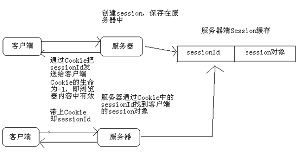

# 1. jsp四大基础语法
## 1.1. jsp注释
<%-- 注释 --%>在HTML的源代码中不能够查看
## 1.2. jsp的声明
<% ! 声明部分%>注意：不能够石宏abstract修饰声明部分的方法
## 1.3. jsp的输出表达式
<% =表达式%>
## 1.4. （4）jsp脚本
<%脚本代码%>注意：脚本不能够使用private，public等访问控制修饰，也不可使用static修饰
# 2. jsp的3个编译指令
## 2.1. page
## 2.2. include
<%@include file=" "%>
## 2.3. taglib
# 3. jsp的7个动作指令
## 3.1. forward:
<jsp:forward page="{relativeURL|<%= expression%>}">
</jsp:forward>
## 3.2. param:
## 3.3. include:
<jsp:include page="" flush="true">
<jsp:param name="" value="">
</jsp:include>
## 3.4. plugin:
## 3.5. useBean:
<jsp:useBeam id="" class="" scope="page|request|session|application">
## 3.6. setProperty:
<jsp:setProperty name="" proterty="" value="">
## 3.7. getProperty:
<jsp:getProperty name="" proterty="" value="">
# 4. 九个内置对象
## 4.1. application:
（1）可以让多个JSP、Servlet共享数据，但是通常是把Web应用的状态数据放入其中
（2）可以获取Web应用配置参数
## 4.2. config:
## 4.3. exception: 
## 4.4. out:
## 4.5. page:
## 4.6. pageContext:
## 4.7. request:
（1）获取请求头/请求参数
HttpServletRequest接口的实例：
（2）操作request范围的属性
setAttribute(String attName,Object attValue);将attValue设置成request范围的属性
Object getAttribute(String attName);获取request范围的属性
（3）执行forward和include
a.getRequestDispatcher("/a.jsp").include(request,response);
b.getRequestDispatcher("/a.jsp").forward(request,response);
请求的方式：
（a）GET方式的请求（传送的数据量少）
（b）POST方式的请求（传输的数据量大，安全性高）
## 4.8. response:
（1）response响应生成非字符响应
（2）重定向 sendRedirect("");
（3）在Cookie的生命限期里会一直存在客户端的机器里addCookie(Cookie cookie);
## 4.9. session:
session对象是HttpSession的实例
### 4.9.1. 获取HttpSession对象
  (1)HttpSession request.getSesssion()：如果当前会话已经有了session对象那么直接返回，如果当前会话还不存在会话，那么创建session并返回；
   (2) HttpSession request.getSession(boolean)：当参数为true时，与requeset.getSession()相同。如果参数为false，那么如果当前会话中存在session则返回，不存在返回null
### 4.9.2. session的域方法
(1)void setAttribute(String name, Object value)：用来存储一个对象，也可以称之为存储一个域属性，例如：session.setAttribute(“xxx”, “XXX”)，在session中保存了一个域属性，域属性名称为xxx，域属性的值为XXX。请注意，如果多次调用该方法，并且使用相同的name，那么会覆盖上一次的值，这一特性与Map相同；
(2)	Object getAttribute(String name)：用来获取session中的数据，当前在获取之前需要先去存储才行，例如：String value = (String) session.getAttribute(“xxx”);，获取名为xxx的域属性；
(3)void removeAttribute(String name)：用来移除HttpSession中的域属性，如果参数name指定的域属性不存在，那么本方法什么都不做；
(4)	Enumeration getAttributeNames()：获取所有域属性的名称；



# 5. 自定义标签类
## 5.1. JSP自定义标签类：
a、如果标签类包含属性，每个属性都应该有对应的getter和setter方法
b、重写doTage（）方法，这个方法负责生成页面的内容
# 6. cookie
## 6.1. Cookie的生命
　　Cookie不只是有name和value，Cookie还是生命。所谓生命就是Cookie在客户端的有效时间，可以通过setMaxAge(int)来设置Cookie的有效时间。
    cookie.setMaxAge(-1)：cookie的maxAge属性的默认值就是-1，表示只在浏览器内ookie就会消失。
    cookie.setMaxAge(60*60)：表示cookie对象可存活1小时。当生命大于0时，浏览器会把Cookie保存到硬盘上，就算关闭浏览器，就算重启客户端电脑，cookie也会存活1小时；
    cookie.setMaxAge(0)：cookie生命等于0是一个特殊的值，它表示cookie被作废！也就是说，如果原来浏览器已经保存了这个Cookie，那么可以通过Cookie的setMaxAge(0)来删除这个Cookie。无论是在浏览器内存中，还是在客户端硬盘上都会删除这个Cookie。 
# 7. EL表达式
## 7.1. EL的作用
JSP2.0要把html和css分离、要把html和javascript分离、要把Java脚本替换成标签。标签的好处是非Java人员都可以使用。
JSP2.0 – 纯标签页面，即：不包含<% … %>、<%! … %>，以及<%= … %>
EL（Expression Language）是一门表达式语言，它对应<%=…%>。我们知道在JSP中，表达式会被输出，所以EL表达式也会被输出。
## 7.2. EL的格式
格式：${…}
例如：${1 + 2}
## 7.3. 关闭EL
如果希望整个JSP忽略EL表达式，需要在page指令中指定isELIgnored=”true”。
如果希望忽略某个EL表达式，可以在EL表达式之前添加“\”，例如：\${1 + 2}。
## 7.4. EL运算符
运算符	说明	范例	结果
```
+	加	${17+5}	22
-	减	${17-5}	12
*	乘	${17*5}	85
/或div	除	${17/5}或${17 div 5}	3
%或mod	取余	${17%5}或${17 mod 5}	2
==或eq	等于	${5==5}或${5 eq 5}	true
!=或ne	不等于	${5!=5}或${5 ne 5}	false
<或lt	小于	${3<5}或${3 lt 5}	true
>或gt	大于	${3>5}或${3 gt 5}	false 
<=或le	小于等于	${3<=5}或${3 le 5}	true 
>=或ge	大于等于	${3>=5}或${3 ge 5}	false 
&&或and	并且	${true&&false}或${true and false}	false 
!或not	非	${!true}或${not true}	false
||或or	或者	${true||false}或${true or false}	true
empty	是否为空	${empty “”}，可以判断字符串、数据、集合的长度是否为0，为0返回true。empty还可以与not或!一起使用。${not empty “”}	true
```
## 7.5. EL不显示null
　　当EL表达式的值为null时，会在页面上显示空白，即什么都不显示。
## 7.6. EL表达式格式
先来了解一下EL表达式的格式！现在还不能演示它，因为需要学习了EL11个内置对象后才方便显示它。
（1）	操作List和数组：${list[0]}、${arr[0]}；
（2）操作bean的属性：${person.name}、${person[‘name’]}，对应person.getName()方法；
（3）操作Map的值：${map.key}、${map[‘key’]}，对应map.get(key)。
## 7.7. EL内置对象
EL一共11个内置对象，无需创建即可以使用。这11个内置对象中有10个是Map类型的，最后一个是pageContext对象。
```
	pageScope
	requestScope
	sessionScope
	applicationScope
	param；
	paramValues；
	header；
	headerValues；
	initParam；
	cookie；
	pageContext；
```
## 7.8. 域相关内置对象（重点）
域内置对象一共有四个：
```
	pageScope：${pageScope.name}等同与pageContext.getAttribute(“name”)；
	requestScope：${requestScope.name}等同与request.getAttribute(“name”)；
	sessionScoep： ${sessionScope.name}等同与session.getAttribute(“name”)；
	applicationScope：${applicationScope.name}等同与application.getAttribute(“name”)；
```
## 7.9. EL四大作用域 9个jsp对象有效范围 及 对应的类
```
java中request,session,application的作用范围
page，request，session，application四者的作用范围:
page的作用范围是当前页面；对应El表达式的pageScope
request的作用范围是页面与页面之间的传递就是请求请求结束则结束； 对应El表达式的requestScope
session的作用范围是直到关闭浏览器；对应El表达式的sessionScope
 application的作用范围是关闭服务器；对应El表达式的applicationScope
 application不是JAVA上的...是JSP中的对应java中的ServletContext类...
 
 它和page request session application response out config exception pageContext都是JSP中的9个内置对象...
    在后台用ServletContext存储的属性数据可jsp页面以用application对象获得..
    而且application的作用域是整个Tomcat启动的过程...
    例如: ServletContext.setAttribute("username",username);
    则在JSP网页中可以使用  application.getAttribute("username");来得到这个用户
    
application与pageContext都是jsp9个对象的成员，
    application是servletContext类的实例，  
    pageContext是PageContext类的实例，
    使用pageContext可以访问page request session application response out config exception范围的变量。
    意思就是在项目中jsp页面可以用pageContext调用到其它8个jsp内置对象的一切。

JSP共有以下9种基本内置组件：   
  request  用户端请求，此请求会包含来自GET/POST请求的参数   对应HttpServletRequest类 
  response     网页传回用户端的回应                   对应HttpServletResponse类  
  pageContext  网页的属性是在这里管理              对应PageContext类
  session      与请求有关的会话期                    对应HttpSession类
  application  servlet正在执行的内容               对应ServletContext类
  out          用来传送回应的输出                    对应JspWrite类
  config       servlet的构架部件                 对应ServletConfig类
  page         JSP网页本身                      对应this
  exception    针对错误网页，未捕捉的例外                   对应Throwable接口

```