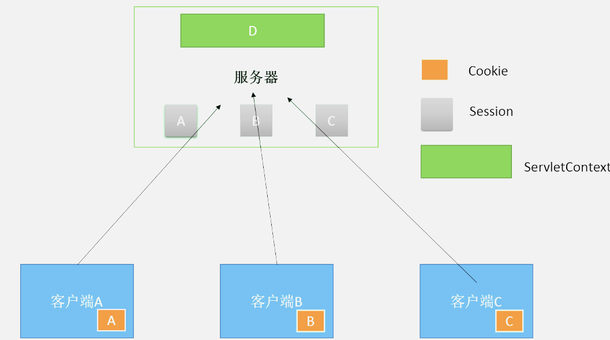

# 1. 简介


你可以把它想象成一个公用的空间，可以被所有的客户访问，也就是说A客户端可以访问D，B客户端可以访问D，C客户端也可以访问D。

- WEB容器在启动时，它会为每个Web应用程序都创建一个对应的ServletContext，它代表当前Web应用。并且它被所有客户端共享。

- ServletContext对象可以通过ServletConfig.getServletContext()方法获得对ServletContext对象的引用，也可以通过this.getServletContext()方法获得其对象的引用。

- 由于一个WEB应用中的所有Servlet共享同一个ServletContext对象，因此Servlet对象之间可以通过ServletContext对象来实现通讯。ServletContext对象通常也被称之为context域对象。公共聊天室就会用到它。

- 当web应用关闭、Tomcat关闭或者Web应用reload的时候，ServletContext对象会被销毁
- ServletContext在WEB服务器启动时创建，服务器关闭时销毁
- 当WEB服务器启动时，会为每一个WEB应用程序(webapps下的每个目录就是一个应用程序)创建一块共享的存储区域

# 2. 使用
- 如何得到ServletContext对象
```
this.getServletContext(); 
this.getServletConfig().getServletContext();
```

- 你可以把它想象成一张表，这个和Session非常相似：每一行就是一个属性，如下：

名字（String）	值（Object）
```
添加属性：setAttribute(String name, Object obj);
得到值：getAttribute(String name)，这个方法返回Object
删除属性：removeAttribute(String name)
```

# 3. 应用
- 多个Servlet通过ServletContext对象实现数据共享

   这个很好理解，类似于Session，我们也可以通过ServletContext对象来共享数据，但要注意的是，Session只能在一个客户端共享数据，它独占一个客户端。而ServletContext中的数据是可以供所有客户端共享的
   
- 实现Servlet的请求转发
   
   之前我们学过的请求转发是通过request对象的： 
```
request.getRequestDispatcher("/url").forward(request, response);
```
这里要说明的是，ServletContext也可以实现请求转发： 
```
this.getServletContext().getRequestDispatcher("/url").forward(request, response); 
```
这两个转发效果是一样的。

- 获取Web应用的初始化参数

现在我们可以通过ServletContext来获取全局的、整个Web应用的初始化参数，全局的初始化参数是这样配置在web.xml文件中的：

```
<!-- 如果希望所有的Servlet都可以使用该配置，则必须这么做 -->
<context-param>
    <param-name>name</param-name>
    <param-value>gavin</param-value>
</context-param>

```
然后我们可以在任意一个Servlet中使用ServletContext获取这个参数：

```
String name = this.getServletContext().getInitParameter("name");
```

- 利用ServletContext对象读取资源文件（比如properties文件） 

(1)文件在WebRoot文件夹下，即我们的Web应用的根目录下。这时候我们可以使用ServletContext来读取该资源文件。

假设我们Web根目录下有一个配置数据库信息的dbinfo.properties文件，里面配置了name和password属性，这时候可以通过ServletContext去读取这个文件：

```
// 这种方法的默认读取路径就是Web应用的根目录
InputStream stream = this.getServletContext().getResourceAsStream("dbinfo.properties");
// 创建属性对象
Properties properties = new Properties();
properties.load(stream);
String name = properties.getProperty("name");
String password = properties.getProperty("password");
out.println("name="+name+";password="+password);
```

(2)但是如果这个文件放在了src目录下，通过ServletContext是读不到的，必须要使用类加载器去读取。

// 类加载器的默认读取路径是src根目录
```
InputStream stream = MyServlet.class.getClassLoader().getResourceAsStream("dbinfo.properties")
```

但是如果这个文件此时还没有直接在src目录下，而是在src目录下的某个包下，比如在com.gavin包下，此时类加载器要加上包的路径，如下：

```
InputStream stream = MyServlet.class.getClassLoader().getResourceAsStream("com/gavin/dbinfo.properties")
```

另外，补充一点，ServletContext可以获取文件的全路径，当然这个也是在Web应用根目录下的文件。比如我们在WebRoot文件夹下有一个images文件夹，images文件夹下有一个Servlet.jpg图片，为了得到这个图片的全路径，如下：


```
// 如何读取到一个文件的全路径，这里会得到在Tomcat的全路径
String path = this.getServletContext().getRealPath("/images/Servlet.jpg");
```


