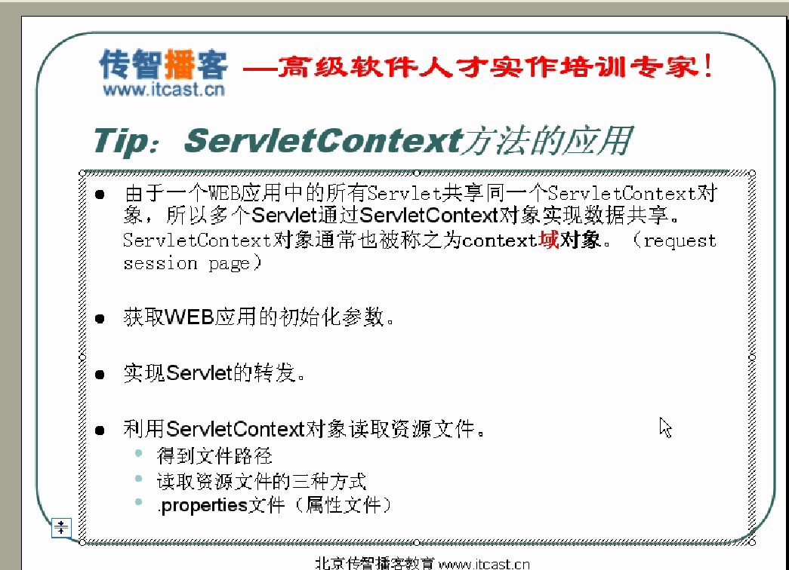

# 1. Servlet简介
Servlet是JavaWeb的三大组件之一，它属于动态资源。Servlet的作用是处理请求，服务器会把接收到的请求交给Servlet来处理，在Servlet中通常需要：
接收请求数据；
处理请求；
完成响应。
　　例如客户端发出登录请求，或者输出注册请求，这些请求都应该由Servlet来完成处理！Servlet需要我们自己来编写。（服务端小程序）必须继承HttpServlet
常见方法：
doGet:
doPost:
doPut:
doDelete:
## 1.1. 实现Servlet有三种方式：
实现javax.servlet.Servlet接口；
继承javax.servlet.GenericServlet类；
**继承javax.servlet.http.HttpServlet类；**（通常我们会去继承HttpServlet类来完成我们的Servlet）
# 2. Servlet的生命周期
## 2.1. Servlet的出生
   服务器会在Servlet第一次被访问时创建Servlet，或者是在服务器启动时创建Servlet。如果服务器启动时就创建Servlet，那么还需要在web.xml文件中配置。也就是说默认情况下，Servlet是在第一次被访问时由服务器创建的。而且一个Servlet类型，服务器只创建一个实例对象，例如在我们首次访问http://localhost:8080/helloservlet/helloworld时，服务器通过“/helloworld”找到了绑定的Servlet名称为cn.itcast.servlet.HelloServlet，然后服务器查看这个类型的Servlet是否已经创建过，如果没有创建过，那么服务器才会通过反射来创建HelloServlet的实例。当我们再次访问http://localhost:8080/helloservlet/helloworld时，服务器就不会再次创建HelloServlet实例了，而是直接使用上次创建的实例。
       在Servlet被创建后，服务器会马上调用Servlet的void init(ServletConfig)方法。请记住， Servlet出生后马上就会调用init()方法，而且一个Servlet的一生。这个方法只会被调用一次。这好比小孩子出生后马上就要去剪脐带一样，而且剪脐带一生只有一次。我们可以把一些对Servlet的初始化工作放到init方法中！
## 2.2. Servlet服务
　　当服务器每次接收到请求时，都会去调用Servlet的service()方法来处理请求。服务器接收到一次请求，就会调用service() 方法一次，所以service()方法是会被调用多次的。正因为如此，所以我们才需要把处理请求的代码写到service()方法中！
## 2.3. Servlet的离去
　　Servlet是不会轻易离去的，通常都是在服务器关闭时Servlet才会离去！在服务器被关闭时，服务器会去销毁Servlet，在销毁Servlet之前服务器会先去调用Servlet的destroy()方法，我们可以把Servlet的临终遗言放到destroy()方法中，例如对某些资源的释放等代码放到destroy()方法中
# 3. Servlet的配置
3.0以后的版本：
a.使用@WebServlet注解进行配置
b.通过在web.xml文件中进行配置
# 4. load-on-startup Servlet
# 5. Servlet配置参数
（1）Servlet配置参数会通过Servlet对象完成，提供一下方法：
java.lang.String getInitParameter(java.lang.String name):用于获取初始化参数
# 6. 使用ServletContext

# 7. ServletContext
## 7.1. ServletContext概述
服务器会为每个应用创建一个ServletContext对象：
ServletContext对象的创建是在服务器启动时完成的；
ServletContext对象的销毁是在服务器关闭时完成的。
　　 ServletContext对象的作用是在整个Web应用的动态资源之间共享数据！例如在AServlet中向ServletContext对象中保存一个值，然后在BServlet中就可以获取这个值，这就是共享数据了。
## 7.2. 在Servlet中获取ServletContext对象
   在void init(ServletConfig config)中：ServletContext context =config.getServletContext();，ServletConfig类的getServletContext()方法可以用来获取ServletContext对象；
  在GenericeServlet或HttpServlet中获取ServletContext对象：GenericServlet类有getServletContext()方法，所以可以直接使用this.getServletContext()来获取；
# 8. JavaWeb四大域对象之一：
在JavaWeb中一共四个域对象，其中Servlet中可以使用的是request、session、application三个对象，而在JSP中可以使用pageContext、request、session、application四个域对象

PageContext；
(1)域对象功能；
(2)	代理其它域对象功能；
(3)	获取其他内置对象

HttpServletRequest；个请求创建一个request对象，所以在同一个请求中可以共享request，例如一个请求从AServlet转发到BServlet，那么AServlet和BServlet可以共享request域中的数据；

HttpSession；一个会话创建一个HttpSession对象，同一会话中的多个请求中可以共享session中的数据

ServletContext；一个应用只创建一个ServletContext对象，所以在ServletContext中的数据可以在整个应用中共享，只要不启动服务器，那么ServletContext中的数据就可以共享

 所有域对象都有存取数据的功能，因为域对象内部有一个Map，用来存储据.
## 8.1. ServletContext对象用来操作数据的方法：
  void setAttribute(String name, Object value)：用来存储一个对象，也可以称之为存储一个域属性，例如：servletContext.setAttribute(“xxx”, “XXX”)，在ServletContext中保存了一个域属性，域属性名称为xxx，域属性的值为XXX。请注意，如果多次调用该方法，并且使用相同的name，那么会覆盖上一次的值，这一特性与Map相同；
  Object getAttribute(String name)：用来获取ServletContext中的数据，当前在获取之前需要先去存储才行，例如：String value = (String)servletContext.getAttribute(“xxx”);，获取名为xxx的域属性；
  void removeAttribute(String name)：用来移除ServletContext中的域属性，如果参数name指定的域属性不存在，那么本方法什么都不做；
	Enumeration getAttributeNames()：获取所有域属性的名称
