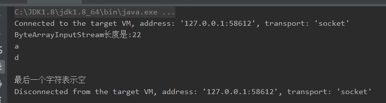
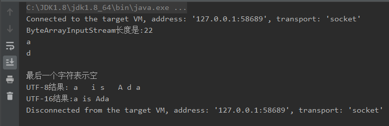

# 1. ByteArrayInputStream
## 1.1. 使用
```
public class ByteArrayTest {
    public static void main(String[] args) throws Exception {
        String str = "ada is Ada";

        /**Unicode的编码就是UTF-16，每个字符占两个字节，UTF-8每个字符占3个字节*/
        ByteArrayInputStream inputStream = new ByteArrayInputStream(str.getBytes("UTF-16"));

        /**之所以多了两个字节，是因为String串在最后有一个不可见的'\0'字符*/
        int len = inputStream.available();
        System.out.println("ByteArrayInputStream长度是:"+len);

        /***只读取6个字节*/
        byte[] array = new byte[6];
        inputStream.read(array);

        /***定义一个ByteBuffer，长度为字节数组长度*/
        /***用array初始化ByteBuffer*/
        ByteBuffer byteBuffer = ByteBuffer.allocate(array.length);
        byteBuffer.put(array);
        /***游标归0*/
        byteBuffer.flip();

        /***定义编码*/
        Charset charset = Charset.forName("UTF-16");
        /***将ByteBuffer转换为CharBuffer*/
        CharBuffer charBuffer = charset.decode(byteBuffer);
        /***读出CharBuffer中的字节*/
        char[] chs = charBuffer.array();


        for (int i = 0; i < chs.length; i++) {
            System.out.println(chs[i]);
        }

        /***表示最后一个字符是'\0'*/
        if (chs[chs.length - 1] == '\0') {
            System.out.println("最后一个字符表示空");
        } else {
            System.out.println("最后一个字符非空");
        }
    }

}
```
## 1.2. 结果

# 2. ByteArrayOutputStream
## 2.1. 常见方法
ByteArrayOutputStream 是字节数组输出流。它继承于OutputStream

- byte[] toByteArray()
新建一个字节数组，将流中的字节以该数组形式返回

- String toString()
将缓冲区的内容以字符串的形式返回，调用的编码方式为工作平台默认的编码方式

- tring toString(String charsetName)
以charsetName的对应的编码方式将缓冲区的内容以字符串的形式返回

## 2.2. 使用
在上面的例子中加上
```
ByteArrayOutputStream outputStream = new ByteArrayOutputStream();
        int ch=0;
        while((ch = inputStream.read()) != -1){                              //读到尾部返回-1
            outputStream.write(ch);                                           //一个字节一个字节再写入到baos中
        }

        System.out.println("UTF-8结果:" + outputStream.toString());                          //默认编码UTF-8
        System.out.println("UTF-16结果:" + outputStream.toString("UTF-16"));

```
## 2.3. 测试结果

