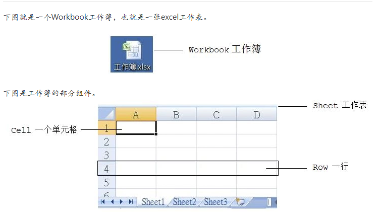

# 1. 什么是POI
Apache POI是Apache软件基金会的开放源码函式库，POI提供API给Java程序对Microsoft Office格式档案读和写的功能。
# 2. 认识EXCEL


# 3. 相关类
```
（1） 一个Excel表格，就是一个Workbook工作簿类的对象。
        Workbook  workbook = new  HSSFWorkbook();
（2） 一个Sheet工作表，就是一个Sheet类的对象，通过workbook获取。
        Sheet  sheet = workbook. createSheet(“工作表名字”);  
（3） 一行，就是一个Row类的对象，通过sheet获取。
        Row  row = sheet. createRow(0);
（4） 一个单元格，就是一个Cell类的对象，通过row获取。
        Cell  cell = row.createCell((short)0);
（5）单元格格式，是一个CellStyle类的对象，通过workbook设置。
        CellStyle  style = workbook.createCellStyle(); 
（6）单元格内容格式，是一个DataFormat类的对象，通过workbook设置。
        DataFormat format= workbook.createDataFormat(); 
```
# 4. 如何使用
## 4.1. 创建一个文件流
```
InputStream is = new FileInputStream(excelPath);
```
## 4.2. 通过文件流读取已有的 Workbook工作簿（一切操作excel的基础类）。

```
（1）Workbook book1 = new HSSFWorkbook(is);  //excel文件后缀是xls 
（2）Workbook book2 = new XSSFWorkbook(is);  //excel文件后缀是xlsx
```
## 4.3. 读取解析Sheet工作表，有两个方法：

```
（1）Sheet sheet = workbook.getSheet("Sheet1");  //通过表名读取工作表Sheet1
（2）Sheet sheet = workbook.getSheetAt(0);  //通过索引读取第一张工作表
```

## 4.4. 得到工作表Sheet以后再读取每一行，将每一行存入一个实体。
```
Row row = sheet.getRow(rowNum);  //rowNum为行号
Cell attribute = row.getCell(index);  //获取每一行的每一个字段，inde
```
# 5. 实例
## 5.1. 前端
 - 以layui框架为例
 - html代码
```
 <div class="layui-input-inline">
               <button type="button" class="layui-btn" id="importTerminal"><i class="layui-icon"></i>导入Excel</button>
            </div>
```

- js代码
```
/**导入EXCEL表格*/
upload.render({
    elem: '#importTerminal'
    , url: '/importTerminal'
    , accept: 'file' //普通文件
    , exts: 'xlsx' //允许上传的文件后缀
    , done: function (res) {//返回值接收
        if (res.message == "ok") {
            layer.msg('导入成功，请稍后！', {}, function () {
                location.reload();
            });
        } else {
            layer.msg('导入失败，请重试！', {}, function () {
                location.reload();
            });
        }
    }
});
```
## 5.2. 后端
- controller

```
	/**导入EXCEL
	 * @throws IOException */
	@RequestMapping("/importTerminal")
	@ResponseBody
	public CommonResult<String> importTerminal(HttpServletRequest request,@RequestParam("file") MultipartFile file) throws IOException {	
		 //如果文件不为空，写入上传路径
	    if (!file.isEmpty()) {
	    /**可根据自己业务逻辑代码接口进行调整*/
	    DaoFactory.getTerminalServiceDao().importTerminal(file);
	        return CommonResult.success("","ok");
	    } else {
	    	return CommonResult.success("","fail");
	    }
			
	}
```

- 业务逻辑代码
```
/** 导入EXCEL表格 */
	@Override
	public void importTerminal(MultipartFile file) throws IOException {
		InputStream inputStream = file.getInputStream();
		Workbook terminalWorkbook = new XSSFWorkbook(inputStream);

		// 循环遍历工作簿里面的sheet表
		for (int i = 0; i < terminalWorkbook.getNumberOfSheets(); i++) {
			XSSFSheet terminalSheet = (XSSFSheet) terminalWorkbook.getSheetAt(i);
			if (terminalSheet == null) { // 为空判断
				continue;
			}
			for (int rowNum = 1; rowNum < terminalSheet.getLastRowNum(); rowNum++) {
				XSSFRow terminalRow = terminalSheet.getRow(rowNum);
				if(terminalRow.getCell(2)!=null &&terminalRow.getCell(2).getCellType()!=Cell.CELL_TYPE_BLANK) {
													
				TerminalInfo info = new TerminalInfo();				
				String termianlUniqueIdentify = getValue(terminalRow.getCell(2));
			    ....;
				info.setTermianlUniqueIdentify(termianlUniqueIdentify);
				.....
				/**数据库的接口*/
				addTerminal(info);
				}
			}
		}

	}
```

