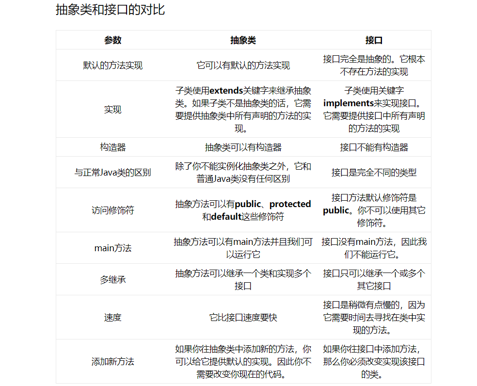

# 1. 抽象类（abstract）
## 1.1. 概念
- 抽象类是对根源的抽象
- 抽象类表示的是，这个对象是什么。
比如，男人，女人，这两个类（如果是类的话……），他们的抽象类是人。说明，他们都是人

抽象方法是一种特殊的方法：它只有声明，而没有具体的实现。抽象方法的声明格式为：
```
abstract void fun();
```

-  抽象方法必须用**abstract**关键字进行修饰。如果一个类含有抽象方法，则称这个类为抽象类，抽象类必须在类前用abstract关键字修饰（将抽象类定义为“包含抽象方法的类”，但是后面发现如果一个类不包含抽象方法，只是用abstract修饰的话也是抽象类。也就是说抽象类不一定必须含有抽象方法。一般没这么无聊的人才创建抽象类而不写抽象方法）
-  抽象类中可以构造方法
抽象类中可以存在普通属性，方法，静态属性和方法。
抽象类中可以存在抽象方法。
如果一个类中有一个抽象方法，那么当前类一定是抽象类；抽象类中不一定有抽象方法。
抽象类中的抽象方法，需要有子类实现，如果子类不实现，则子类也需要定义为抽象的

## 1.2. 普通类的区别
- 抽象方法必须为public或者protected（因为如果为private，则不能被子类继承，子类便无法实现该方法），缺省情况下默认为public。

- 抽象类不能用来创建对象；

- 如果一个类继承于一个抽象类，则子类必须实现父类的抽象方法。如果子类没有实现父类的抽象方法，则必须将子类也定义为为abstract类

## 1.3. 抽象类与接口

**1. 抽象类** 

抽象类和抽象方法都使用 abstract 进行声明。抽象类一般会包含抽象方法，抽象方法一定位于抽象类中。

抽象类和普通类最大的区别是，抽象类不能被实例化，需要继承抽象类才能实例化其子类。

```java
public abstract class AbstractClassExample {

    protected int x;
    private int y;

    public abstract void func1();

    public void func2() {
        System.out.println("func2");
    }
}
```

```java
public class AbstractExtendClassExample extends AbstractClassExample{
    @Override
    public void func1() {
        System.out.println("func1");
    }
}
```

```java
// AbstractClassExample ac1 = new AbstractClassExample(); // 'AbstractClassExample' is abstract; cannot be instantiated
AbstractClassExample ac2 = new AbstractExtendClassExample();
ac2.func1();
```
# 2. 接口（interface）
## 2.1. 概念
- 接口是对动作（行为）的抽象
- 接口表示的是，这个对象能做什么。
人可以吃东西，狗也可以吃东西，你可以把“吃东西”定义成一个接口，然后让这些类去实现它.
- 变量
    被隐式地指定为public static final变量（并且只能是public static final变量，用private修饰会报编译错误）
- 方法
    被隐式地指定为public abstract方法且只能是public abstract方法（用其他关键字，比如private、protected、static、 final等修饰会报编译错误）
- 在接口中只有方法的声明，没有方法体。
在接口中只有常量，因为定义的变量，在编译的时候都会默认加上
public static final 
在接口中的方法，永远都被public来修饰。
接口中没有构造方法，也不能实例化接口的对象。
接口可以实现多继承
接口中定义的方法都需要有实现类来实现，如果实现类不能实现接口中的所有方法
则实现类定义为抽象类
## 2.2. 补充

接口是抽象类的延伸，在 Java 8 之前，它可以看成是一个完全抽象的类，也就是说它不能有任何的方法实现。

从 Java 8 开始，接口也可以拥有默认的方法实现，这是因为不支持默认方法的接口的维护成本太高了。在 Java 8 之前，如果一个接口想要添加新的方法，那么要修改所有实现了该接口的类。

接口也可以包含域，并且这些域隐式都是 static 和 final 的。

接口中的方法默认都是 public 的，并且不允许定义为 private 或者 protected。

```java
public interface InterfaceExample {
    void func1();

    default void func2(){
        System.out.println("func2");
    }

    int x = 123;
    //int y;                // Variable 'y' might not have been initialized
    public int z = 0;       // Modifier 'public' is redundant for interface fields
    // private int k = 0;   // Modifier 'private' not allowed here
    // protected int l = 0; // Modifier 'protected' not allowed here
    // private void fun3(); // Modifier 'private' not allowed here
}
```

```java
public class InterfaceImplementExample implements InterfaceExample {
    @Override
    public void func1() {
        System.out.println("func1");
    }
}
```

```java
// InterfaceExample ie1 = new InterfaceExample(); // 'InterfaceExample' is abstract; cannot be instantiated
InterfaceExample ie2 = new InterfaceImplementExample();
ie2.func1();
System.out.println(InterfaceExample.x);
```


# 3. 使用选择

使用抽象类：

- 需要在几个相关的类中共享代码；
- 需要能控制继承来的方法和域的访问权限，而不是都为 public。
- 需要继承非静态（non-static）和非常量（non-final）字段。

使用接口：

- 需要让不相关的类都实现一个方法，例如不相关的类都可以实现 Compareable 接口中的 compareTo() 方法；
- 需要使用多重继承。

在很多情况下，接口优先于抽象类，因为接口没有抽象类严格的类层次接口要求，可以灵活地为一个类添加行为。并且从 Java 8 开始，接口也可以有默认的方法实现，使得修改接口的成本也变的很低。

> [深入理解 abstract class 和 interface](https://www.ibm.com/developerworks/cn/java/l-javainterface-abstract/) </br> [When to Use Abstract Class and Interface](https://dzone.com/articles/when-to-use-abstract-class-and-intreface)

# 4. 区别
- 一个类只能继承一个类（抽象类）(正如人不可能同时是生物和非生物)，但是可以实现多个接口(吃饭接口、走路接口)
- 抽象类和接口都不能直接实例化，如果要实例化，抽象类变量必须指向实现所有抽象方法的子类对象，接口变量必须指向实现所有接口方法的类对象。
- 抽象类要被子类继承，接口要被类实现
- 接口里定义的变量只能是公共的静态的常量，抽象类中的变量是普通变量。
- 抽象类里的抽象方法必须全部被子类所实现，如果子类不能全部实现父类抽象方法，那么该子类只能是抽象类。同样，一个实现接口的时候，如不能全部实现接口方法，那么该类也只能为抽象类。
- 抽象方法只能申明，不能实现，接口是设计的结果 ，抽象类是重构的结果
- 抽象类里可以没有抽象方法
- 如果一个类里有抽象方法，那么这个类只能是抽象类
- 抽象方法要被实现，所以不能是静态的，也不能是私有的。
- 接口可继承接口，并可多继承接口，但类只能单根继承
## 4.1. 比较

- 从设计层面上看，抽象类提供了一种 IS-A 关系，那么就必须满足里式替换原则，即子类对象必须能够替换掉所有父类对象。而接口更像是一种 LIKE-A 关系，它只是提供一种方法实现契约，并不要求子类和父类具有 IS-A 关系；
- 从使用上来看，一个类可以实现多个接口，但是不能继承多个抽象类。
- 接口的域只能是 static 和 final 类型的，而抽象类的域可以有多种访问权限。
- 接口的方法只能是 public 的，而抽象类的方法可以由多种访问权限。
- 