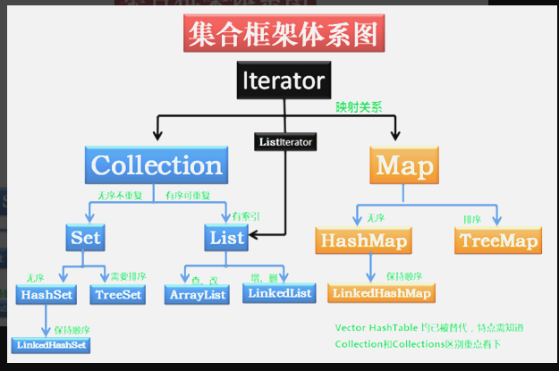
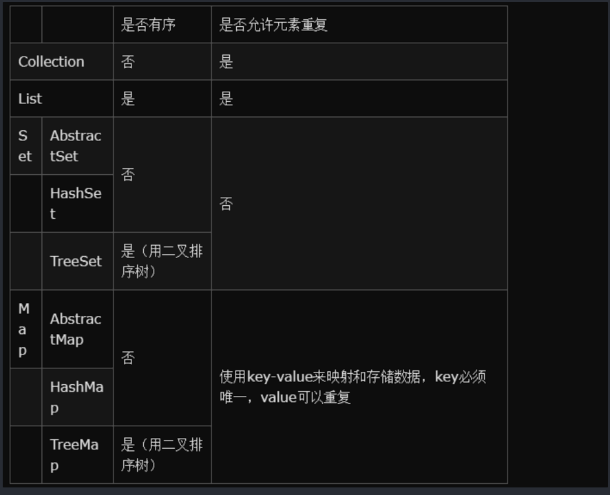

# 1. 集合框架预览

# 2. Collection定义了集合框架的共性功能。

## 2.1. 添加
```
add(e);
addAll(collection);
```

## 2.2. 删除
```
remove(e);
removeAll(collection);
clear();

```
## 2.3. 判断
```
contains(e);
isEmpty();

```
## 2.4. 获取
```
iterator();
size();
```

## 2.5. 获取交集。
```
retainAll();
```

## 2.6. 集合变数组。
```
toArray();## 2.1. 添加
add(e);
addAll(collection);
```

# 3. 集合比较

# 4. Collections
- 集合框架的工具类。里面定义的都是静态方法。
## 4.1. Collections和Collection有什么区别？
- Collection是集合框架中的一个顶层接口，它里面定义了单列集合的共性方法。
它有两个常用的子接口，
List：对元素都有定义索引。有序的。可以重复元素。
Set：不可以重复元素。无序。

- Collections是集合框架中的一个工具类。该类中的方法都是静态的,提供的方法中有可以对list集合进行排序，二分查找等方法。
- 通常常用的集合都是线程不安全的。因为要提高效率。
- 如果多线程操作这些集合时，可以通过该工具类中的同步方法，将线程不安全的集合，转换成安全的。
# 5. Iterator:迭代器
- 它是Java集合的顶层接口（不包括 map 系列的集合，Map接口 是 map 系列集合的顶层接口）
```
      Object next()：返回迭代器刚越过的元素的引用，返回值是 Object，需要强制转换成自己需要的类型
　　boolean hasNext()：判断容器内是否还有可供访问的元素
　　void remove()：删除迭代器刚越过的元素
```

所以除了 map 系列的集合，我们都能通过迭代器来对集合中的元素进行遍历。

- 注意：我们可以在源码中追溯到集合的顶层接口，比如 Collection 接口，可以看到它继承的是类 Iterable
```
public interface Collection<E> extends Iterable<E>{
}
```

- 那这就得说明一下 Iterator 和 Iterable 的区别：

 - Iterable ：存在于 java.lang 包中。
```
 public interface Iterable<T>{
 Iterator<T> iterator();
 }
 我们可以看到，里面封装了 Iterator 接口。所以只要实现了只要实现了Iterable接口的类，就可以使用Iterator迭代器了。
```
- Iterator ：存在于 java.util 包中。核心的方法next(),hasnext(),remove()。

 这里我们引用一个Iterator 的实现类 ArrayList 来看一下迭代器的使用：暂时先不管 List 集合是什么，只需要看看迭代器的用法就行了
```
//产生一个 List 集合，典型实现为 ArrayList。
        List list = new ArrayList();
        //添加三个元素
        list.add("Tom");
        list.add("Bob");
        list.add("Marry");
        //构造 List 的迭代器
        Iterator it = list.iterator();
        //通过迭代器遍历元素
        while(it.hasNext()){
            Object obj = it.next();
            System.out.println(obj);
        }
```