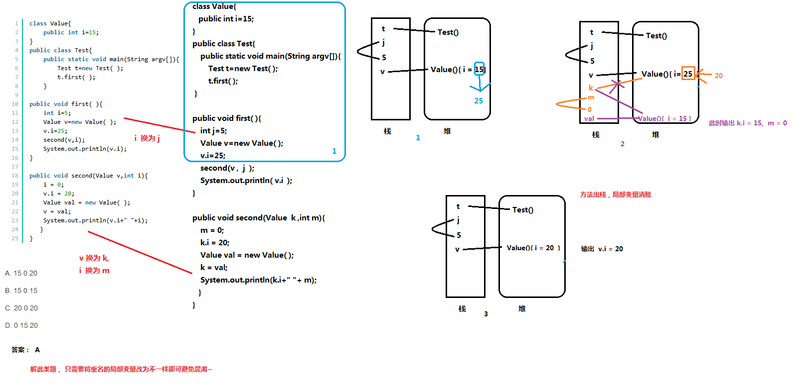

# 1. 值传递
## 1.1. 题目
class Value{
    public int i=15;
}
public class Test{
    public static void main(String argv[]){
        Test t=new Test( );
        t.first( );
    }
 
public void first( ){
    int i=5;
    Value v=new Value( );
    v.i=25;
    second(v,i);
    System.out.println(v.i);
}
 
public void second(Value v,int i){
    i = 0;
    v.i = 20;
    Value val = new Value( );
    v = val;
    System.out.println(v.i+" "+i);
   }
}
## 1.2. 思路
