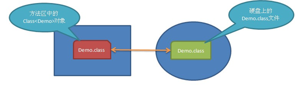
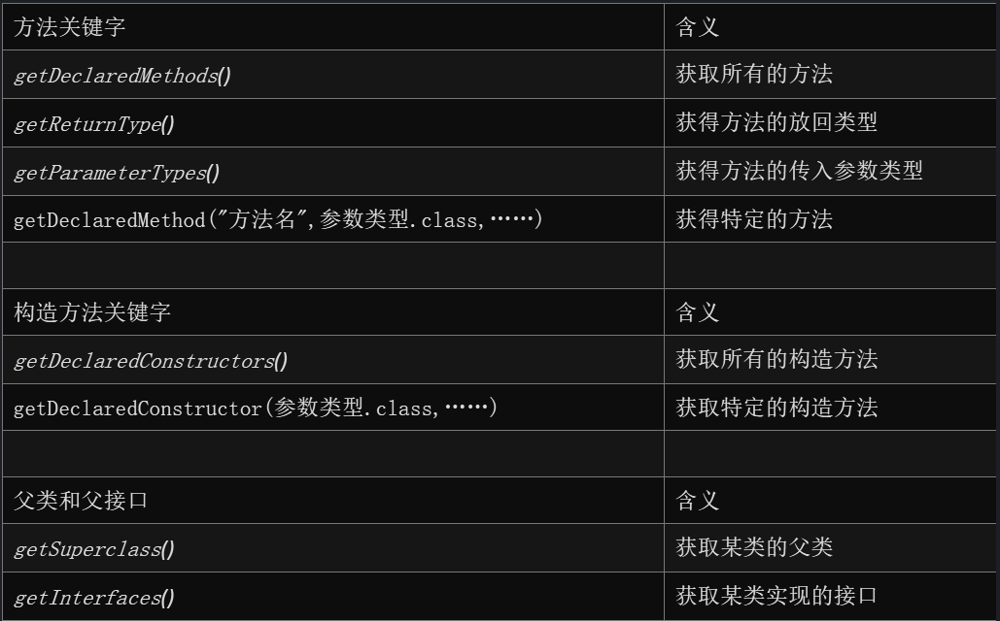

# 1. 反射的概念
主要是指程序可以访问，检测和修改它本身状态或行为的一种能力，并能根据自身行为的状态和结果，调整或修改应用所描述行为的状态和相关的语义。            

反射是java中一种强大的工具，能够使我们很方便的创建灵活的代码，这些代码可以再运行时装配，无需在组件之间进行源代码链接。但是反射使用不当会成本很高！

每个.class文件被加载到内存后都是一个Class类的对象！例如Demo.class加载到内存后它是Class<Demo>类型的一个对象，反射就是通过Class对象获取类型相关的信息。一个Class对象就表示一个.class文件，可以通过Class对象获取这个类的构造器、方法，以及成员变量等

放射可以帮助我们在动态运行的时候，对于任意一个类，可以获得其所有的方法（包括 public protected private 默认状态的），所有的变量 （包括 public protected private 默认状态的），就是我们能够通过反射机制来获取类的相关属性和方法
# 2. 与反射相关的类：
## 2.1. Class：表示类；
### 2.1.1. 获取Class类的三种基本方式：
通过类名称.class，对基本类型也支持；
	Class c = int.class；
	Class c = int[].class；
	Class c = String.class
通过对象.getClass()方法
	Class c = obj.getClass();
Class.forName()通过类名称加载类，这种方法只要有类名称就可以得到Class；
	Class c = Class.forName(“cn.itcast.Demo”)
### 2.1.2. Class类的常用方法
String getName()：获取类名称，包含包名；
String getSimpleName()：获取类名称，不包含包名；
T Class getSupperClass()：获取父类的Class，例如：new Integer(100).getClass().getSupperClass()返回的是Class<Number>！但new Object().getSupperClass()返回的是null，因为Object没有父类；
newInstance()：使用本类无参构造器来创建本类对象；
boolean isArray()：是否为数组类型；
boolean isAnnotation()：是否为注解类型；
boolean isAnnotationPresent(Class annotationClass)：当前类是否被annotationClass注解了；
boolean isEnum()：是否为枚举类型；
boolean isInterface()：是否为接口类型；
boolean isPrimitive()：是否为基本类型；
boolean isSynthetic()：是否为引用类型
## 2.2. Field：表示成员变量；
### 2.2.1. 获取Field对象需要使用Class对象，下面是Class类的API：
	Field getField(String name)：通过名字获取公有成员变量的反射对象，包含父类中声明的公有成员变量；
	Field[] getFields()：获取所有公有成员变量反射对象，包含父类中声明的公有成员变量；
	Field getDeclaredField(String name)：通过名字获取本类中某个成员变量，包含本类的private成员变量，但父类中声明的任何成员变量都不包含；
	Field[] getDeclaredFields()：获取本类中声明的所有成员变量，包含private成员变量，但不包含父类中声明的任何成员变量；
### 2.2.2. Field类的常用方法
String getName()：获取成员变量名；
Class getDeclaringClass()：获取成员变量的类型；
Class getType()：获取当前成员变量的类型；
Object get(Object obj)：获取obj对象的成员变量的值；
void set(Object obj, Object value)：设置obj对象的成员变量值为value；
## 2.3. Method：表示方法；
### 2.3.1. 获取Method需要通过Class对象，下面是Class类的API：
Method getMethod(String name, Class… parameterTypes)：通过方法名和方法参数类型获取方法反射对象，包含父类中声明的公有方法，但不包含所有私有方法；
Method[] getMethods()：获取所有公有方法，包含父类中的公有方法，但不包含任何私有方法；
Method getDeclaredMethod(String name, Class… parameterTypes)：通过方法名和方法参数类型获取本类中声明的方法的反射对象，包含本类中的私有方法，但不包含父类中的任何方法；
Method[] getDeclaredMethods()：获取本类中所有方法，包含本类中的私有方法，但不包含父类中的任何方法。
### 2.3.2. Method常用方法
String getName()：获取方法名；
Class getDeclaringClass()：获取方法所属的类型；
Class[] getParameterTypes()：获取方法的所有参数的类型；
Class[] getExceptionTypes()：获取方法上声明的所有异常类型；
Class getReturnType()：获取方法的返回值类型；
Object invode(Object obj, Object… args)：通过方法反射对象调用方法，如果当前方法是实例方法，那么当前对象就是obj，如果当前方法是static方法，那么可以给obj传递null。args表示是方法的参数；
## 2.4. Constructor：表示构造器。
### 2.4.1. 获取Constructor对象
　　获取Construcator对象需要使用Class对象，下面API来自Class类：
Constructor getConstructor(Class… parameterTypes)：通过指定的参数类型获取公有构造器反射对象；
Constructor[] getConstructors()：获取所有公有构造器对象；
Constructor getDeclaredConstructor(Class… parameterTypes)：通过指定参数类型获取构造器反射对象。可以是私有构造器对象；
Constructor[] getDeclaredConstructors()：获取所有构造器对象。包含私有构造器；
### 2.4.2. Construcator类常用方法
String getName()：获取构造器名；
Class getDeclaringClass()：获取构造器所属的类型；
Class[] getParameterTypes()：获取构造器的所有参数的类型；
Class[] getExceptionTypes()：获取构造器上声明的所有异常类型；
T newInstance(Object… initargs)：通过构造器反射对象调用构造器

# 3. 作用
- 工厂模式：Factory类中用反射的话，添加了一个新的类之后，就不需要再修改工厂类Factory了
- 数据库JDBC中通过Class.forName(Driver).来获得数据库连接驱动
- 分析类文件：毕竟能得到类中的方法等等
- 访问一些不能访问的变量或属性：破解别人代码
- 反编译：.class-->.java
- 通过反射机制访问java对象的属性，方法，构造方法等；

