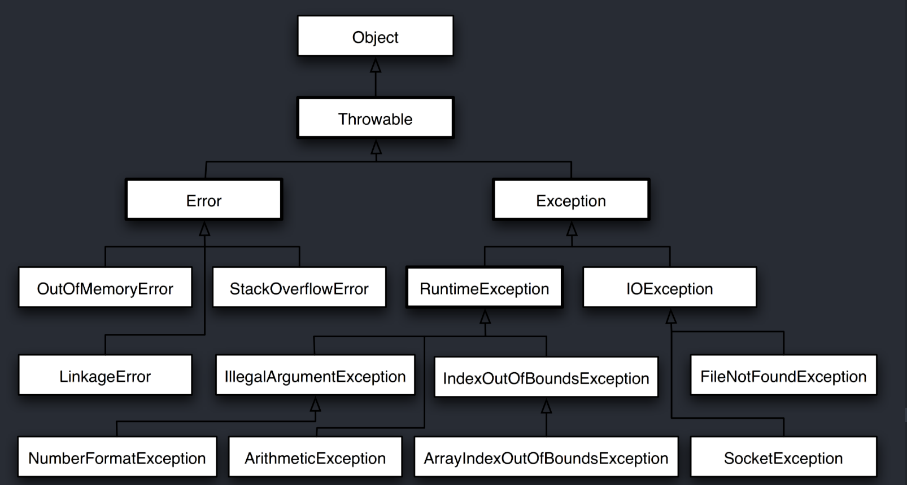

# 1. 1.预览

Throwable 可以用来表示任何可以作为异常抛出的类，分为两种： **Error**  和 **Exception**。其中 Error 用来表示 JVM 无法处理的错误，Exception 分为两种：

1.  **受检异常** ：需要用 try...catch... 语句捕获并进行处理，并且可以从异常中恢复；
2.  **非受检异常** ：是程序运行时错误，例如除 0 会引发 Arithmetic Exception，此时程序奔溃并且无法恢复。

# 2. throw与throws的比较
- throws出现在方法函数头；而throw出现在函数体。

- throws表示出现异常的一种可能性，并不一定会发生这些异常；throw则是抛出了异常，执行throw则一定抛出了某种异常对象。

- 两者都是消极处理异常的方式（这里的消极并不是说这种方式不好），只是抛出或者可能抛出异常，但是不会由函数去处理异常，真正的处理异常由函数的上层调用处理

> [Java 入门之异常处理](https://www.tianmaying.com/tutorial/Java-Exception)   [Java 异常的面试问题及答案 -Part 1](http://www.importnew.com/7383.html)
