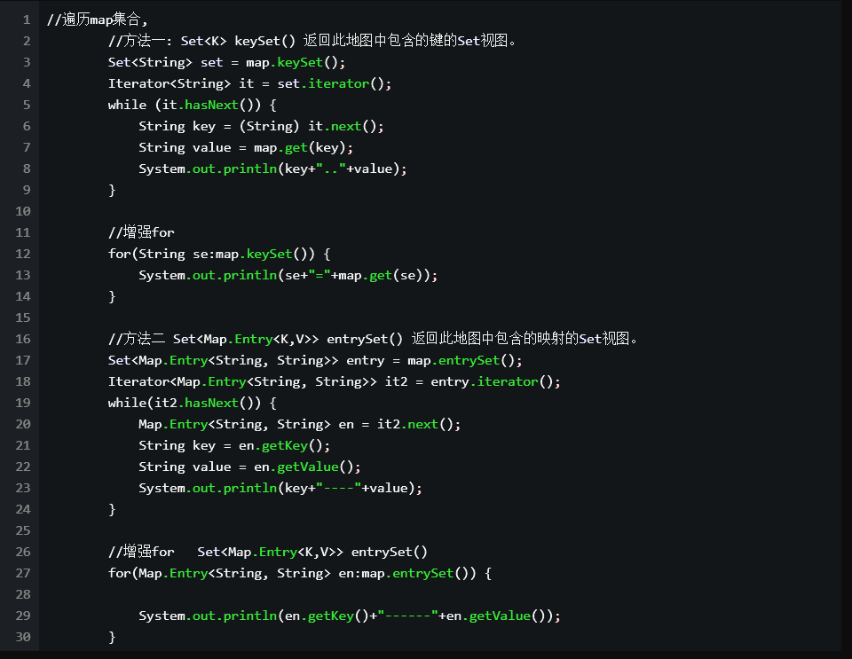

# 1. Map
key-value 的键值对，key 不允许重复，value 可以

　　严格来说 Map 并不是一个集合，而是两个集合之间 的映射关系。

　　这两个集合没每一条数据通过映射关系，我们可以看成是一条数据。即 Entry(key,value）。Map 可以看成是由多个 Entry 组成。

　　 因为 Map 集合即没有实现于 Collection 接口，也没有实现 Iterable 接口，所以不能对 Map 集合进行 for-each 遍历。


# 2. 存储形式
 而Map中的每个元素都使用key——>value的形式存储在集合中。

## 2.1. Map集合
该集合存储键值对。一对一对往里存。而且要保证键的唯一性。
```
添加。
put(K key, V value) 
putAll(Map<? extends K,? extends V> m)

删除。
clear() 
remove(Object key)

判断。
containsValue(Object value) 
containsKey(Object key) 
isEmpty()

获取。 
get(Object key) 
size() 
values()
entrySet() 
keySet()
```

## 2.2. Map接口的常用子类

Map
|--HashMap：底层是哈希表数据结构，允许使用 null 值和 null 键，该集合是不同步的。将hashtable替代，jdk1.2.效率高。
|--TreeMap：底层是二叉树数据结构。线程不同步。可以用于给map集合中的键进行排序

# 3. hashCode()和equals()
## 3.1. equals()
equals()方法是用来判断其他的对象是否和该对象相等.

  equals()方法在object类中定义如下： 

public boolean equals(Object obj) {  
    return (this == obj);  
}  
很明显是对两个对象的地址值进行的比较（即比较引用是否相同）。但是我们知道，String 、Math、Integer、Double等这些封装类在使用equals()方法时，已经覆盖了object类的equals()方法。

很明显，这是进行的内容比较，而已经不再是地址的比较。依次类推Math、Integer、Double等这些类都是重写了equals()方法的，从而进行的是内容的比较。当然，基本类型是进行值的比较。

它的性质有：

自反性（reflexive）。对于任意不为null的引用值x，x.equals(x)一定是true。

对称性（symmetric）。对于任意不为null的引用值x和y，当且仅当x.equals(y)是true时，y.equals(x)也是true。

传递性（transitive）。对于任意不为null的引用值x、y和z，如果x.equals(y)是true，同时y.equals(z)是true，那么x.equals(z)一定是true。

一致性（consistent）。对于任意不为null的引用值x和y，如果用于equals比较的对象信息没有被修改的话，多次调用时x.equals(y)要么一致地返回true要么一致地返回false。

对于任意不为null的引用值x，x.equals(null)返回false。

对于Object类来说，equals()方法在对象上实现的是差别可能性最大的等价关系，即，对于任意非null的引用值x和y，当且仅当x和y引用的是同一个对象，该方法才会返回true。

需要注意的是当equals()方法被override时，hashCode()也要被override。按照一般hashCode()方法的实现来说，相等的对象，它们的hash code一定相等
## 3.2. hashCode()
1、相等（相同）的对象必须具有相等的哈希码（或者散列码）。

2、如果两个对象的hashCode相同，它们并不一定相同。

 

 以下是Object对象API关于equal方法和hashCode方法的说明：

```
If two objects are equal according to the equals(Object) method, then calling the hashCode method on each of the two objects must produce the same integer result.
It is not required that if two objects are unequal according to the equals(java.lang.Object) method, then calling the hashCode method on each of the two objects must produce distinct integer results. However, the programmer should be aware that producing distinct integer results for unequal objects may improve the performance of hash tables.
```
以上API说明是对之前2点的官方详细说明
关于第一点，相等（相同）的对象必须具有相等的哈希码（或者散列码），为什么？

 想象一下，假如两个Java对象A和B，A和B相等（eqauls结果为true），但A和B的哈希码不同，则A和B存入HashMap时的哈希码计算得到的HashMap内部数组位置索引可能不同，那么A和B很有可能允许同时存入HashMap，显然相等/相同的元素是不允许同时存入HashMap，HashMap不允许存放重复元素。

 关于第二点，两个对象的hashCode相同，它们并不一定相同

 也就是说，不同对象的hashCode可能相同；假如两个Java对象A和B，A和B不相等（eqauls结果为false），但A和B的哈希码相等，将A和B都存入HashMap时会发生哈希冲突，也就是A和B存放在HashMap内部数组的位置索引相同这时HashMap会在该位置建立一个链接表，将A和B串起来放在该位置，显然，该情况不违反HashMap的使用原则，是允许的。当然，哈希冲突越少越好，尽量采用好的哈希算法以避免哈希冲突。

 所以，Java对于eqauls方法和hashCode方法是这样规定的：     

 - 如果两个对象相同，那么它们的hashCode值一定要相同；

 - 如果两个对象的hashCode相同，它们并不一定相同（这里说的对象相同指的是用eqauls方法比较）。  
        如不按要求去做了，会发现相同的对象可以出现在Set集合中，同时，增加新元素的效率会大大下降。
  - equals()相等的两个对象，hashcode()一定相等；equals()不相等的两个对象，却并不能证明他们的hashcode()不相等。

      换句话说，equals()方法不相等的两个对象，hashcode()有可能相等（我的理解是由于哈希码在生成的时候产生冲突造成的）。反过来，hashcode()不等，一定能推出equals()也不等；hashcode()相等，equals()可能相等，也可能不等。

      在object类中，hashcode()方法是本地方法，返回的是对象的地址值，而object类中的equals()方法比较的也是两个对象的地址值，如果equals()相等，说明两个对象地址值也相等，当然hashcode()也就相等了；在String类中，equals()返回的是两个对象内容的比较，当两个对象内容相等时，Hashcode()方法根据String类的重写代码的分析，也可知道hashcode()返回结果也会相等。以此类推，可以知道Integer、Double等封装类中经过重写的equals()和hashcode()方法也同样适合于这个原则。当然没有经过重写的类，在继承了object类的equals()和hashcode()方法后，也会遵守这个原则。


