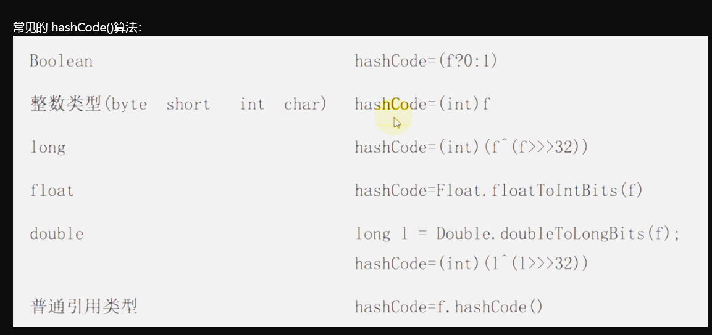

# 1. Set：典型实现 HashSet()是一个无序，不可重复的集合

## 1.1. Set hashSet = new HashSet();

　　①、HashSet:不能保证元素的顺序；不可重复；不是线程安全的；集合元素可以为 NULL;

　　②、其底层其实是一个数组，存在的意义是加快查询速度。我们知道在一般的数组中，元素在数组中的索引位置是随机的，元素的取值和元素的位置之间不存在确定的关系，因此，在数组中查找特定的值时，需要把查找值和一系列的元素进行比较，此时的查询效率依赖于查找过程中比较的次数。而 HashSet 集合底层数组的索引和值有一个确定的关系：index=hash(value),那么只需要调用这个公式，就能快速的找到元素或者索引。

　　③、对于 HashSet: 如果两个对象通过 equals() 方法返回 true，这两个对象的 hashCode 值也应该相同。
　　
 　 　　|--当向HashSet集合中存入一个元素时，HashSet会先调用该对象的hashCode（）方法来得到该对象的hashCode值，然后根据hashCode值决定该对象在HashSet中的存储位置
　　　　　如果 hashCode 值不同，直接把该元素存储到 hashCode() 指定的位置
　　　   　如果 hashCode 值相同，那么会继续判断该元素和集合对象的 equals() 作比较
　　　　　hashCode 相同，equals 为 true，则视为同一个对象，不保存在 hashSet（）中
　　　　　hashCode 相同，equals 为 false，则存储在之前对象同槽位的链表上，这非常麻烦，我们应该约束这种情况，即保证：如果两个对象通过 equals() 方法返回 true，这两个对象的 hashCode 值也应该相同。
       |--注意：每一个存储到 哈希 表中的对象，都得提供 hashCode() 和 equals() 方法的实现，用来判断是否是同一个对象，对于 HashSet 集合，我们要保证如果两个对象通过 equals() 方法返回 true，这两个对象的 hashCode 值也应该相同。
 
## 1.2. Set linkedHashSet = new LinkedHashSet();
　　不可以重复，有序
　　因为底层采用** 链表 和 哈希表**的算法。链表保证元素的添加顺序，哈希表保证元素的唯一性
## 1.3. Set treeSet = new TreeSet();
　　TreeSet:有序；不可重复，底层使用 红黑树算法，擅长于范围查询。
　　*  如果使用 TreeSet() 无参数的构造器创建一个 TreeSet 对象, 则要求放入其中的元素的类必须实现 Comparable 接口所以, 在其中不能放入 null 元素
 
     *  必须放入同样类的对象.(默认会进行排序) 否则可能会发生类型转换异常.我们可以使用泛型来进行限制
## 1.4. 排序
自动排序：
添加自定义对象的时候，必须要实现 Comparable 接口，并要覆盖 compareTo(Object obj) 方法来自定义比较规则

　　　　如果 this > obj,返回正数 1

　　　　如果 this < obj,返回负数 -1

　　　　如果 this = obj,返回 0 ，则认为这两个对象相等
 定制排序: 
 创建 TreeSet 对象时, 传入 Comparator 接口的实现类. 要求: Comparator 接口的 compare 方法的返回值和 两个元素的 equals() 方法具有一致的返回值   
# 2. 小结
以上三个 Set 接口的实现类比较：
共同点：
　　       |--都不允许元素重复
　　       |--都不是线程安全的类，解决办法：Set set = Collections.synchronizedSet(set 对象)
不同点：
　　　　|--HashSet:不保证元素的添加顺序，底层采用 哈希表算法，查询效率高。判断两个元素是否相等，equals() 方法返回 true,hashCode() 值相等。即要求存入 HashSet 中的元素要覆盖 equals() 方法和 hashCode()方法 
　　　　|--LinkedHashSet:HashSet 的子类，底层采用了 哈希表算法以及 链表算法，既保证了元素的添加顺序，也保证了查询效率。但是整体性能要低于 HashSet
             |--TreeSet:不保证元素的添加顺序，但是会对集合中的元素进行排序。底层采用 红-黑 树算法（树结构比较适合范围查询）
# 3. Set：元素是无序(存入和取出的顺序不一定一致)，元素不可以重复。
|——HashSet:底层数据结构是哈希表。是线程不安全的。不同步。
　　HashSet是如何保证元素唯一性的呢？
　　是通过元素的两个方法，hashCode和equals来完成。
　　如果元素的HashCode值相同，才会判断equals是否为true。
　　如果元素的hashcode值不同，不会调用equals。
　　注意,对于判断元素是否存在，以及删除等操作，依赖的方法是元素的hashcode和equals方法。

|——TreeSet：
有序的存放：TreeSet　　线程不安全，可以对Set集合中的元素进行排序
通过compareTo或者compare方法来保证元素的唯一性，元素以二叉树的形式存放。