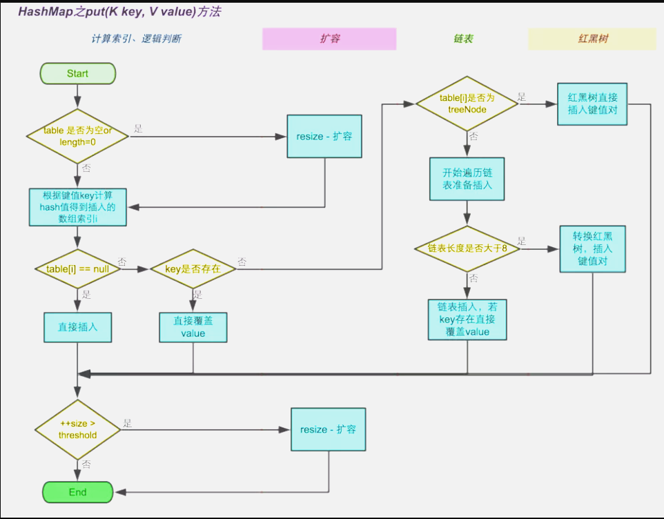
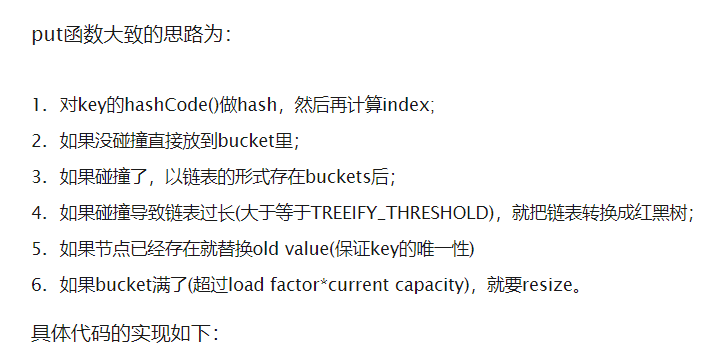
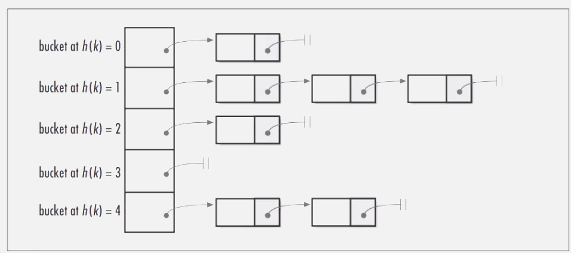
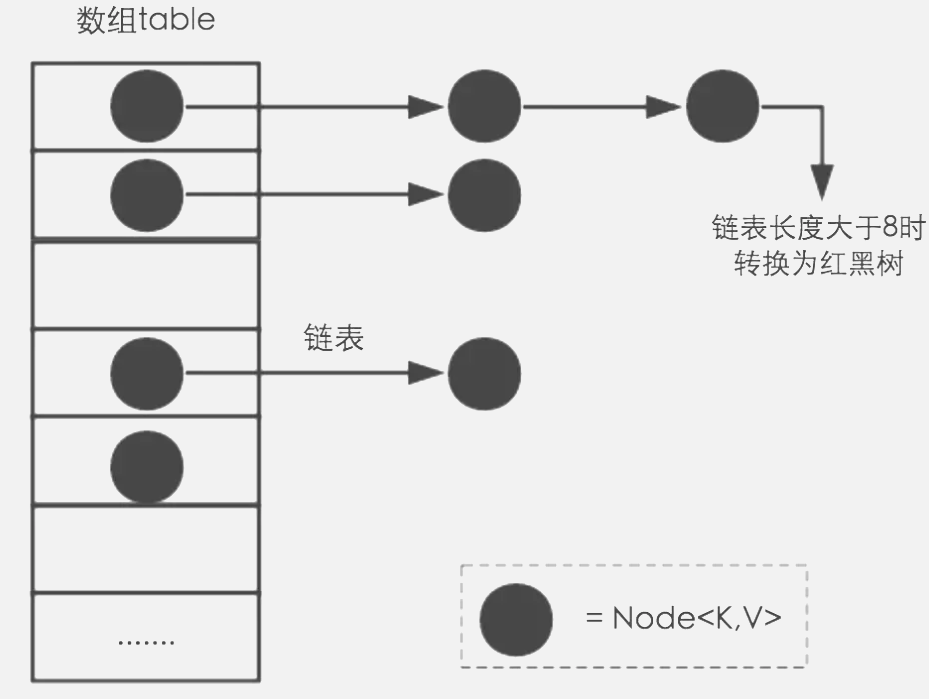
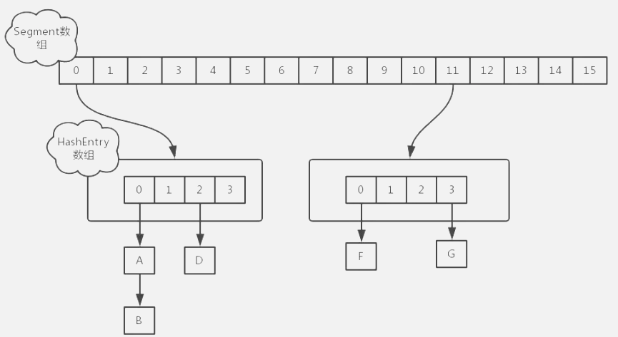

# 1. HashMap和hashtable有什么区别
- HashMap没有考虑同步，是线程不安全的（Collections.synchronizedMap()多线程使用这个）；Hashtable使用了synchronized关键字，是线程安全的；
- HashMap允许K/V都为null；后者K/V都不允许为null；
- HashMap继承自AbstractMap类；而Hashtable继承自Dictionary类；
- HashTable中的hash数组初始大小是11，增加的方式是 old*2+1。HashMap中hash数组的默认大小是16，而且一定是2的指数
- HashTable直接使用对象的hashCode。而HashMap重新计算hash值。
- hashMap的实现是通过哈希表来实现的，hashtable是一个哈希表实现，都是数组加链表实现；
 
# 2. 解决hash冲突的方法有：
 开放定址法（线性探测再散列，二次探测再散列，伪随机探测再散列）
再哈希法
链地址法（hashmap采用的是）
建立一个公共溢出区

# 3. HashMap的put方法的具体流程
源码：
```
final V putVal(int hash, K key, V value, boolean onlyIfAbsent,
               boolean evict) {
    HashMap.Node<K,V>[] tab; HashMap.Node<K,V> p; int n, i;
    // 1.如果table为空或者长度为0，即没有元素，那么使用resize()方法扩容
    if ((tab = table) == null || (n = tab.length) == 0)
        n = (tab = resize()).length;
    // 2.计算插入存储的数组索引i，此处计算方法同 1.7 中的indexFor()方法
    // 如果数组为空，即不存在Hash冲突，则直接插入数组
    if ((p = tab[i = (n - 1) & hash]) == null)
        tab[i] = newNode(hash, key, value, null);
    // 3.插入时，如果发生Hash冲突，则依次往下判断
    else {
        HashMap.Node<K,V> e; K k;
        // a.判断table[i]的元素的key是否与需要插入的key一样，若相同则直接用新的value覆盖掉旧的value
        // 判断原则equals() - 所以需要当key的对象重写该方法
        if (p.hash == hash &&
                ((k = p.key) == key || (key != null && key.equals(k))))
            e = p;
        // b.继续判断：需要插入的数据结构是红黑树还是链表
        // 如果是红黑树，则直接在树中插入 or 更新键值对
        else if (p instanceof HashMap.TreeNode)
            e = ((HashMap.TreeNode<K,V>)p).putTreeVal(this, tab, hash, key, value);
        // 如果是链表，则在链表中插入 or 更新键值对
        else {
            // i .遍历table[i]，判断key是否已存在：采用equals对比当前遍历结点的key与需要插入数据的key
            //    如果存在相同的，则直接覆盖
            // ii.遍历完毕后任务发现上述情况，则直接在链表尾部插入数据
            //    插入完成后判断链表长度是否 > 8：若是，则把链表转换成红黑树
            for (int binCount = 0; ; ++binCount) {
                if ((e = p.next) == null) {
                    p.next = newNode(hash, key, value, null);
                    if (binCount >= TREEIFY_THRESHOLD - 1) // -1 for 1st
                        treeifyBin(tab, hash);
                    break;
                }
                if (e.hash == hash &&
                        ((k = e.key) == key || (key != null && key.equals(k))))
                    break;
                p = e;
            }
        }
        // 对于i 情况的后续操作：发现key已存在，直接用新value覆盖旧value&返回旧value
        if (e != null) { // existing mapping for key
            V oldValue = e.value;
            if (!onlyIfAbsent || oldValue == null)
                e.value = value;
            afterNodeAccess(e);
            return oldValue;
        }
    }
    ++modCount;
    // 插入成功后，判断实际存在的键值对数量size > 最大容量
    // 如果大于则进行扩容
    if (++size > threshold)
        resize();
    // 插入成功时会调用的方法（默认实现为空）
    afterNodeInsertion(evict);
    return null;
}
```



# 4. HashMap是怎么解决哈希冲突的？
答：在解决这个问题之前，我们首先需要知道什么是哈希冲突，而在了解哈希冲突之前我们还要知道什么是哈希才行；
什么是哈希？
Hash，一般翻译为“散列”，也有直接音译为“哈希”的，这就是把任意长度的输入通过散列算法，变换成固定长度的输出，该输出就是散列值（哈希值）；这种转换是一种压缩映射，也就是，散列值的空间通常远小于输入的空间，不同的输入可能会散列成相同的输出，所以不可能从散列值来唯一的确定输入值。简单的说就是一种将任意长度的消息压缩到某一固定长度的消息摘要的函数。
所有散列函数都有如下一个基本特性：根据同一散列函数计算出的散列值如果不同，那么输入值肯定也不同。但是，根据同一散列函数计算出的散列值如果相同，输入值不一定相同。
什么是哈希冲突？
当两个不同的输入值，根据同一散列函数计算出相同的散列值的现象，我们就把它叫做碰撞（哈希碰撞）。
HashMap的数据结构
在Java中，保存数据有两种比较简单的数据结构：数组和链表。数组的特点是：寻址容易，插入和删除困难；链表的特点是：寻址困难，但插入和删除容易；所以我们将数组和链表结合在一起，发挥两者各自的优势，使用一种叫做链地址法的方式可以解决哈希冲突：



这样我们就可以将拥有相同哈希值的对象组织成一个链表放在hash值所对应的bucket下，但相比于hashCode返回的int类型，我们HashMap初始的容量大小DEFAULT_INITIAL_CAPACITY = 1 << 4（即2的四次方16）要远小于int类型的范围，所以我们如果只是单纯的用hashCode取余来获取对应的bucket这将会大大增加哈希碰撞的概率，并且最坏情况下还会将HashMap变成一个单链表，所以我们还需要对hashCode作一定的优化
hash()函数
上面提到的问题，主要是因为如果使用hashCode取余，那么相当于参与运算的只有hashCode的低位，高位是没有起到任何作用的，所以我们的思路就是让hashCode取值出的高位也参与运算，进一步降低hash碰撞的概率，使得数据分布更平均，我们把这样的操作称为扰动，在JDK 1.8中的hash()函数如下：

```
static final int hash(Object key) {
    int h;
    return (key == null) ? 0 : (h = key.hashCode()) ^ (h >>> 16);// 与自己右移16位进行异或运算（高低位异或）
}
```

这比在JDK 1.7中，更为简洁，相比在1.7中的4次位运算，5次异或运算（9次扰动），在1.8中，只进行了1次位运算和1次异或运算（2次扰动）；

JDK1.8新增红黑树


通过上面的链地址法（使用散列表）和扰动函数我们成功让我们的数据分布更平均，哈希碰撞减少，但是当我们的HashMap中存在大量数据时，加入我们某个bucket下对应的链表有n个元素，那么遍历时间复杂度就为O(n)，为了针对这个问题，JDK1.8在HashMap中新增了红黑树的数据结构，进一步使得遍历复杂度降低至O(logn)；
总结
简单总结一下HashMap是使用了哪些方法来有效解决哈希冲突的：

-  使用链地址法（使用散列表）来链接拥有相同hash值的数据；
-  使用2次扰动函数（hash函数）来降低哈希冲突的概率，使得数据分布更平均；
- 引入红黑树进一步降低遍历的时间复杂度，使得遍历更快；

# 5. HashMap为什么不直接使用hashCode()处理后的哈希值直接作为table的下标？
答：hashCode()方法返回的是int整数类型，其范围为-(2 ^ 31)~(2 ^ 31 - 1)，约有40亿个映射空间，而HashMap的容量范围是在16（初始化默认值）~2 ^ 30，HashMap通常情况下是取不到最大值的，并且设备上也难以提供这么多的存储空间，从而导致通过hashCode()计算出的哈希值可能不在数组大小范围内，进而无法匹配存储位置；

- 面试官：那怎么解决呢？
答：

HashMap自己实现了自己的hash()方法，通过两次扰动使得它自己的哈希值高低位自行进行异或运算，降低哈希碰撞概率也使得数据分布更平均；
在保证数组长度为2的幂次方的时候，使用hash()运算之后的值与运算（&）（数组长度 - 1）来获取数组下标的方式进行存储，这样一来是比取余操作更加有效率，二来也是因为只有当数组长度为2的幂次方时，h&(length-1)才等价于h%length，三来解决了“哈希值与数组大小范围不匹配”的问题；

- 面试官：为什么数组长度要保证为2的幂次方呢？
答：

只有当数组长度为2的幂次方时，h&(length-1)才等价于h%length，即实现了key的定位，2的幂次方也可以减少冲突次数，提高HashMap的查询效率；
如果 length 为 2 的次幂 则 length-1 转化为二进制必定是 11111……的形式，在于 h 的二进制与操作效率会非常的快，而且空间不浪费；如果 length 不是 2 的次幂，比如 length 为 15，则 length - 1 为 14，对应的二进制为 1110，在于 h 与操作，最后一位都为 0 ，而 0001，0011，0101，1001，1011，0111，1101 这几个位置永远都不能存放元素了，空间浪费相当大，更糟的是这种情况中，数组可以使用的位置比数组长度小了很多，这意味着进一步增加了碰撞的几率，减慢了查询的效率！这样就会造成空间的浪费。

- 面试官：那为什么是两次扰动呢？

答：这样就是加大哈希值低位的随机性，使得分布更均匀，从而提高对应数组存储下标位置的随机性&均匀性，最终减少Hash冲突，两次就够了，已经达到了高位低位同时参与运算的目的；

# 6. HashMap在JDK1.7和JDK1.8中有哪些不同


# 7. 为什么HashMap中String、Integer这样的包装类适合作为K？
答：String、Integer等包装类的特性能够保证Hash值的不可更改性和计算准确性，能够有效的减少Hash碰撞的几率

都是final类型，即不可变性，保证key的不可更改性，不会存在获取hash值不同的情况
内部已重写了equals()、hashCode()等方法，遵守了HashMap内部的规范（不清楚可以去上面看看putValue的过程），不容易出现Hash值计算错误的情况；

面试官：如果我想要让自己的Object作为K应该怎么办呢？
答：重写hashCode()和equals()方法

重写hashCode()是因为需要计算存储数据的存储位置，需要注意不要试图从散列码计算中排除掉一个对象的关键部分来提高性能，这样虽然能更快但可能会导致更多的Hash碰撞；
重写equals()方法，需要遵守自反性、对称性、传递性、一致性以及对于任何非null的引用值x，x.equals(null)必须返回false的这几个特性，目的是为了保证key在哈希表中的唯一性；

# 8. 什么是CAS机制


# 9. ConcurrentHashMap和Hashtable的区别？
答：ConcurrentHashMap 结合了 HashMap 和 HashTable 二者的优势。HashMap 没有考虑同步，HashTable 考虑了同步的问题。但是 HashTable 在每次同步执行时都要锁住整个结构。 ConcurrentHashMap 锁的方式是稍微细粒度的。
面试官：ConcurrentHashMap的具体实现知道吗？

参考资料：http://www.importnew.com/23610.html

答：在JDK1.7中，ConcurrentHashMap采用Segment + HashEntry的方式进行实现，结构如下：



该类包含两个静态内部类 HashEntry 和 Segment ；前者用来封装映射表的键值对，后者用来充当锁的角色；
Segment 是一种可重入的锁 ReentrantLock，每个 Segment 守护一个HashEntry 数组里得元素，当对 HashEntry 数组的数据进行修改时，必须首先获得对应的 Segment 锁。

在JDK1.8中，放弃了Segment臃肿的设计，取而代之的是采用Node + CAS + Synchronized来保证并发安全进行实现，结构如下：


## 9.1. put实现
当执行put方法插入数据时，根据key的hash值，在Node数组中找到相应的位置，实现如下：

- 如果相应位置的Node还未初始化，则通过CAS插入相应的数据；

```
else if ((f = tabAt(tab, i = (n - 1) & hash)) == null) {
    if (casTabAt(tab, i, null, new Node<K,V>(hash, key, value, null)))
        break;                   // no lock when adding to empty bin
}
```
- 如果相应位置的Node不为空，且当前该节点不处于移动状态，则对该节点加synchronized锁，如果该节点的hash不小于0，则遍历链表更新节点或插入新节点；

```
if (fh >= 0) {
    binCount = 1;
    for (Node<K,V> e = f;; ++binCount) {
        K ek;
        if (e.hash == hash &&
            ((ek = e.key) == key ||
             (ek != null && key.equals(ek)))) {
            oldVal = e.val;
            if (!onlyIfAbsent)
                e.val = value;
            break;
        }
        Node<K,V> pred = e;
        if ((e = e.next) == null) {
            pred.next = new Node<K,V>(hash, key, value, null);
            break;
        }
    }
}
```

- 如果该节点是TreeBin类型的节点，说明是红黑树结构，则通过putTreeVal方法往红黑树中插入节点；


```
else if (f instanceof TreeBin) {
    Node<K,V> p;
    binCount = 2;
    if ((p = ((TreeBin<K,V>)f).putTreeVal(hash, key, value)) != null) {
        oldVal = p.val;
        if (!onlyIfAbsent)
            p.val = value;
    }
}
```
- 如果binCount不为0，说明put操作对数据产生了影响，如果当前链表的个数达到8个，则通过treeifyBin方法转化为红黑树，如果oldVal不为空，说明是一次更新操作，没有对元素个数产生影响，则直接返回旧值；

```
if (binCount != 0) {
    if (binCount >= TREEIFY_THRESHOLD)
        treeifyBin(tab, i);
    if (oldVal != null)
        return oldVal;
    break;
}
```
- 如果插入的是一个新节点，则执行addCount()方法尝试更新元素个数baseCount；

## 9.2. size实现
1.8中使用一个volatile类型的变量baseCount记录元素的个数，当插入新数据或则删除数据时，会通过addCount()方法更新baseCount，实现如下：
```
if ((as = counterCells) != null ||
    !U.compareAndSwapLong(this, BASECOUNT, b = baseCount, s = b + x)) {
    CounterCell a; long v; int m;
    boolean uncontended = true;
    if (as == null || (m = as.length - 1) < 0 ||
        (a = as[ThreadLocalRandom.getProbe() & m]) == null ||
        !(uncontended =
          U.compareAndSwapLong(a, CELLVALUE, v = a.value, v + x))) {
        fullAddCount(x, uncontended);
        return;
    }
    if (check <= 1)
        return;
    s = sumCount();
}
```

- 初始化时counterCells为空，在并发量很高时，如果存在两个线程同时执行CAS修改baseCount值，则失败的线程会继续执行方法体中的逻辑，使用CounterCell记录元素个数的变化；

- 如果CounterCell数组counterCells为空，调用fullAddCount()方法进行初始化，并插入对应的记录数，通过CAS设置cellsBusy字段，只有设置成功的线程才能初始化CounterCell数组，实现如下：

```
else if (cellsBusy == 0 && counterCells == as &&
         U.compareAndSwapInt(this, CELLSBUSY, 0, 1)) {
    boolean init = false;
    try {                           // Initialize table
        if (counterCells == as) {
            CounterCell[] rs = new CounterCell[2];
            rs[h & 1] = new CounterCell(x);
            counterCells = rs;
            init = true;
        }
    } finally {
        cellsBusy = 0;
    }
    if (init)
        break;
}
```

- 如果通过CAS设置cellsBusy字段失败的话，则继续尝试通过CAS修改baseCount字段，如果修改baseCount字段成功的话，就退出循环，否则继续循环插入CounterCell对象；

```

else if (U.compareAndSwapLong(this, BASECOUNT, v = baseCount, v + x))
    break;
```
所以在1.8中的size实现比1.7简单多，因为元素个数保存baseCount中，部分元素的变化个数保存在CounterCell数组中，实现如下：


```
public int size() {
    long n = sumCount();
    return ((n < 0L) ? 0 :
            (n > (long)Integer.MAX_VALUE) ? Integer.MAX_VALUE :
            (int)n);
}
 
final long sumCount() {
    CounterCell[] as = counterCells; CounterCell a;
    long sum = baseCount;
    if (as != null) {
        for (int i = 0; i < as.length; ++i) {
            if ((a = as[i]) != null)
                sum += a.value;
        }
    }
    return sum;
}
```
通过累加baseCount和CounterCell数组中的数量，即可得到元素的总个数

# 10. Java集合的快速失败机制 “fail-fast”？
答：
是java集合的一种错误检测机制，当多个线程对集合进行结构上的改变的操作时，有可能会产生 fail-fast 机制。
例如：假设存在两个线程（线程1、线程2），线程1通过Iterator在遍历集合A中的元素，在某个时候线程2修改了集合A的结构（是结构上面的修改，而不是简单的修改集合元素的内容），那么这个时候程序就会抛出 ConcurrentModificationException 异常，从而产生fail-fast机制。
原因：迭代器在遍历时直接访问集合中的内容，并且在遍历过程中使用一个 modCount 变量。集合在被遍历期间如果内容发生变化，就会改变modCount的值。每当迭代器使用hashNext()/next()遍历下一个元素之前，都会检测modCount变量是否为expectedmodCount值，是的话就返回遍历；否则抛出异常，终止遍历。
解决办法：
1. 在遍历过程中，所有涉及到改变modCount值得地方全部加上synchronized。
2. 使用CopyOnWriteArrayList来替换ArrayList


# 11. ArrayList 和 Vector 的区别？
答：
这两个类都实现了 List 接口（List 接口继承了 Collection 接口），他们都是有序集合，即存储在这两个集合中的元素位置都是有顺序的，相当于一种动态的数组，我们以后可以按位置索引来取出某个元素，并且其中的数据是允许重复的，这是与 HashSet 之类的集合的最大不同处，HashSet 之类的集合不可以按索引号去检索其中的元素，也不允许有重复的元素。
ArrayList 与 Vector 的区别主要包括两个方面：

同步性：
Vector 是线程安全的，也就是说它的方法之间是线程同步（加了synchronized 关键字）的，而 ArrayList 是线程不安全的，它的方法之间是线程不同步的。如果只有一个线程会访问到集合，那最好是使用 ArrayList，因为它不考虑线程安全的问题，所以效率会高一些；如果有多个线程会访问到集合，那最好是使用 Vector，因为不需要我们自己再去考虑和编写线程安全的代码。
数据增长：
ArrayList 与 Vector 都有一个初始的容量大小，当存储进它们里面的元素的个人超过了容量时，就需要增加 ArrayList 和 Vector 的存储空间，每次要增加存储空间时，不是只增加一个存储单元，而是增加多个存储单元，每次增加的存储单元的个数在内存空间利用与程序效率之间要去的一定的平衡。Vector 在数据满时（加载因子1）增长为原来的两倍（扩容增量：原容量的 2 倍），而 ArrayList 在数据量达到容量的一半时（加载因子 0.5）增长为原容量的 (0.5 倍 + 1) 个空间


# 12. ArrayList和LinkedList的区别？
答：

LinkedList 实现了 List 和 Deque 接口，一般称为双向链表；ArrayList 实现了 List 接口，动态数组；
LinkedList 在插入和删除数据时效率更高，ArrayList 在查找某个 index 的数据时效率更高；
LinkedList 比 ArrayList 需要更多的内存；

面试官：Array 和 ArrayList 有什么区别？什么时候该应 Array 而不是 ArrayList 呢？
答：它们的区别是：

Array 可以包含基本类型和对象类型，ArrayList 只能包含对象类型。
Array 大小是固定的，ArrayList 的大小是动态变化的。
ArrayList 提供了更多的方法和特性，比如：addAll()，removeAll()，iterator() 等等。

对于基本类型数据，集合使用自动装箱来减少编码工作量。但是，当处理固定大小的基本数据类型的时候，这种方式相对比较慢。

# 13. HashSet是如何保证数据不可重复的？
答：HashSet的底层其实就是HashMap，只不过我们HashSet是实现了Set接口并且把数据作为K值，而V值一直使用一个相同的虚值来保存，我们可以看到源码：
```
public boolean add(E e) {
    return map.put(e, PRESENT)==null;// 调用HashMap的put方法,PRESENT是一个至始至终都相同的虚值
}

```
由于HashMap的K值本身就不允许重复，并且在HashMap中如果K/V相同时，会用新的V覆盖掉旧的V，然后返回旧的V，那么在HashSet中执行这一句话始终会返回一个false，导致插入失败，这样就保证了数据的不可重复性；

# 14. BlockingQueue是什么？
答：
Java.util.concurrent.BlockingQueue是一个队列，在进行检索或移除一个元素的时候，它会等待队列变为非空；当在添加一个元素时，它会等待队列中的可用空间。BlockingQueue接口是Java集合框架的一部分，主要用于实现生产者-消费者模式。我们不需要担心等待生产者有可用的空间，或消费者有可用的对象，因为它都在BlockingQueue的实现类中被处理了。Java提供了集中BlockingQueue的实现，比如ArrayBlockingQueue、LinkedBlockingQueue、PriorityBlockingQueue,、SynchronousQueue等

