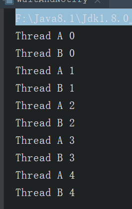
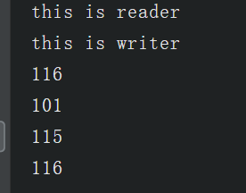

# 1.  锁与同步
- 在Java中，锁的概念都是**基于对象**的，所以我们又经常称它为对象锁。
- 线程和锁的关系，我们可以用婚姻关系来理解。一个锁同一时间只能被一个线程持有。也就是说，一个锁如果和一个线程“结婚”（持有），那其他线程如果需要得到这个锁，就得等这个线程和这个锁“离婚”（释放）

在我们的线程之间，有一个同步的概念。
什么是同步呢，假如我们现在有2位正在抄暑假作业答案的同学：线程A和线程B。当他们正在抄的时候，老师突然来修改了一些答案，可能A和B最后写出的暑假作业就不一样。我们为了A,B能写出2本相同的暑假作业，我们就需要让老师先修改答案，然后A，B同学再抄。或者A，B同学先抄完，老师再修改答案。这就是线程A，线程B的线程同步

- 线程同步是线程之间按照一定的顺序执行。
为了达到线程同步，我们可以使用锁来实现它

## 1.1. 例子
我们先来看看一个无锁的程序：
```
public class NoneLock {

    static class ThreadA implements Runnable {
        @Override
        public void run() {
            IntStream.range(0, 100).forEach(i -> System.out.println("Thread A " + i));
        }
    }

    static class ThreadB implements Runnable {
        @Override
        public void run() {
            IntStream.range(0, 100).forEach(i -> System.out.println("Thread B " + i));
        }
    }

    public static void main(String[] args) {
        new Thread(new ThreadA()).start();
        new Thread(new ThreadB()).start();
    }
}
```
## 1.2. 结果
- 第一次

```
Thread A 0
Thread A 1
Thread B 0
Thread A 2
Thread B 1
Thread A 3
Thread B 2
Thread A 4
Thread B 3
Thread A 5
Thread B 4
Thread A 6
Thread B 5
```
- 第二次
```
Thread B 0
Thread B 1
Thread B 2
Thread B 3
Thread B 4
Thread B 5
Thread B 6
Thread B 7
Thread B 8
Thread B 9
```
- 执行这个程序，你会在控制台看到，线程A和线程B各自独立工作，输出自己的打印值。如下是我的电脑上某一次运行的结果。每一次运行结果都会不一样
## 1.3. 新需求
那我现在有一个需求，我想等A先执行完之后，再由B去执行，怎么办呢？最简单的方式就是使用一个“对象锁”：
```
public class ObjectLock {
    private static Object lock = new Object();

    static class ThreadA implements Runnable {
        @Override
        public void run() {
            synchronized (lock) {
                for (int i = 0; i < 100; i++) {
                    System.out.println("Thread A " + i);
                }
            }
        }
    }

    static class ThreadB implements Runnable {
        @Override
        public void run() {
            synchronized (lock) {
                for (int i = 0; i < 100; i++) {
                    System.out.println("Thread B " + i);
                }
            }
        }
    }

    public static void main(String[] args) throws InterruptedException {
        new Thread(new ThreadA()).start();
        Thread.sleep(10);
        new Thread(new ThreadB()).start();
    }
}
```
- 这里声明了一个名字为lock的对象锁。我们在ThreadA和ThreadB内需要同步的代码块里，都是用synchronized关键字加上了同一个对象锁lock

- 上文我们说到了，根据线程和锁的关系，同一时间只有一个线程持有一个锁，那么线程B就会等线程A执行完成后释放lock，线程B才能获得锁lock。
- 这里在主线程里使用sleep方法睡眠了10毫秒，是为了防止线程B先得到锁。因为如果同时start，线程A和线程B都是出于就绪状态，操作系统可能会先让B运行。这样就会先输出B的内容，然后B执行完成之后自动释放锁，线程A再执行。

# 2. 等待/通知机制
上面一种基于“锁”的方式，线程需要不断地去尝试获得锁，如果失败了，再继续尝试。这可能会耗费服务器资源。
而等待/通知机制是另一种方式。
Java多线程的等待/通知机制是基于Object类的wait()方法和notify(), notifyAll()方法来实现的。
notify()方法会随机叫醒一个正在等待的线程，而notifyAll()会叫醒所有正在等待的线程。
前面我们讲到，一个锁同一时刻只能被一个线程持有。而假如线程A现在持有了一个锁lock并开始执行，它可以使用lock.wait()让自己进入等待状态。这个时候，lock这个锁是被释放了的。
这时，线程B获得了lock这个锁并开始执行，它可以在某一时刻，使用lock.notify()，通知之前持有lock锁并进入等待状态的线程A，说“线程A你不用等了，可以往下执行了”。
需要注意的是，这个时候线程B并没有释放锁lock，除非线程B这个时候使用lock.wait()释放锁，或者线程B执行结束自行释放锁，线程A才能得到lock锁。
我们用代码来实现一下：
```
public class WaitAndNotify {
    private static Object lock = new Object();

    static class ThreadA implements Runnable {
        @Override
        public void run() {
            synchronized (lock) {
                for (int i = 0; i < 5; i++) {
                    try {
                        System.out.println("ThreadA: " + i);
                        lock.notify();
                        lock.wait();
                    } catch (InterruptedException e) {
                        e.printStackTrace();
                    }
                }
                lock.notify();
            }
        }
    }

    static class ThreadB implements Runnable {
        @Override
        public void run() {
            synchronized (lock) {
                for (int i = 0; i < 5; i++) {
                    try {
                        System.out.println("ThreadB: " + i);
                        lock.notify();
                        lock.wait();
                    } catch (InterruptedException e) {
                        e.printStackTrace();
                    }
                }
                lock.notify();
            }
        }
    }

    public static void main(String[] args) throws InterruptedException {
        new Thread(new ThreadA()).start();
        Thread.sleep(1000);
        new Thread(new ThreadB()).start();
    }
}
```

// 输出：

在这个Demo里，线程A和线程B首先打印出自己需要的东西，然后使用notify()方法叫醒另一个正在等待的线程，然后自己使用wait()方法陷入等待并释放lock锁。
需要注意的是等待/通知机制使用的是使用同一个对象锁，如果你两个线程使用的是不同的对象锁，那它们之间是不能用等待/通知机制通信的。

# 3. 管道
管道是基于“管道流”的通信方式。JDK提供了PipedWriter、 PipedReader、 PipedOutputStream、 PipedInputStream。其中，前面两个是基于字符的，后面两个是基于字节流的。
这里的示例代码使用的是基于字符的：
```
public class Pipe {
    static class ReaderThread implements Runnable {
        private PipedReader reader;

        public ReaderThread(PipedReader reader) {
            this.reader = reader;
        }

        @Override
        public void run() {
            System.out.println("this is reader");
            int receive = 0;
            try {
                while ((receive = reader.read()) != -1) {
                    System.out.print((char)receive);
                }
            } catch (IOException e) {
                e.printStackTrace();
            }
        }
    }

    static class WriterThread implements Runnable {

        private PipedWriter writer;

        public WriterThread(PipedWriter writer) {
            this.writer = writer;
        }

        @Override
        public void run() {
            System.out.println("this is writer");
            int receive = 0;
            try {
                writer.write("test");
            } catch (IOException e) {
                e.printStackTrace();
            } finally {
                try {
                    writer.close();
                } catch (IOException e) {
                    e.printStackTrace();
                }
            }
        }
    }

    public static void main(String[] args) throws IOException, InterruptedException {
        PipedWriter writer = new PipedWriter();
        PipedReader reader = new PipedReader();
        writer.connect(reader); // 这里注意一定要连接，才能通信

        new Thread(new ReaderThread(reader)).start();
        Thread.sleep(1000);
        new Thread(new WriterThread(writer)).start();
    }
}

```
// 输出：
this is reader
this is writer
test
我们通过线程的构造函数，传入了PipedWrite和PipedReader对象。可以简单分析一下这个示例代码的执行流程：
线程ReaderThread开始执行，
线程ReaderThread使用管道reader.read()进入”阻塞“，
线程WriterThread开始执行，
线程WriterThread用writer.write("test")往管道写入字符串，
线程WriterThread使用writer.close()结束管道写入，并执行完毕，
线程ReaderThread接受到管道输出的字符串并打印，
线程ReaderThread执行完毕。
管道通信的应用场景：
这个很好理解。使用管道多半与I/O流相关。当我们一个线程需要先另一个线程发送一个信息（比如字符串）或者文件等等时，就需要使用管道通信了。



# 4. 它通信相关
以上介绍了一些线程间通信的基本原理和方法。除此以外，还有一些与线程通信相关的知识点，这里一并介绍。
## 4.1. join方法
join()方法是Thread类的一个实例方法。它的作用是让当前线程陷入“等待”状态，等join的这个线程执行完成后，再继续执行当前线程。
有时候，主线程创建并启动了子线程，如果子线程中需要进行大量的耗时运算，主线程往往将早于子线程结束之前结束。
如果主线程想等待子线程执行完毕后，获得子线程中的处理完的某个数据，就要用到join方法了。
示例代码：
```
public class Join {
    static class ThreadA implements Runnable {

        @Override
        public void run() {
            try {
                System.out.println("我是子线程，我先睡一秒");
                Thread.sleep(1000);
                System.out.println("我是子线程，我睡完了一秒");
            } catch (InterruptedException e) {
                e.printStackTrace();
            }
        }
    }

    public static void main(String[] args) throws InterruptedException {
        Thread thread = new Thread(new ThreadA());
        thread.start();
        thread.join();
        System.out.println("如果不加join方法，我会先被打出来，加了就不一样了");
    }
}
```
注意join()方法有两个重载方法，一个是join(long)， 一个是join(long, int)。
实际上，通过源码你会发现，join()方法及其重载方法底层都是利用了wait(long)这个方法。
对于join(long, int)，通过查看源码(JDK 1.8)发现，底层并没有精确到纳秒，而是对第二个参数做了简单的判断和处理。

# 5. 通过共享对象通信
有一个简单的实现线程之间通信的方式，就是在共享对象的变量中设置信号值。比如线程A在一个同步块中设置一个成员变量hasDataToProcess值为true，而线程B同样在一个同步块中读取这个成员变量。下面例子演示了一个持有信号值的对象，并提供了设置信号值和获取信号值的同步方法：

```
public class MySignal {
    private boolean hasDataToProcess;

    public synchronized void setHasDataToProcess(boolean hasData){
        this.hasDataToProcess=hasData;
    }
    public synchronized boolean hasDataToProcess(){
        return this.hasDataToProcess;
    }

}

```
ThreadB计算完成会在共享对象中设置信号值：

```
public class ThreadB extends Thread{
    int count;
    MySignal mySignal;
    public ThreadB(MySignal mySignal){
        this.mySignal=mySignal;
    }
    @Override
    public void run(){
        for(int i=0;i<100;i++){
            count=count+1;
        }
        try {
            Thread.sleep(500);
        } catch (InterruptedException e) {
            e.printStackTrace();
        }
        mySignal.setHasDataToProcess(true);
    }
}

```
ThreadA在循环中一直检测共享对象的信号值，等待ThreadB计算完成的信号：

```
public class ThreadA extends Thread{
    MySignal mySignal;
    ThreadB threadB;
    public ThreadA(MySignal mySignal, ThreadB threadB){
        this.mySignal=mySignal;
        this.threadB=threadB;
    }
    @Override
    public void run(){
        while (true){
            if(mySignal.hasDataToProcess()){
                System.out.println("线程B计算结果为:"+threadB.count);
                break;
            }
        }
    }
    public static void main(String[] args) {
        MySignal mySignal=new MySignal();
        ThreadB threadB=new ThreadB(mySignal);
        ThreadA threadA=new ThreadA(mySignal,threadB);
        threadB.start();
        threadA.start();
    }
}
```

很明显，采用共享对象方式通信的线程A和线程B必须持有同一个MySignal对象的引用，这样它们才能彼此检测到对方设置的信号。当然，信号也可存储在共享内存buffer中，它和实例是分开的

