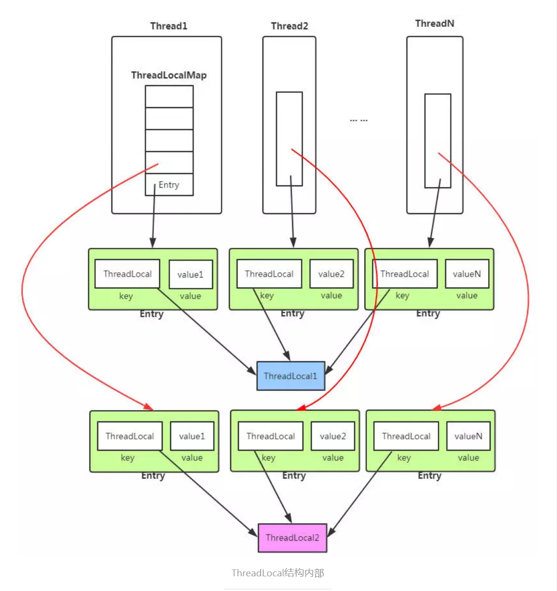

# 1. ThreadLocal是什么
通常情况下，我们创建的变量是可以被任何一个线程访问并修改的。而使用ThreadLocal创建的变量只能被当前线程访问，其他线程则无法访问和修改。
# 2. 从数据结构入手


从上面的结构图，我们已经窥见ThreadLocal的核心机制：

- 每个Thread线程内部都有一个Map。
-  Map里面存储线程本地对象（key）和线程的变量副本（value）
- 但是，Thread内部的Map是由ThreadLocal维护的，由ThreadLocal负责向map获取和设置线程的变量值。
所以对于不同的线程，每次获取副本值时，别的线程并不能获取到当前线程的副本值，形成了副本的隔离，互不干扰。

Thread线程内部的Map在类中描述如下：

```
public class Thread implements Runnable {
    /* ThreadLocal values pertaining to this thread. This map is maintained
     * by the ThreadLocal class. */
    ThreadLocal.ThreadLocalMap threadLocals = null;
}
```
## 2.1. 深入解析ThreadLocal
ThreadLocal类提供如下几个核心方法：

```
public T get()
public void set(T value)
public void remove()
```
get()方法用于获取当前线程的副本变量值。
set()方法用于保存当前线程的副本变量值。
initialValue()为当前线程初始副本变量值。
remove()方法移除当前前程的副本变量值。
## 2.2. get()方法
```
/**
 * Returns the value in the current thread's copy of this
 * thread-local variable.  If the variable has no value for the
 * current thread, it is first initialized to the value returned
 * by an invocation of the {@link #initialValue} method.
 *
 * @return the current thread's value of this thread-local
 */
public T get() {
    Thread t = Thread.currentThread();
    ThreadLocalMap map = getMap(t);
    if (map != null) {
        ThreadLocalMap.Entry e = map.getEntry(this);
        if (e != null)
            return (T)e.value;
    }
    return setInitialValue();
}

ThreadLocalMap getMap(Thread t) {
    return t.threadLocals;
}

private T setInitialValue() {
    T value = initialValue();
    Thread t = Thread.currentThread();
    ThreadLocalMap map = getMap(t);
    if (map != null)
        map.set(this, value);
    else
        createMap(t, value);
    return value;
}

protected T initialValue() {
    return null;
}
```
步骤：
1.获取当前线程的ThreadLocalMap对象threadLocals
2.从map中获取线程存储的K-V Entry节点。
3.从Entry节点获取存储的Value副本值返回。
4.map为空的话返回初始值null，即线程变量副本为null，在使用时需要注意判断NullPointerException。

## 2.3. set()方法
```
public void set(T value) {
    Thread t = Thread.currentThread();
    ThreadLocalMap map = getMap(t);
    if (map != null)
        map.set(this, value);
    else
        createMap(t, value);
}

ThreadLocalMap getMap(Thread t) {
    return t.threadLocals;
}

void createMap(Thread t, T firstValue) {
    t.threadLocals = new ThreadLocalMap(this, firstValue);
}
```

1.获取当前线程的成员变量map
2.map非空，则重新将ThreadLocal和新的value副本放入到map中。
3.map空，则对线程的成员变量ThreadLocalMap进行初始化创建，并将ThreadLocal和value副本放入map中

## 2.4. remove()方法
```
public void remove() {
 ThreadLocalMap m = getMap(Thread.currentThread());
 if (m != null)
     m.remove(this);
}

ThreadLocalMap getMap(Thread t) {
    return t.threadLocals;
}
```