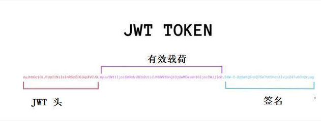

# 1. JWT
- jwt：全称（JSON Web Token），是一个开放标准(RFC 7519)，它定义了一种紧凑的、自包含的方式，用于作为**JSON对象**在各方之间安全地传输信息。是目前最流行的跨域身份验证解决方案。
- 它将**用户信息加密到token**里，服务器不保存任何用户信息。服务器通过使用保存的密钥验证token的正确性，只要正确即通过验证
# 2. 优缺点
## 2.1. 优点 
分布式系统中，
- 很好地解决了单点登录问题
- 很容易解决了session共享的问题
## 2.2. 缺点
- 无法作废已颁布的令牌
- 不易应对数据过期
# 3. 组成

由三部分组成，每个部分它们之间用圆点(.)连接，
例如 ada.ada.ada
## 3.1. Header
 由两部分组成： 
 - token的类型（“JWT”）
 - 算法名称（比如：HMAC SHA256或者RSA等等）
```
例如：{
  “alg”:”HS256”，
  “typ”：“JWT”
}
```
 然后，用Base64对这个JSON编码就得到JWT的第一部分
## 3.2. Payload
是JWT的第二部分
- 是关于实体(通常是用户)和其他数据的声明
```
   例如：{
           “name”：“username”,
            “age”:18
}
```
对payload进行Base64编码就得到JWT的第二部分
注意：不要在JWT的payload或header中放置敏感信息，除非它们是加密的。
## 3.3. Signature
签名部分，你必须有编码过的header、编码过的payload、一个秘钥，签名算法是header中指定的那个，然对它们签名即可
例如：HMACSHA256(base64UrlEncode(header) + "." + base64UrlEncode(payload), secret)
说明：Signature用于验证消息在传递过程中有没有被更改，并且，对于使用私钥签名的token，它还可以验证JWT的发送方是否为它所称的发送方
# 4. 和session比较
   - 相同点：
   都是存储用户信息；
   - 不同点：
    Session是在服务器端的，而JWT是在客户端的。
    Session方式存储用户信息的最大问题在于要占用大量服务器内存，增加服务器的开销
    JWT方式将用户状态分散到了客户端中，可以明显减轻服务端的内存压力
# 5. Token授权是如何工作的
流程：
- 1.用于通过用户名和密码登陆
- 2.服务器校验用户名和密码
- 3.服务器端提供一个token给客户端
- 4.客户端存储token，并在之后的请求中通过header部分携带传入服务器端
- 5.服务器端校验客户端传入的token是否有效
- 6.校验通过访问相应的资源
注意：如果是应用请求来自不同的域，当前应用请设置允许跨域。
# 6. JJWT
- 它是为了更友好在JVM上使用JWT，是基本于JWT, JWS, JWE, JWK框架的Java实现
- 适用于 Java 和 Android 的 JSON Web Token（JWT）库