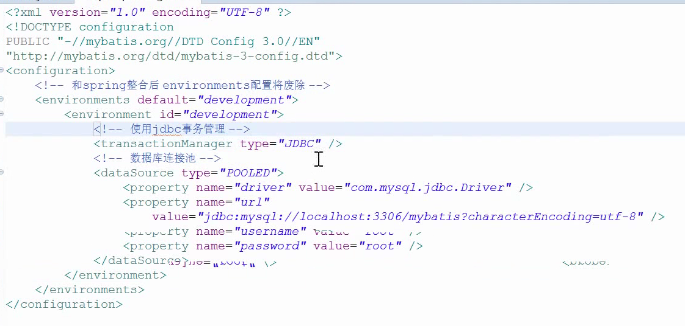
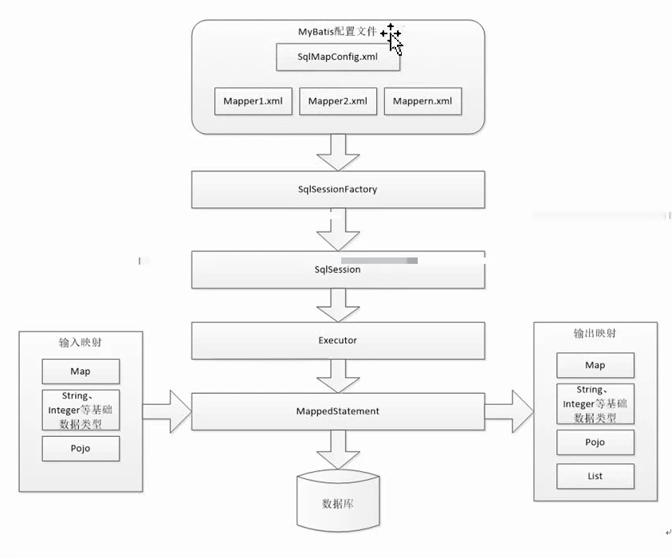

# 1. 创建新项目
## 1.1. 导入必须的jar包

## 1.2. 配置SalMapConfig.xml文件

## 1.3. 配置log4j.properties

## 1.4. MyBatis架构体系

## 1.5. 动态代理dao开发规则
1.	namespace必需是接口的全路径名
2.	接口的方法名必需与映射文件的sql id一致
3.	接口的输入参数必需与映射文件的parameterType类型一致
4.	接口的返回类型必须与映射文件的resultType类型一致
（另一种说法：
Mapper.xml中的namespace等于mapper接口的地址。
Mapper.xml中定义的sql的id（mapped statement的id）等于mapper.java中方法名
Mapper.xml中定义的statement的parametertype等于mapper.java中方法的形参类型。
Mapper.xml中定义的statement的resultType等于mapper.java中方法的返回值类型。
）

# 2. Spring和mybatis整合,dao开发
方法一：

方法二：
Mapper动态代理（推荐）
（1）

（2）使用mapper自动扫描器
即使用mybaits和spring整合包中提供的mapper扫描器，自动扫描mapper，生成动态代理对象，在spring容器注册。

开发两个文件：mapper.java和mapper.xml，注意：mapper.xml和mapper.java同名且在一个目录