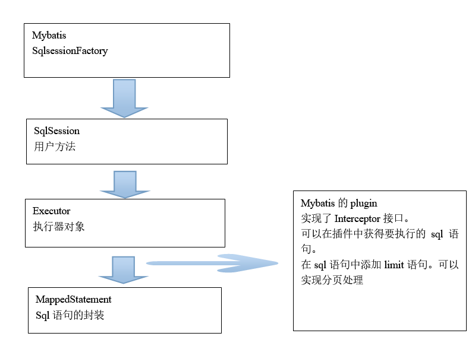

# 1. 分页插件的PageHelper的GitHub地址
https://github.com/pagehelper/Mybatis-PageHelper/tree/master/src/main/java/com/github/pagehelper
# 2. 实现原理

# 3. 使用方法
第一步：引入pageHelper的jar包。
如（maven依赖）
```
   <dependency>
			<groupId>com.github.pagehelper</groupId>
			<artifactId>pagehelper</artifactId>	
			</dependency>
```
第二步：需要在SqlMapConfig.xml中配置插件。
```
<?xml version="1.0" encoding="UTF-8" ?>
<!DOCTYPE configuration
		PUBLIC "-//mybatis.org//DTD Config 3.0//EN"
		"http://mybatis.org/dtd/mybatis-3-config.dtd">
<configuration>
	<!-- 配置分页插件 -->
	<plugins>
		<plugin interceptor="com.github.pagehelper.PageHelper">
			<!-- 设置数据库类型 Oracle,Mysql,MariaDB,SQLite,Hsqldb,PostgreSQL六种数据库-->        
        	<property name="dialect" value="mysql"/>
		</plugin>
	</plugins>
</configuration>

```
第三步：在查询的sql语句执行之前，添加一行代码：
PageHelper.startPage(1, 10);
第一个参数是page，要显示第几页。
第二个参数是rows，没页显示的记录数。
第四步：取查询结果的总数量。
创建一个PageInfo类的对象，从对象中取分页信息
