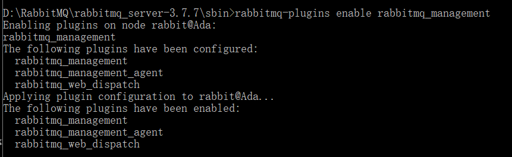
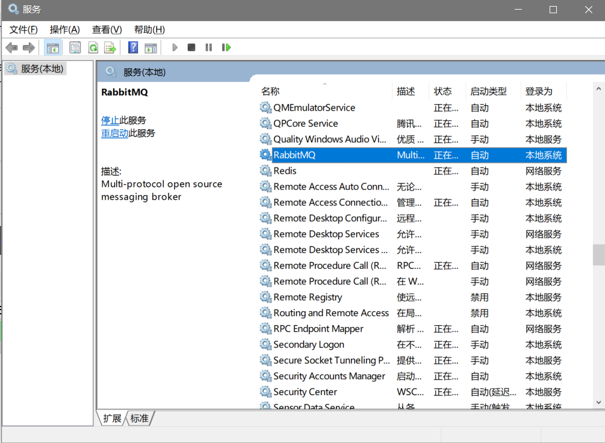
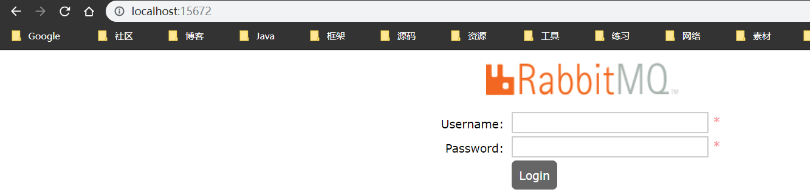
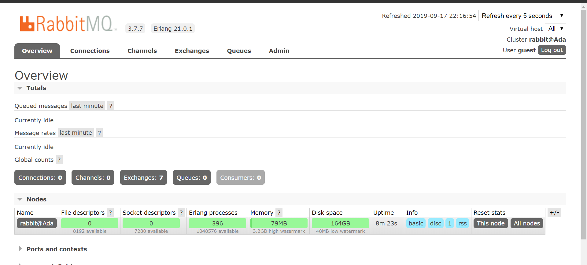
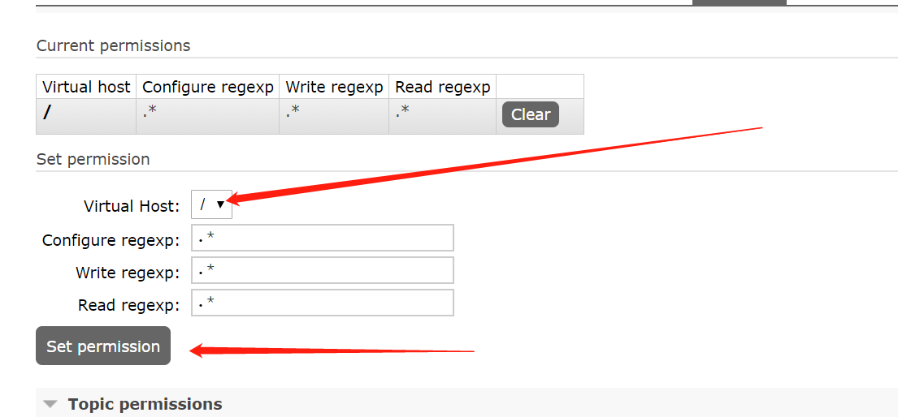

# 1. 下载Erlang和RabbitMQ
```
链接：https://pan.baidu.com/s/1k1hR2OetdlW1n-l_J0Odmw 
提取码：t58v 
复制这段内容后打开百度网盘手机App，操作更方便哦
```

- 在rabbitmq的sbin目录下输入
```
rabbitmq-plugins enable rabbitmq_management
```

- 打开服务可以看到


- 然后打开浏览器，输入localhost:15672

```
默认账户：guest
默认密码：guest
```


# 2. 创建用户 
输入用户名密码就可以创建了，tags表示用户标签，相当于角色，可选值有management、none、policymaker、monitoring和administrator，不同取值所对应的权限区别如下：

## 2.1. none
1.不能访问 management plugin

## 2.2. management
用户可以通过AMQP做的任何事外加：

1.列出自己可以通过AMQP登入的virtual hosts
2.查看自己的virtual hosts中的queues, exchanges 和 bindings
3.查看和关闭自己的channels 和 connections
4.查看有关自己的virtual hosts的“全局”的统计信息，包含其他用户在这些virtual hosts中的活动

## 2.3. policymaker
management可以做的任何事外加：

1.查看、创建和删除自己的virtual hosts所属的policies和parameters

## 2.4. monitoring
management可以做的任何事外加：

1.列出所有virtual hosts，包括他们不能登录的virtual hosts
2.查看其他用户的connections和channels
3.查看节点级别的数据如clustering和memory使用情况
4.查看真正的关于所有virtual hosts的全局的统计信息

## 2.5. administrator
policymaker和monitoring可以做的任何事外加:

1.创建和删除virtual hosts
2.查看、创建和删除users
3.查看创建和删除permissions
4.关闭其他用户的connections

# 3. 基础命令
- 查看已有用户及用户的角色：
```
rabbitmqctl.bat list_users
```
- 新增一个用户：
```
rabbitmqctl.bat add_user username password
```

- 好啦，我们也给 eric 变成 “超级管理员” 角色：
```
rabbitmqctl.bat set_user_tags username administrator

```

- 像我们人一样，我们角色除了是公司的员工，还是父母的孩子、子女的爸妈等，用户也可以同时具有多个角色,设置方式:
```
rabbitmqctl.bat  set_user_tags  username tag1 tag2 ...
```

- 恩，现在总觉得guest 这个不安全（它的默认密码是guest）,想更改密码，好办：
```
rabbitmqctl change_password userName newPassword
```

- 有的人也许会说，我就是看guest不爽，老子新增了administrator用户了，就是想干掉它，可以：
```
rabbitmqctl.bat delete_user username
```

## 3.1. 权限相关命令为：

- 设置用户权限
```
rabbitmqctl  set_permissions  -p  VHostPath  User  ConfP  WriteP  ReadP
```

-  查看(指定hostpath)所有用户的权限信息
```
rabbitmqctl  list_permissions  [-p  VHostPath]
```

- 查看指定用户的权限信息
```
rabbitmqctl  list_user_permissions  User
```

- 清除用户的权限信息
```
rabbitmqctl  clear_permissions  [-p VHostPath]  User
```

 