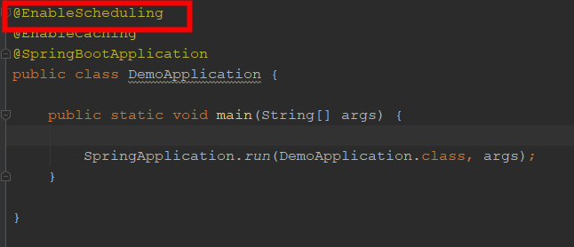
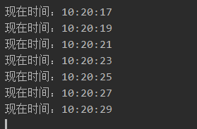
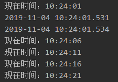
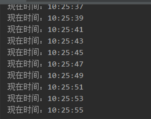

# 1. @MapperScan
之前是在配置中都是要引入@Mapper这个来给每一个mapper类进行配置，显得有点麻烦和冗余
## 1.1. 配置一个

通过使用@MapperScan可以指定要扫描的Mapper类的包的路径,比如:

```
@SpringBootApplication
@MapperScan("com.ada.web.mapper")
// 添加对mapper包扫描
public class Application {
	public static void main(String[] args) {
		SpringApplication.run(Application.class, args);
	}

}
```
## 1.2. 配置多个
同时,使用@MapperScan注解多个包

```
@SpringBootApplication  
@MapperScan({"com.ada.web","com.ada.user"})  
public class App {  
    public static void main(String[] args) {  
       SpringApplication.run(App.class, args);  
    }  
} 

```
## 1.3. 非常规情况
如果如果mapper类没有在Spring Boot主程序可以扫描的包或者子包下面，可以使用如下方式进行配置

```
@SpringBootApplication  
@MapperScan({"com.ada.*.mapper", "com.ada.*.mapper"})  
public class App {  
    public static void main(String[] args) {  
       SpringApplication.run(App.class, args);  
    }  
} 

```

# 2. @GetMapping
Spring4.3中引进了｛@GetMapping、@PostMapping、@PutMapping、@DeleteMapping、@PatchMapping｝，来帮助简化常用的HTTP方法的映射，并更好地表达被注解方法的语义。
  以@GetMapping为例，Spring官方文档说：
  @GetMapping是一个组合注解，是@RequestMapping(method = RequestMethod.GET)的缩写。该注解将HTTP Get 映射到 特定的处理方法上

# 3. @RequestParam
GET和POST请求传的参数会自动转换赋值到@RequestParam 所注解的变量上
@RequestParam 和 @PathVariable 注解是用于从request中接收请求的，两个都可以接收参数，关键点不同的是@RequestParam 是从request里面拿取值，而 @PathVariable 是从一个URI模板里面来填充

- @RequestParam
看下面一段代码：

```
http://localhost:8080/springmvc/hello/101?param1=10&param2=20
```

根据上面的这个URL，你可以用这样的方式来进行获取

```
public String getDetails(
    @RequestParam(value="param1", required=true) String param1,
        @RequestParam(value="param2", required=false) String param2){
...
}

```
@RequestParam 支持下面四种参数

defaultValue 如果本次请求没有携带这个参数，或者参数为空，那么就会启用默认值
name 绑定本次参数的名称，要跟URL上面的一样
required 这个参数是不是必须的
value 跟name一样的作用，是name属性的一个别名

# 4. @RequestBody

@RequestBody注解可以接收json格式的数据，并将其转换成对应的数据类型。

-  @RequestBody接收一个对象
url请求：http://localhost:8080/WxProgram/findBookByName
```
@RequestMapping(value="/findBookByName", method = RequestMethod.POST)
@ResponseBody
public DbBook findBookByName(@RequestBody DbBook book){
    System.out.println("book: " + book.toString());
    System.out.println("book name: " + book.getTitle());
    String bookName = book.getTitle();
    DbBook book = wxService.findBookByName(bookName);    
    return book;
}
```

- @RequestBody接收不同的字符串

(1)前台界面，这里以小程序为例
```
wx.request({
      url: host.host + `/WxProgram/deleteBookById`,
      method: 'POST',
      data: {
        nick: this.data.userInfo.nickName,
        bookIds: bookIds
      },
      success: (res) => {
        console.log(res);
        this.getCollectionListFn();
      },
      fail: (err) => {
        console.log(err);
      }
    })
```
- controller

(2)controller
```
@RequestMapping(value="/deleteBookById",method=RequestMethod.POST)
@ResponseBody
public void deleteBookById(@RequestBody Map<String, String> map){
    String bookIds = map.get("bookIds");
    String nick = map.get("nick");
    String[] idArray = bookIds.split(",");
    Integer userId = wxService.findIdByNick(nick);
    for(String id : idArray){
        Integer bookid = Integer.parseInt(id);
        System.out.println("bookid: " + bookid);
        wxService.removeBookById(bookid, userId);
    }
}
```
@RequestBody
处理HttpEntity传递过来的数据，一般用来处理非Content-Type: application/x-www-form-urlencoded编码格式的数据。

GET请求中，因为没有HttpEntity，所以@RequestBody并不适用。
POST请求中，通过HttpEntity传递的参数，必须要在请求头中声明数据的类型Content-Type，SpringMVC通过使用HandlerAdapter 配置的HttpMessageConverters来解析HttpEntity中的数据，然后绑定到相应的bean上。


@RequestBody用于post请求，不能用于get请求
- @RequestBody用于post请求，不能用于get请求

这里涉及到使用@RequestBody接收不同的对象
1. 创建一个新的entity，将两个entity都进去。这是最简单的，但是不够“优雅”。
2. 用Map<String, Object>接受request body，自己反序列化到各个entity中。
3. 类似方法2，不过更为generic，实现自己的HandlerMethodArgumentResolver
# 5. @ModelAttribute

@ModelAttribute注解类型将参数绑定到Model对象

userTest.jsp
```
<form action="/WxProgram/json/modelAttributeTest" method="post">
    modelAttribute Test<br>
    用户id：<input type="text" name="userId"><br>
    用户名：<input type="text" name="userName"><br>
    用户密码：<input type="password" name="userPwd"><br>
    <input type="submit" value="提交"><br>
</form>
```
name的属性值要跟User的属性相对应。
 UserController.java

```
@RequestMapping(value="/modelAttributeTest", method = RequestMethod.POST)
    public String modelAttributeTest(@ModelAttribute User user){
        System.out.println("modelAttribute Test");
        System.out.println("userid: " + user.getUserId());
        System.out.println("username: " + user.getUserName());
        System.out.println("userpwd: " + user.getUserPwd());
        return "hello";
    }
```
 User.java

```
public class User {
    private Integer userId;
    private String userName;
    private String userPwd;
    
    public User(){
        super();
    }
        //setter and getter      
}
```
当前台界面使用GET或POST方式提交数据时，数据编码格式由请求头的ContentType指定。分为以下几种情况：
1. application/x-www-form-urlencoded，这种情况的数据@RequestParam、@ModelAttribute可以处理，@RequestBody也可以处理。
2. multipart/form-data，@RequestBody不能处理这种格式的数据。（form表单里面有文件上传时，必须要指定enctype属性值为multipart/form-data，意思是以二进制流的形式传输文件。）
3. application/json、application/xml等格式的数据，必须使用@RequestBody来处理
# 6. @PathVariable
请求路径上有个id的变量值，可以通过@PathVariable来获取  @RequestMapping(value = "/page/{id}", method = RequestMethod.GET)

# 7. @Param
dao层示例

```
Public User selectUser(@param(“userName”) String name,@param(“userpassword”) String password);
```

xml映射对应示例

```

<select id=" selectUser" resultMap="BaseResultMap">  
   select  *  from user_user_t   where user_name = #{userName，jdbcType=VARCHAR} and user_password=#{userPassword,jdbcType=VARCHAR}  
</select>
```

注意：采用#{}的方式把@Param注解括号内的参数进行引用（括号内参数对应的是形参如 userName对应的是name）；

- @Param注解JavaBean对象

dao层示例

```
public List<user> getUserInformation(@Param("user") User user);

```
xml映射对应示例


```
<select id="getUserInformation" parameterType="com.github.demo.vo.User" resultMap="userMapper">  
        select   
        <include refid="User_Base_Column_List" />  
        from mo_user t where 1=1  
                      <!-- 因为传进来的是对象所以这样写是取不到值得 -->  
            <if test="user.userName!=null  and user.userName!=''">   and   t.user_name = #{user.userName}  </if>  
            <if test="user.userAge!=null  and user.userAge!=''">   and   t.user_age = #{user.userAge}  </if>  
    </select>  

```

- 使用@Param注解

当以下面的方式进行写SQL语句时：

```
    @Select("select column from table where userid = #{userid} ")
    public int selectColumn(int userid);
```

当你使用了使用@Param注解来声明参数时，如果使用 #{} 或 ${} 的方式都可以。

```
    @Select("select column from table where userid = ${userid} ")
    public int selectColumn(@Param("userid") int userid);
```

当你不使用@Param注解来声明参数时，必须使用使用 #{}方式。如果使用 ${} 的方式，会报错。

```
    @Select("select column from table where userid = ${userid} ")
    public int selectColumn(@Param("userid") int userid);

```


- 不使用@Param注解

不使用@Param注解时，参数只能有一个，并且是Javabean。在SQL语句里可以引用JavaBean的属性，而且只能引用JavaBean的属性。

```
    // 这里id是user的属性

    @Select("SELECT * from Table where id = ${id}")
    Enchashment selectUserById(User user);

```
# 8. @Component 
指示自动扫描组件
@Component是Spring容器中的基本注解，表示容器中的一个组件（bean）可以作用在任何层次，下面的示例介绍该注解的使用方法。
注解配置示例：
```
@Component("userDao")
public class userDao{......}
```
他等效于XML配置
```
<bean id="userDao" class="cn.lovepi.***.userDao"/>
```
- 还有一些其他的可以被用来注解bean的注解，这些可以让注解类本身的用途更加清晰，此外，特定的注解也具备特定的功能。
Spring在2.5后提供了一个context的命名空间，它提供了通过扫描类包来加载利用注解定义的Bean的方式。
在context中可以使用resource-pattern来过滤出特定的类。
```
<context:component-scan base-package="cn.lovepi.spring" resource-pattern="anno/*.class"/>
```
- 默认情况下加载的是package下的*.class即扫描全部类，在使用了resource-pattern之后，则只扫描package下的anno子包下的所有类。
不过使用resource-pattern并不能提供给我们完善的功能，所有我们得使用过滤子元素的方法。
```
<context:component-scan base-package="cn.lovepi.spring">
   <context:include-filter type="regex" expression="cn.lovepi.spring.*"/>
   <context:exclude-filter type="aspectj" expression="cn.lovepi..*Controller+"/>
</context:component-scan>
```
其中：
include-filter表示要包含的目标类，
exclude-filter表示要排除在外的目标类

# 9. @Repository 
表示在持久层DAO组件。
# 10. @Service 
表示在业务层服务组件。
## 10.1. 例如

首先，在applicationContext.xml文件中加一行：
```
<context:component-scan base-package="xxx"/> 
```
加上这一行以后，将自动扫描路径下面的包，如果一个类带了@Service注解，将自动注册到Spring容器，不需要再在applicationContext.xml文件定义bean了，类似的还包括@Component、@Repository、@Controller
```
@Service("courseDAO")
@Scope("prototype")
public class CourseDAOImpl extends HibernateDaoSupport implements CourseDAO{

    ......
    
}
其作用就相当于applicationContext.xml文件里面的：

<bean id="courseDAO"
         class="com.hzhi.course.dao.CourseDAOImpl" scope="prototype">
         ......    
    </bean>
```

# 11. @Controller 
表示在表示层控制器组件

# 12. @Autowired  
当不能确定 Spring 容器中一定拥有某个类的 Bean 时，可以在需要自动注入该类 Bean 的地方可以使用 @Autowired(required = false)，这等于告诉 Spring：在找不到匹配 Bean 时也不报错

# 13. @Scheduled
## 13.1. 使用
- 开启注解

- 代码
```
@Component
public class ScheduledTasks {
    private static final SimpleDateFormat dateFormat = new SimpleDateFormat("HH:mm:ss");

    /**
     * @Scheduled(fixedRate = 2000)上一次开始执行时间点之后5秒再执行
     * @Scheduled(fixedDelay = 5000)上一次执行完毕时间点之后5秒再执行
     * @Scheduled(initialDelay=1000, fixedRate=2000) 第一次延迟1秒后执行，之后按fixedRate的规则每5秒执行一次
     * @Scheduled(cron="*5 * * * * *")
     */
    @Scheduled(cron="0/2 * * * * ?")
    public void print() {
        System.out.println("现在时间：" + dateFormat.format(new Date()));
    }
}
```
## 13.2. 测试结果



## 13.3. cron表达式详解：    

一个cron表达式有至少6个（也可能7个）有空格分隔的时间元素。
      按顺序依次为
      
```
      1  秒（0~59）
      2  分钟（0~59）
      3 小时（0~23）
      4  天（0~31）
      5 月（0~11）
      6  星期（1~7 1=SUN 或 SUN，MON，TUE，WED，THU，FRI，SAT）
      7.年份（1970－2099）
```
其中每个元素可以是一个值(如6),一个连续区间(9-12),一个间隔时间(8-18/4)(/表示每隔4小时),一个列表(1,3,5),通配符。由于"月份中的日期"和"星期中的日期"这两个元素互斥的,必须要对其中一个设置?.

```
       0 0 10,14,16 * * ? 每天上午10点，下午2点，4点
       0 0/30 9-17 * * ?   朝九晚五工作时间内每半小时
       0 0 12 ? * WED 表示每个星期三中午12点
       "0 0 12 * * ?" 每天中午12点触发
       "0 15 10 ? * *" 每天上午10:15触发
       "0 15 10 * * ?" 每天上午10:15触发
       "0 15 10 * * ? *" 每天上午10:15触发
       "0 15 10 * * ? 2005" 2005年的每天上午10:15触发
       "0 * 14 * * ?" 在每天下午2点到下午2:59期间的每1分钟触发
       "0 0/5 14 * * ?" 在每天下午2点到下午2:55期间的每5分钟触发
       "0 0/5 14,18 * * ?" 在每天下午2点到2:55期间和下午6点到6:55期间的每5分钟触发
       "0 0-5 14 * * ?" 在每天下午2点到下午2:05期间的每1分钟触发
       "0 10,44 14 ? 3 WED" 每年三月的星期三的下午2:10和2:44触发
       "0 15 10 ? * MON-FRI" 周一至周五的上午10:15触发
       "0 15 10 15 * ?" 每月15日上午10:15触发
       "0 15 10 L * ?" 每月最后一日的上午10:15触发
       "0 15 10 ? * 6L" 每月的最后一个星期五上午10:15触发
       "0 15 10 ? * 6L 2002-2005" 2002年至2005年的每月的最后一个星期五上午10:15触发
       "0 15 10 ? * 6#3" 每月的第三个星期五上午10:15触发
```

- 例如：      
         子表达式（天（星期））可以为 “MON-FRI”，“MON，WED，FRI”，“MON-WED,SAT”
        “*”字符代表所有可能的值
        “/”字符用来指定数值的增量
- 例如：
         在子表达式（分钟）里的“0/15”表示从第0分钟开始，每15分钟
         在子表达式（分钟）里的“3/20”表示从第3分钟开始，每20分钟（它和“3，23，43”）的含义一样
       “？”字符仅被用于天（月）和天（星期）两个子表达式，表示不指定值
        当2个子表达式其中之一被指定了值以后，为了避免冲突，需要将另一个子表达式的值设为“？”
       “L” 字符仅被用于天（月）和天（星期）两个子表达式，它是单词“last”的缩写
        如果在“L”前有具体的内容，它就具有其他的含义了。例如：“6L”表示这个月的倒数第６天
        注意：在使用“L”参数时，不要指定列表或范围，因为这会导致问题
        W 字符代表着平日(Mon-Fri)，并且仅能用于日域中。它用来指定离指定日的最近的一个平日。大部分的商业处理都是基于工作周的，所以 W 字符可能是非常重要的。
 - 例如
        日域中的 15W 意味着 "离该月15号的最近一个平日。" 假如15号是星期六，那么 trigger 会在14号(星期五)触发，因为星期四比星期一离15号更近。
       C：代表“Calendar”的意思。它的意思是计划所关联的日期，如果日期没有被关联，则相当于日历中所有日期。例如5C在日期字段中就相当于日历5日以后的第一天。1C在星期字段中相当于星期日后的第一天。
       字段   允许值   允许的特殊字符
       秒           0-59           , - * /
       分           0-59           , - * /
       小时           0-23           , - * /
       日期           1-31           , - * ? / L W C
       月份           1-12 或者 JAN-DEC           , - * /
       星期           1-7 或者 SUN-SAT           , - * ? / L C #
       年（可选）           留空, 1970-2099           , - * /

# 14. @Configuration
@Configuration：代表这个类是一个配置类
```
@Target({ElementType.TYPE})
@Retention(RetentionPolicy.RUNTIME)
@Documented
@Component
public @interface Configuration {
    @AliasFor(
        annotation = Component.class
    )
    String value() default "";
}

```

- 条件
- - 配置类不能是 final 类（没法动态代理）
- - 配置类必须是非本地的（即不能将配置类定义在其他类的方法内部，不能是private）
- - 配置类必须有一个无参构造函数
符合上述条件的类，就可以使用@Configuration来进行注解，表示这个类可以使用Spring IoC容器作为bean定义的来源
## 14.1. 例子
```
@Configuration
public class DataSourceConfig {
	@Bean
	public MysqlDataSource mysqlDataSource() {
		return new MysqlDataSource();
	}
	
	@Bean(name = "oracleDataSource")
	public OracleDataSource oracleDataSource() {
		return new OracleDataSource();
	}
}
```
Spring在解析该类时，会识别出标注@Bean的所有方法，执行并将方法的返回值(MysqlDataSource和OracleDataSource对象)注册到IoC容器中。默认情况下，方法名即为Bean的名字。与以上配置等价的XML配置如下：

```
<bean id="mysqlDataSource" class="**.MysqlDataSource"/> 
<bean id="oracleDataSource" class="**.OracleDataSource"/>
```
# 15. @Bean
用@Configuration注解该类，等价 与XML中配置beans；用@Bean标注方法等价于XML中配置bean
@Bean：用来定义一个bean，可以指定初始、销毁方法，及bean范围等
