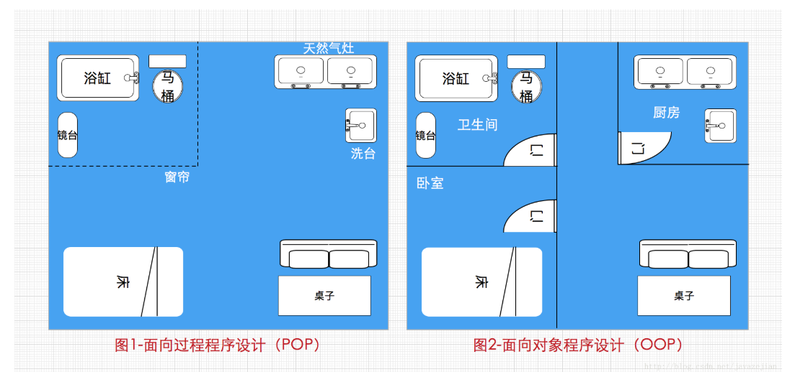
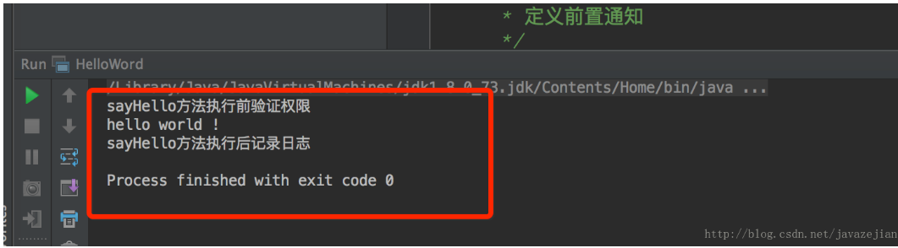
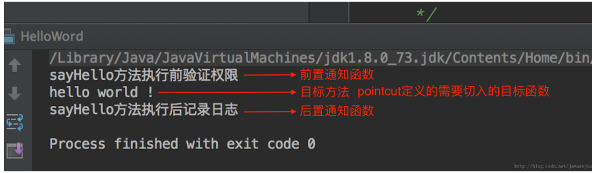
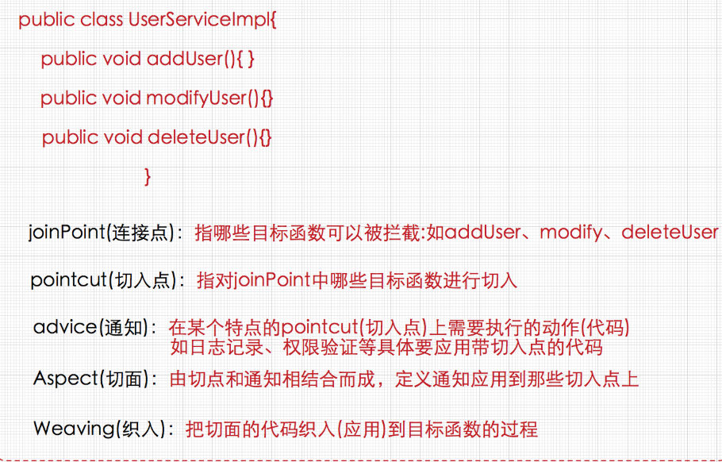
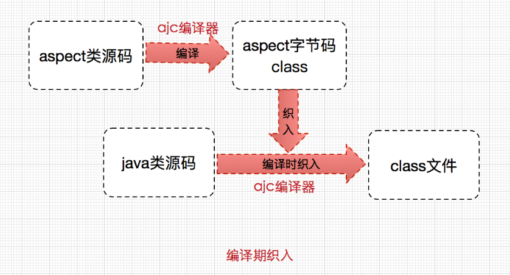
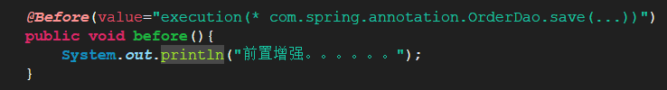
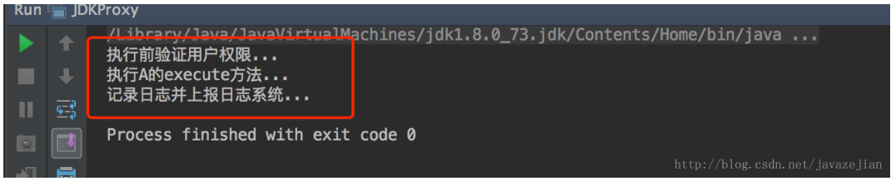
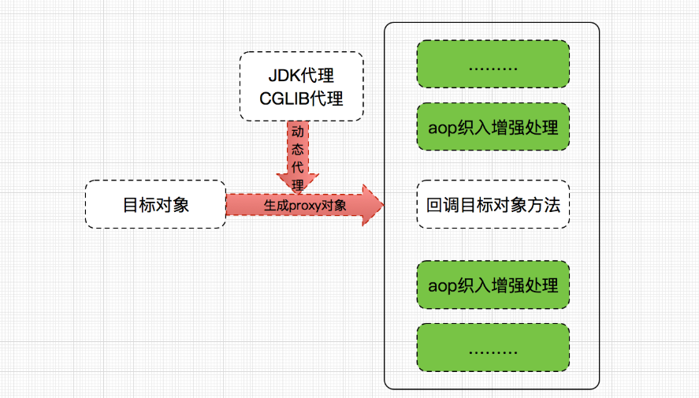

# 1. OOP和POP

＃　例子
```
public class HelloWord {

    public void sayHello(){
        System.out.println("hello world !");－－－－连接点
    }
    public static void main(String args[]){
        HelloWord helloWord =new HelloWord();
        helloWord.sayHello();
    }
}

```
编写AspectJ类，注意关键字为aspect(MyAspectJDemo.aj,其中aj为AspectJ的后缀)，含义与class相同，即定义一个AspectJ的类

```

public aspect MyAspectJDemo {
    /**
     * 定义切点,日志记录切点
     */
    pointcut recordLog():call(* HelloWord.sayHello(..));

    /**
     * 定义切点,权限验证(实际开发中日志和权限一般会放在不同的切面中,这里仅为方便演示)
     */
    pointcut authCheck():call(* HelloWord.sayHello(..));

    /**
     * 定义前置通知!
     */
    before():authCheck(){
        System.out.println("sayHello方法执行前验证权限");
    }

    /**
     * 定义后置通知
     */
    after():recordLog(){
        System.out.println("sayHello方法执行后记录日志");
    }
}

```



对于结果不必太惊讶，完全是意料之中。我们发现，明明只运行了main函数，却在sayHello函数运行前后分别进行了权限验证和日志记录，事实上这就是AspectJ的功劳了。对aspectJ有了感性的认识后，再来聊聊aspectJ到底是什么？AspectJ是一个java实现的AOP框架，它能够对java代码进行AOP编译（一般在编译期进行），让java代码具有AspectJ的AOP功能（当然需要特殊的编译器），可以这样说AspectJ是目前实现AOP框架中最成熟，功能最丰富的语言，更幸运的是，AspectJ与java程序完全兼容，几乎是无缝关联，因此对于有java编程基础的工程师，上手和使用都非常容易。在案例中，我们使用aspect关键字定义了一个类，这个类就是一个切面，它可以是单独的日志切面(功能)，也可以是权限切面或者其他，在切面内部使用了pointcut定义了两个切点，一个用于权限验证，一个用于日志记录，而所谓的切点就是那些需要应用切面的方法，如需要在sayHello方法执行前后进行权限验证和日志记录，那么就需要捕捉该方法，而pointcut就是定义这些需要捕捉的方法（常常是不止一个方法的），这些方法也称为目标方法，最后还定义了两个通知，通知就是那些需要在目标方法前后执行的函数，如before()即前置通知在目标方法之前执行，即在sayHello()方法执行前进行权限验证，另一个是after()即后置通知，在sayHello()之后执行，如进行日志记录。到这里也就可以确定，切面就是切点和通知的组合体，组成一个单独的结构供后续使用，下图协助理解。




切入点(pointcut)和通知(advice)的概念已比较清晰，而切面则是定义切入点和通知的组合如上述使用aspect关键字定义的MyAspectJDemo，把切面应用到目标函数的过程称为织入(weaving)。在前面定义的HelloWord类中除了sayHello函数外，还有main函数，以后可能还会定义其他函数，而这些函数都可以称为目标函数，也就是说这些函数执行前后也都可以切入通知的代码，这些目标函数统称为连接点，切入点(pointcut)的定义正是从这些连接点中过滤出来的，下图协助理解。

# 2. AspectJ的织入方式
织入这个概念，可以简单理解为aspect(切面)应用到目标函数(类)的过程。
对于这个过程，一般分为

- 动态织入
动态织入的方式是在运行时动态将要增强的代码织入到目标类中，这样往往是通过动态代理技术完成的，如Java JDK的动态代理(Proxy，底层通过反射实现)或者CGLIB的动态代理(底层通过继承实现)，Spring AOP采用的就是基于运行时增强的代理技术
- 静态织入
ApectJ采用的就是静态织入的方式。ApectJ主要采用的是编译期织入，在这个期间使用AspectJ的acj编译器(类似javac)把aspect类编译成class字节码后，在java目标类编译时织入，即先编译aspect类再编译目标类


关于ajc编译器，是一种能够识别aspect语法的编译器，它是采用java语言编写的，由于javac并不能识别aspect语法，便有了ajc编译器，注意ajc编译器也可编译java文件


# 3. Spring的AOP（核心）
## 3.1. AOP的概念
	* 面向切面编程是OOP的 扩展和延伸，解决OOP开发遇到的问题
	* AOP采用的是横向抽取机制（代理机制）取代了传统的纵向继承
	* 底层实现的原理：动态代理（
              JDK动态代理，只能对实现 了接口的类产生代理            
              Cglib动态代理，对没有实现接口的类产生代理对象）
              
## 3.2. Spring的AOP开发（AspectJ的XML的方式）
	* Spring的AOP的简介
	* AspectJ是一个AOP的框架  
## 3.3. AOP开发中的术语
	
### 3.3.1. 连接点(Join point)：

能够被拦截的地方：Spring AOP是基于动态代理的，所以是方法拦截的。每个成员方法都可以称之为连接点~
### 3.3.2. 切点(Poincut)：

具体定位的连接点：上面也说了，每个方法都可以称之为连接点，我们具体定位到某一个方法就成为切点。
### 3.3.3. 增强/通知(Advice)：

表示添加到切点的一段逻辑代码，并定位连接点的方位信息。
简单来说就定义了是干什么的，具体是在哪干
Spring AOP提供了5种Advice类型给我们：前置、后置、返回、异常、环绕给我们使用！
### 3.3.4. 织入(Weaving)：

将增强/通知添加到目标类的具体连接点上的过程。
### 3.3.5. 引入/引介(Introduction)：

引入/引介允许我们向现有的类添加新方法或属性。是一种特殊的增强！
### 3.3.6. 切面(Aspect)：

切面由切点和增强/通知组成，它既包括了横切逻辑的定义、也包括了连接点的定义。
在《Spring 实战 (第4版)》给出的总结是这样子的：

通知/增强包含了需要用于多个应用对象的横切行为；连接点是程序执行过程中能够应用通知的所有点；切点定义了通知/增强被应用的具体位置。其中关键的是切点定义了哪些连接点会得到通知/增强。

总的来说：

这些术语可能翻译过来不太好理解，但对我们正常使用AOP的话影响并没有那么大~~看多了就知道它是什么意思了。

# 4. Spring的AOP入门（AspectJ的XML的方式）
## 4.1. 需要的Java包（Spring基础包加上以下几个）
aspectjrt.jar
aspectjweaver.jar
aopalliance-1.0.jar,
	
	Spring整合Junit开发


## 4.2. Spring的通知类型
5.2.1前置通知：在目标方法执行之前进行操作
       *可以获得切入点信息
5.2.2后置通知：之后
        获得方法的返回值
5.2.3环绕通知：之前和之后
5.2.4异常抛出通知：在程序出现异常的时候进行操作
5.2.5最终通知：无论代码是否有异常，总是会被执行

## 4.3. 切入点表达式语法
     #语法：（基于execution的函数完成的）
              [访问修饰符] 方法返回值 包名.类名.方法名（参数）
              #public void com.spring.aop.CustomerDao.save(...)
              #*****Dao.save()
              #*com.spring.aop.CustomerDao+.save(..)   ＋表示是子类
              #*com.spring.aop.CustormerDao.*.*(...)
## 4.4. AOP思想

# 5. Spring的AOP的基于AspectJ注解开发 
## 5.1. 新建工程
导入相关的jar包，新建xml文件，然后在applicationContext.xml之中加入
<aop:aspectj-autoproxy />

## 5.2. Spring的注解AOP的通知类型
@Before：前置通知

@afeterReturning:后置通知

@Around：环绕通知

@AfterThrowing：；异常通知

@After：最终通知

# 6. Spring的JDBC的模板的使用
## 6.1. Spring提供的模板


## 6.2. 将连接池和模板交给Spring管理
在applicationContext.xml文件中配置如下
```
连接池
<bean id="dataSource" class="org.springframework.jdbc.datasource.DriverManagerDataSource">
		<property name="driverClassName" value="com.mysql.jdbc.Driver"/>
		<property name="url" value="jdbc:mysql:///test"/>
		<property name="username" value="root"/>
		<property name="password" value="123"/>
	</bean>
	jdbc模板
<bean id="jdbcTemplate" class="org.springframework.jdbc.core.JdbcTemplate">
		<property name="dataSource" ref="dataSource" />
	</bean>
```

# 7. 使用开源的数据库连接池
## 7.1. DBCP的使用
### 7.1.1. 引入jar包

### 7.1.2. 配置applicationContext.xml文件
```<bean id="dataSource" class="org.apache.commons.dbcp.BasicDataSource">
		<property name="driverClassName" value="com.mysql.jdbc.Driver" />
		<property name="url" value="jdbc:mysql:///test" />
		<property name="username" value="root" />
		<property name="password" value="123" />
	</bean>
```

## 7.2. C3P0的使用 
引入Jar包

配置applicationContext.xml文件
```<bean id="dataSource" class="com.mchange.v2.c3p0.ComboPooledDataSource">
		<property name="driverClass" value="${jdbc.driverClass}" />
		<property name="jdbcUrl" value="${jdbc.url}" />
		<property name="user" value="${jdbc.username}" />
		<property name="password" value="${jdbc.password}" />
	</bean>
```
属性文件：
```jdbc.driverClass=com.mysql.jdbc.Driver
jdbc.url=jdbc:mysql:///test
jdbc.username=root
jdbc.password=123
```
引入属性文件
方式一：（很少情况使用）
```
<bean class="org.springframework.beans.factory.config.PropertyPlaceholderConfigurer"> 
		<property name="location" value="classpath:jdbc.properties"/>
```
方式二：
```
<context:property-placeholder location="classpath:jdbc.properties"></context:property-placeholder>
```

# 8. 通配符
在定义匹配表达式时，通配符几乎随处可见，如*、.. 、+ ，它们的含义如下：

.. ：匹配方法定义中的任意数量的参数，此外还匹配类定义中的任意数量包

```
//任意返回值，任意名称，任意参数的公共方法
execution(public * *(..))
//匹配xxx包及其子包中所有类中的所有方法
within(xxx..*)
```

＋ ：匹配给定类的任意子类

```
//匹配实现了DaoUser接口的所有子类的方法
within(com.xxx.dao.DaoUser+)
```

＊ ：匹配任意数量的字符

```
//匹配com.xxx.service包及其子包中所有类的所有方法
within(com.xxx.service..*)
//匹配以set开头，参数为int类型，任意返回值的方法
execution(* set*(int))
```

## 8.1. 类型签名表达式
为了方便类型（如接口、类名、包名）过滤方法，Spring AOP 提供了within关键字。其语法格式如下：

within(<type name>)
## 8.2. 其他指示符
bean：Spring AOP扩展的，AspectJ没有对于指示符，用于匹配特定名称的Bean对象的执行方法；

//匹配名称中带有后缀Service的Bean。
@Pointcut("bean(*Service)")
private void myPointcut1(){}

this ：用于匹配当前AOP代理对象类型的执行方法；请注意是AOP代理对象的类型匹配，这样就可能包括引入接口也类型匹配

//匹配了任意实现了UserDao接口的代理对象的方法进行过滤
@Pointcut("this(com.zejian.spring.springAop.dao.UserDao)")
private void myPointcut2(){}
target ：用于匹配当前目标对象类型的执行方法；

//匹配了任意实现了UserDao接口的目标对象的方法进行过滤
@Pointcut("target(com.zejian.spring.springAop.dao.UserDao)")
private void myPointcut3(){}

@within：用于匹配所以持有指定注解类型内的方法；请注意与within是有区别的， within是用于匹配指定类型内的方法执行；

//匹配使用了MarkerAnnotation注解的类(注意是类)
@Pointcut("@within(com.zejian.spring.annotation.MarkerAnnotation)")
private void myPointcut4(){}

@annotation(com.zejian.spring.MarkerMethodAnnotation) : 根据所应用的注解进行方法过滤

//匹配使用了MarkerAnnotation注解的方法(注意是方法)
@Pointcut("@annotation(com.zejian.spring.annotation.MarkerAnnotation)")
private void myPointcut5(){}

# 9. Spring AOP的实现原理概要
前面的分析中，我们谈到Spring AOP的实现原理是基于动态织入的动态代理技术，而AspectJ则是静态织入，而动态代理技术又分为Java JDK动态代理和CGLIB动态代理，前者是基于反射技术的实现，后者是基于继承的机制实现，下面通过一个简单的例子来分析这两种技术的代码实现
## 9.1. JDK动态代理
先看一个简单的例子，声明一个A类并实现ExInterface接口，利用JDK动态代理技术在execute()执行前后织入权限验证和日志记录，注意这里仅是演示代码并不代表实际应用。


```
//自定义的接口类，JDK动态代理的实现必须有对应的接口类
public interface ExInterface {
    void execute();
}

//A类，实现了ExInterface接口类
public class A implements ExInterface{
    public void execute(){
        System.out.println("执行A的execute方法...");
    }
}
//代理类的实现
public class JDKProxy implements InvocationHandler{

    /**
     * 要被代理的目标对象
     */
    private A target;

    public JDKProxy(A target){
        this.target=target;
    }

    /**
     * 创建代理类
     * @return
     */
    public ExInterface createProxy(){
        return (ExInterface) Proxy.newProxyInstance(target.getClass().getClassLoader(),target.getClass().getInterfaces(),this);
    }

    /**
     * 调用被代理类(目标对象)的任意方法都会触发invoke方法
     * @param proxy 代理类
     * @param method 被代理类的方法
     * @param args 被代理类的方法参数
     * @return
     * @throws Throwable
     */
    @Override
    public Object invoke(Object proxy, Method method, Object[] args) throws Throwable {
        //过滤不需要该业务的方法
        if("execute".equals(method.getName())) {
            //调用前验证权限
            AuthCheck.authCheck();
            //调用目标对象的方法
            Object result = method.invoke(target, args);
            //记录日志数据
            Report.recordLog();
            return result;
        }eles if("delete".equals(method.getName())){
            //.....
        }
        //如果不需要增强直接执行原方法
        return method.invoke(target,args);
    }
}

```
 //测试验证
```
 public static void main(String args[]){
      A a=new A();
      //创建JDK代理
      JDKProxy jdkProxy=new JDKProxy(a);
      //创建代理对象
      ExInterface proxy=jdkProxy.createProxy();
      //执行代理对象方法
      proxy.execute();
  }
```

运行结果：



在A的execute方法里面并没有调用任何权限和日志的代码，也没有直接操作a对象，相反地只是调用了proxy代理对象的方法，最终结果却是预期的，这就是动态代理技术，是不是跟Spring AOP似曾相识？实际上动态代理的底层是通过反射技术来实现，只要拿到A类的class文件和A类的实现接口，很自然就可以生成相同接口的代理类并调用a对象的方法了，关于底层反射技术的实现，暂且不过多讨论，请注意实现java的动态代理是有先决条件的，该条件是目标对象必须带接口，如A类的接口是ExInterface，通过ExInterface接口动态代理技术便可以创建与A类类型相同的代理对象，如下代码演示了创建并调用时利用多态生成的proxy对象：

```
 A a=new A();
 //创建JDK代理类
 JDKProxy jdkProxy=new JDKProxy(a);
 //创建代理对象，代理对象也实现了ExInterface，通过Proxy实现
 ExInterface proxy=jdkProxy.createProxy();
 //执行代理对象方法
 proxy.execute();
```

代理对象的创建是通过Proxy类达到的，Proxy类由Java JDK提供，利用Proxy#newProxyInstance方法便可以动态生成代理对象(proxy)，底层通过反射实现的，该方法需要3个参数

```
/**
* @param loader 类加载器，一般传递目标对象(A类即被代理的对象)的类加载器
* @param interfaces 目标对象(A)的实现接口
* @param h 回调处理句柄(后面会分析到)
*/
public static Object newProxyInstance(ClassLoader loader,Class<?>[] interfaces,InvocationHandler h)

```
创建代理类proxy的代码如下：
```

public ExInterface createProxy(){
   return (ExInterface) Proxy.newProxyInstance(target.getClass().getClassLoader(),target.getClass().getInterfaces(),this);
    }

```
到此并没结束，因为有接口还是远远不够，代理类（Demo中的JDKProxy）还需要实现InvocationHandler接口，也是由JDK提供，代理类必须实现的并重写invoke方法，完全可以把InvocationHandler看成一个回调函数(Callback)，Proxy方法创建代理对象proxy后，当调用execute方法(代理对象也实现ExInterface)时,将会回调InvocationHandler#invoke方法，因此我们可以在invoke方法中来控制被代理对象(目标对象)的方法执行，从而在该方法前后动态增加其他需要执行的业务，Demo中的代码很好体现了这点：

```
@Override
public Object invoke(Object proxy, Method method, Object[] args) throws Throwable {
    //过滤不需要该业务的方法
    if("execute".equals(method.getName())) {
        //调用前验证权限(动态添加其他要执行业务)
        AuthCheck.authCheck();

        //调用目标对象的方法(执行A对象即被代理对象的execute方法)
        Object result = method.invoke(target, args);

        //记录日志数据(动态添加其他要执行业务)
        Report.recordLog();

        return result;
    }eles if("delete".equals(method.getName())){
     //.....
     return method.invoke(target, args);
    }
    //如果不需要增强直接执行原方法
    return method.invoke(target,args);
}

```
invoke方法有三个参数：

- Object proxy ：生成的代理对象
- Method method：目标对象的方法，通过反射调用
- Object[] args：目标对象方法的参数
这就是Java JDK动态代理的代码实现过程，小结一下，运用JDK动态代理，被代理类(目标对象，如A类)，必须已有实现接口如(ExInterface)，因为JDK提供的Proxy类将通过目标对象的类加载器ClassLoader和Interface，以及句柄(Callback)创建与A类拥有相同接口的代理对象proxy，该代理对象将拥有接口ExInterface中的所有方法，同时代理类必须实现一个类似回调函数的InvocationHandler接口并重写该接口中的invoke方法，当调用proxy的每个方法(如案例中的proxy#execute())时，invoke方法将被调用，利用该特性，可以在invoke方法中对目标对象(被代理对象如A)方法执行的前后动态添加其他外围业务操作，此时无需触及目标对象的任何代码，也就实现了外围业务的操作与目标对象(被代理对象如A)完全解耦合的目的。当然缺点也很明显需要拥有接口，这也就有了后来的CGLIB动态代理了

## 9.2. CGLIB动态代理
通过CGLIB动态代理实现上述功能并不要求目标对象拥有接口类，实际上CGLIB动态代理是通过继承的方式实现的，因此可以减少没必要的接口，下面直接通过简单案例协助理解（CGLIB是一个开源项目，github网址是：https://github.com/cglib/cglib）。

//被代理的类即目标对象
```
public class A {
    public void execute(){
        System.out.println("执行A的execute方法...");
    }
}

//代理类
public class CGLibProxy implements MethodInterceptor {

    /**
     * 被代理的目标类
     */
    private A target;

    public CGLibProxy(A target) {
        super();
        this.target = target;
    }

    /**
     * 创建代理对象
     * @return
     */
    public A createProxy(){
        // 使用CGLIB生成代理:
        // 1.声明增强类实例,用于生产代理类
        Enhancer enhancer = new Enhancer();
        // 2.设置被代理类字节码，CGLIB根据字节码生成被代理类的子类
        enhancer.setSuperclass(target.getClass());
        // 3.//设置回调函数，即一个方法拦截
        enhancer.setCallback(this);
        // 4.创建代理:
        return (A) enhancer.create();
    }

    /**
     * 回调函数
     * @param proxy 代理对象
     * @param method 委托类方法
     * @param args 方法参数
     * @param methodProxy 每个被代理的方法都对应一个MethodProxy对象，
     *                    methodProxy.invokeSuper方法最终调用委托类(目标类)的原始方法
     * @return
     * @throws Throwable
     */
    @Override
    public Object intercept(Object proxy, Method method, Object[] args, MethodProxy methodProxy) throws Throwable {
   //过滤不需要该业务的方法
      if("execute".equals(method.getName())) {
          //调用前验证权限(动态添加其他要执行业务)
          AuthCheck.authCheck();

          //调用目标对象的方法(执行A对象即被代理对象的execute方法)
          Object result = methodProxy.invokeSuper(proxy, args);

          //记录日志数据(动态添加其他要执行业务)
          Report.recordLog();

          return result;
      }else if("delete".equals(method.getName())){
          //.....
          return methodProxy.invokeSuper(proxy, args);
      }
      //如果不需要增强直接执行原方法
      return methodProxy.invokeSuper(proxy, args);

    }
}
```

从代码看被代理的类无需接口即可实现动态代理，而CGLibProxy代理类需要实现一个方法拦截器接口MethodInterceptor并重写intercept方法，类似JDK动态代理的InvocationHandler接口，也是理解为回调函数，同理每次调用代理对象的方法时，intercept方法都会被调用，利用该方法便可以在运行时对方法执行前后进行动态增强。关于代理对象创建则通过Enhancer类来设置的，Enhancer是一个用于产生代理对象的类，作用类似JDK的Proxy类，因为CGLib底层是通过继承实现的动态代理，因此需要传递目标对象(如A)的Class，同时需要设置一个回调函数对调用方法进行拦截并进行相应处理，最后通过create()创建目标对象(如A)的代理对象，运行结果与前面的JDK动态代理效果相同。

```
public A createProxy(){
    // 1.声明增强类实例,用于生产代理类
    Enhancer enhancer = new Enhancer();
    // 2.设置被代理类字节码，CGLIB根据字节码生成被代理类的子类
    enhancer.setSuperclass(target.getClass());
    // 3.设置回调函数，即一个方法拦截
    enhancer.setCallback(this);
    // 4.创建代理:
    return (A) enhancer.create();
  }
```

关于JDK代理技术 和 CGLIB代理技术到这就讲完了，我们也应该明白 Spring AOP 确实是通过 CGLIB或者JDK代理 来动态地生成代理对象，这个代理对象指的就是 AOP 代理累，而 AOP 代理类的方法则通过在目标对象的切入点动态地织入增强处理，从而完成了对目标方法的增强。这里并没有非常深入去分析这两种技术，更倾向于向大家演示Spring AOP 底层实现的最简化的模型代码，Spring AOP内部已都实现了这两种技术，Spring AOP 在使用时机上也进行自动化调整，当有接口时会自动选择JDK动态代理技术，如果没有则选择CGLIB技术，当然Spring AOP的底层实现并没有这么简单，为更简便生成代理对象，Spring AOP 内部实现了一个专注于生成代理对象的工厂类，这样就避免了大量的手动编码，这点也是十分人性化的，但最核心的还是动态代理技术。从性能上来说，Spring AOP 虽然无需特殊编译器协助，但性能上并不优于AspectJ的静态织入，这点了解一下即可
版权声明：本文为博主原创文章，转载请附上博文链接！


