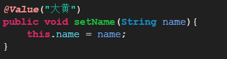

# 1. Spring的IOC（重点）
## 1.1. IOC：控制反转，将对象的创建权反转给Spring
利用工厂+反射+配置文件的方式实现程序的解耦合
IOC和DI ，DI:依赖注入，前提必须要有IOC的环境，Spring管理这个类的时候将类的依赖的属性注入（设置）进来

# 2. SpringIOC的注解开发（重点）
## 2.1. IOC注解开发的准备的jar包

## 2.2. IOC引入约束
	* 在src中新建一个xml文件，之后引入约束， 使用注解开发需要引入context约束，约束文件的目录（G:\编程学习\API-JAR\Spring相关JAR包\spring-framework-4.2.4.RELEASE-dist\spring-framework-4.2.4.RELEASE\docs\spring-framework-reference\html\xsd-configuration.html）

## 2.3. 使用注解需要在xml之后配置扫描

# 3. 注解方式设置属性的值
## 3.1. 注解方式
 

# 4. SpringIOC的注解的详解
## 4.1. @Conponent：组件
	修饰一个类，将这个类交给Spring管理
	这个注解有三个衍生的注解（即功能类似)
              @Controller: web层        
              @Service:   service层       
              @Repository:   dao层
## 4.2. 属性注入的注解
	   普通属性：@Value("值")
   	    对象类型属性：@Autowired(但是按照类型完成属性注入  )加上@qualifier（value="名称"）就可以是实现按名称注入
	      对象类型属性：@Resource（name=" 名称"），按照名称完成属性的注入（一般使用这个）
	  
## 4.3. Bean的其他的注解
	* Bean作用范围的注解
         @Scope            
         singleton:默认          
         prototype:多例          
         request:           
         session:             
         globalsession:
         
## 4.4. IOC的xml和注解开发的比较
  

	* xml：适用于任何场景
	* 注解：这个类不是自己提供的

