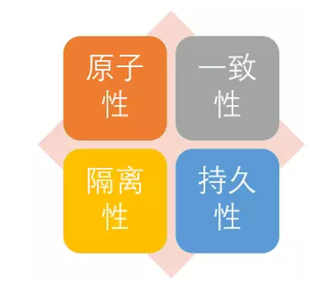
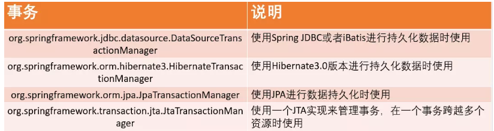
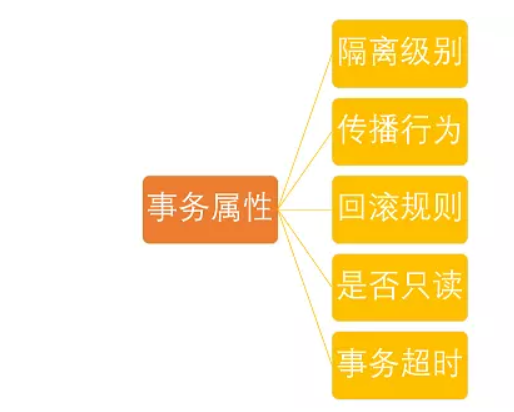

# 1. 定义
事务是逻辑上的一组操作，要么都执行，要么都不执行.
# 2. 特性
事物的特性（ACID）

原子性： 事务是最小的执行单位，不允许分割。事务的原子性确保动作要么全部完成，要么完全不起作用；
一致性： 执行事务前后，数据保持一致；
隔离性： 并发访问数据库时，一个用户的事物不被其他事物所干扰，各并发事务之间数据库是独立的；
持久性:  一个事务被提交之后。它对数据库中数据的改变是持久的，即使数据库发生故障也不应该对其有任何影响。

# 3. 事务管理接口 
## 3.1. 接口
### 3.1.1. PlatformTransactionManager：
 平台事务管理器
（接口，是Spring用于管理事务的真正对象）
DataSourceTransactionManager：底层使用jdbc管理事务
HibernateTransactionManager：底层使用hibernate管理事务

Spring并不直接管理事务，而是提供了多种事务管理器 ，他们将事务管理的职责委托给Hibernate或者JTA等持久化机制所提供的相关平台框架的事务来实现。 Spring事务管理器的接口是： org.springframework.transaction.PlatformTransactionManager ，通过这个接口，Spring为各个平台如JDBC、Hibernate等都提供了对应的事务管理器，但是具体的实现就是各个平台自己的事情了

接口源码：
```
Public interface PlatformTransactionManager()...{  
    // Return a currently active transaction or create a new one, according to the specified propagation behavior（根据指定的传播行为，返回当前活动的事务或创建一个新事务。）
    TransactionStatus getTransaction(TransactionDefinition definition) throws TransactionException; 
    // Commit the given transaction, with regard to its status（使用事务目前的状态提交事务）
    Void commit(TransactionStatus status) throws TransactionException;  
    // Perform a rollback of the given transaction（对执行的事务进行回滚）
    Void rollback(TransactionStatus status) throws TransactionException;  
    } 


```

我们刚刚也说了Spring中PlatformTransactionManager根据不同持久层框架所对应的接口实现类,几个比较常见的如下图所示


比如我们在使用JDBC或者iBatis（就是Mybatis）进行数据持久化操作时,我们的xml配置通常如下：
```
	<!-- 事务管理器 -->
	<bean id="transactionManager"
		class="org.springframework.jdbc.datasource.DataSourceTransactionManager">
		<!-- 数据源 -->
		<property name="dataSource" ref="dataSource" />
	</bean>
```

### 3.1.2. TransactionDefinition
- 事务定义信息
事务定义：用于定义事务的相关的信息，隔离级别、超时信息、传播行为，是否只读
事务管理器接口 PlatformTransactionManager 通过 getTransaction(TransactionDefinition definition) 方法来得到一个事务，这个方法里面的参数是 TransactionDefinition类 ，这个类就定义了一些基本的事务属性。

那么什么是事务属性呢？

事务属性可以理解成事务的一些基本配置，描述了事务策略如何应用到方法上。事务属性包含了5个方面

```
public interface TransactionDefinition {
    // 返回事务的传播行为
    int getPropagationBehavior(); 
    // 返回事务的隔离级别，事务管理器根据它来控制另外一个事务可以看到本事务内的哪些数据
    int getIsolationLevel(); 
    // 返回事务必须在多少秒内完成
    //返回事务的名字
    String getName()；
    int getTimeout();  
    // 返回是否优化为只读事务。
    boolean isReadOnly();
} 

```
1）事务隔离级别（定义了一个事务可能受其他并发事务影响的程度）：
我们先来看一下 并发事务带来的问题 ，然后再来介绍一下 TransactionDefinition 接口 中定义了五个表示隔离级别的常量。

并发事务带来的问题

在典型的应用程序中，多个事务并发运行，经常会操作相同的数据来完成各自的任务（多个用户对统一数据进行操作）。并发虽然是必须的，但可能会导致一下的问题。


- 脏读（Dirty read）:
当一个事务正在访问数据并且对数据进行了修改，而这种修改还没有提交到数据库中，这时另外一个事务也访问了这个数据，然后使用了这个数据。因为这个数据是还没有提交的数据，那么另外一个事务读到的这个数据是“脏数据”，依据“脏数据”所做的操作可能是不正确的。


- 丢失修改（Lost to modify）
指在一个事务读取一个数据时，另外一个事务也访问了该数据，那么在第一个事务中修改了这个数据后，第二个事务也修改了这个数据。这样第一个事务内的修改结果就被丢失，因此称为丢失修改。
例如：事务1读取某表中的数据A=20，事务2也读取A=20，事务1修改A=A-1，事务2也修改A=A-1，最终结果A=19，事务1的修改被丢失。


- 不可重复读（Unrepeatableread）
指在一个事务内多次读同一数据。在这个事务还没有结束时，另一个事务也访问该数据。那么，在第一个事务中的两次读数据之间，由于第二个事务的修改导致第一个事务两次读取的数据可能不太一样。这就发生了在一个事务内两次读到的数据是不一样的情况，因此称为不可重复读。


- 幻读（Phantom read）
幻读与不可重复读类似。它发生在一个事务（T1）读取了几行数据，接着另一个并发事务（T2）插入了一些数据时。在随后的查询中，第一个事务（T1）就会发现多了一些原本不存在的记录，就好像发生了幻觉一样，所以称为幻读。


- 不可重复度和幻读区别：
不可重复读的重点是修改，幻读的重点在于新增或者删除。
例1（同样的条件, 你读取过的数据, 再次读取出来发现值不一样了 ）：事务1中的A先生读取自己的工资为     1000的操作还没完成，事务2中的B先生就修改了A的工资为2000，导        致A再读自己的工资时工资变为  2000；这就是不可重复读。
例2（同样的条件, 第1次和第2次读出来的记录数不一样 ）：假某工资单表中工资大于3000的有4人，事务1读取了所有工资大于3000的人，共查到4条记录，这时事务2 又插入了一条工资大于3000的记录，事务1再次读取时查到的记录就变为了5条，这样就导致了幻读。

2）隔离级别

TransactionDefinition 接口中定义了五个表示隔离级别的常量：

TransactionDefinition.ISOLATION_DEFAULT:	使用后端数据库默认的隔离级别，Mysql 默认采用的 REPEATABLE_READ隔离级别 Oracle 默认采用的 READ_COMMITTED隔离级别.
TransactionDefinition.ISOLATION_READ_UNCOMMITTED: 最低的隔离级别，允许读取尚未提交的数据变更，可能会导致脏读、幻读或不可重复读
TransactionDefinition.ISOLATION_READ_COMMITTED: 	允许读取并发事务已经提交的数据，可以阻止脏读，但是幻读或不可重复读仍有可能发生
TransactionDefinition.ISOLATION_REPEATABLE_READ: 	对同一字段的多次读取结果都是一致的，除非数据是被本身事务自己所修改，可以阻止脏读和不可重复读，但幻读仍有可能发生。
TransactionDefinition.ISOLATION_SERIALIZABLE: 	最高的隔离级别，完全服从ACID的隔离级别。所有的事务依次逐个执行，这样事务之间就完全不可能产生干扰，也就是说，该级别可以防止脏读、不可重复读以及幻读。但是这将严重影响程序的性能。通常情况下也不会用到该级别。

3）事务传播行为（为了解决业务层方法之间互相调用的事务问题）：
当事务方法被另一个事务方法调用时，必须指定事务应该如何传播。例如：方法可能继续在现有事务中运行，也可能开启一个新事务，并在自己的事务中运行。在TransactionDefinition定义中包括了如下几个表示传播行为的常量：
支持当前事务的情况：

TransactionDefinition.PROPAGATION_REQUIRED： 如果当前存在事务，则加入该事务；如果当前没有事务，则创建一个新的事务。
TransactionDefinition.PROPAGATION_SUPPORTS： 如果当前存在事务，则加入该事务；如果当前没有事务，则以非事务的方式继续运行。
TransactionDefinition.PROPAGATION_MANDATORY： 如果当前存在事务，则加入该事务；如果当前没有事务，则抛出异常。（mandatory：强制性）

不支持当前事务的情况：

TransactionDefinition.PROPAGATION_REQUIRES_NEW： 创建一个新的事务，如果当前存在事务，则把当前事务挂起。
TransactionDefinition.PROPAGATION_NOT_SUPPORTED： 以非事务方式运行，如果当前存在事务，则把当前事务挂起。
TransactionDefinition.PROPAGATION_NEVER： 以非事务方式运行，如果当前存在事务，则抛出异常。

其他情况：

TransactionDefinition.PROPAGATION_NESTED： 如果当前存在事务，则创建一个事务作为当前事务的嵌套事务来运行；如果当前没有事务，则该取值等价于TransactionDefinition.PROPAGATION_REQUIRED。

这里需要指出的是，前面的六种事务传播行为是 Spring 从 EJB 中引入的，他们共享相同的概念。而 PROPAGATION_NESTED 是 Spring 所特有的。以 PROPAGATION_NESTED 启动的事务内嵌于外部事务中（如果存在外部事务的话），此时，内嵌事务并不是一个独立的事务，它依赖于外部事务的存在，只有通过外部的事务提交，才能引起内部事务的提交，嵌套的子事务不能单独提交。如果熟悉 JDBC 中的保存点（SavePoint）的概念，那嵌套事务就很容易理解了，其实嵌套的子事务就是保存点的一个应用，一个事务中可以包括多个保存点，每一个嵌套子事务。另外，外部事务的回滚也会导致嵌套子事务的回滚。

4）事务超时属性(一个事务允许执行的最长时间)
所谓事务超时，就是指一个事务所允许执行的最长时间，如果超过该时间限制但事务还没有完成，则自动回滚事务。在 TransactionDefinition 中以 int 的值来表示超时时间，其单位是秒。


5) 事务只读属性（对事物资源是否执行只读操作）
事务的只读属性是指，对事务性资源进行只读操作或者是读写操作。所谓事务性资源就是指那些被事务管理的资源，比如数据源、 JMS 资源，以及自定义的事务性资源等等。如果确定只对事务性资源进行只读操作，那么我们可以将事务标志为只读的，以提高事务处理的性能。在 TransactionDefinition 中以 boolean 类型来表示该事务是否只读。


6) 回滚规则（定义事务回滚规则）
这些规则定义了哪些异常会导致事务回滚而哪些不会。默认情况下，事务只有遇到运行期异常时才会回滚，而在遇到检查型异常时不会回滚（这一行为与EJB的回滚行为是一致的）。
但是你可以声明事务在遇到特定的检查型异常时像遇到运行期异常那样回滚。同样，你还可以声明事务遇到特定的异常不回滚，即使这些异常是运行期异常。


### 3.1.3. TransactionStatus
  事务的状态
事务状态：用于记录在事务管理过程中，事务的状态的对象

TransactionStatus接口用来记录事务的状态 该接口定义了一组方法,用来获取或判断事务的相应状态信息.
PlatformTransactionManager.getTransaction(…) 方法返回一个 TransactionStatus 对象。返回的TransactionStatus 对象可能代表一个新的或已经存在的事务（如果在当前调用堆栈有一个符合条件的事务）。

```
public interface TransactionStatus{
    boolean isNewTransaction(); // 是否是新的事物
    boolean hasSavepoint(); // 是否有恢复点
    void setRollbackOnly();  // 设置为只回滚
    boolean isRollbackOnly(); // 是否为只回滚
    boolean isCompleted; // 是否已完成
} 
```

## 3.2. 事务管理的API的关系
Spring进行事务管理的时候，首先平台事务管理器根据**事务定义信息**进行事务管理，在事务管理过程中，产生各种状态，将这些事务信息记录到事态状态对象中

补充：
事务管理的本质
所谓事务管理，其实就是“按照给定的事务规则来执行提交或者回滚操作”
## 3.3. 3.3.事务传播行为
Spring的七种传播行为：

保证多个操作在同一个事务之中
`**PROPAGATION_REQUIRED(propagetion_required)**` 默认值：如果a中有事务，使用a中的事务，如果a没有，创建一个新的事务，将操作包含进来
`PROPAGATION_SUPPORTS ：`支持事务，如果a中有事务，使用a中的事务，如果a没有事务，不适用事务
`PROPAGATION_MANDATORY：`如果a中有事务，使用a中事务，如果a中没有事务，抛出异 常

保证多个操作不在同一个事务之中
`**PROPAGATION_REQUIRES_NEW**`：如果a中有事务，将a中的事务挂起，创建新事务，只包含自身操作，如果a中没有事务，创建一个新事务，包含自身操作
`PROPAGATION_NOT_SUPPORTED`：如果a中有事务，将a中的事务挂起，不会使用事务
`PROPAGATION_NEVER`  ： 如果a中有事务，直接报异常

嵌套式事务
**PROPAGATION_NESTED**：嵌套事务，如果a中有事务，按照a的事务执行，执行完成后，设置一个保存点，执行b操作，如果没有异常，执行通过，如果有异常，可以选择回滚到最初始位置或者回滚到保存点
# 4. 事务类型：
## 4.1. 编程式事务管理
- 通过Transaction Template手动管理事务，实际应用中很少使用，


一类：编程式
```
OrdersDao.java(Dao层)
package cn.itcast.dao;

import org.springframework.jdbc.core.JdbcTemplate;

public class OrdersDao {
	// 注入jdbcTemplate模板对象
	private JdbcTemplate jdbcTemplate;

	public void setJdbcTemplate(JdbcTemplate jdbcTemplate) {
		this.jdbcTemplate = jdbcTemplate;
	}

	// 对数据操作的方法不包含业务操作
	/**
	 * 小王少钱的方法
	 */
	public void reduceMoney() {
		String sql = "update account set salary=salary-? where username=?";
		jdbcTemplate.update(sql, 1000, "小王");
	}

	/**
	 * 小马多钱的方法
	 */
	public void addMoney() {
		String sql = "update account set salary=salary+? where username=?";
		jdbcTemplate.update(sql, 1000, "小马");
	}
}


```

OrdersService.java（业务逻辑层）
```
package cn.itcast.service;

import org.springframework.transaction.TransactionStatus;
import org.springframework.transaction.support.TransactionCallback;
import org.springframework.transaction.support.TransactionTemplate;

import cn.itcast.dao.OrdersDao;

public class OrdersService {
	// 注入Dao层对象
	private OrdersDao ordersDao;

	public void setOrdersDao(OrdersDao ordersDao) {
		this.ordersDao = ordersDao;
	}

	// 注入TransactionTemplate对象
	private TransactionTemplate transactionTemplate;

	public void setTransactionTemplate(TransactionTemplate transactionTemplate) {
		this.transactionTemplate = transactionTemplate;
	}

	// 调用dao的方法
	// 业务逻辑，写转账业务
	public void accountMoney() {
		transactionTemplate.execute(new TransactionCallback<Object>() {

			@Override
			public Object doInTransaction(TransactionStatus status) {
				Object result = null;
				try {
					// 小马多1000
					ordersDao.addMoney();
					// 加入出现异常如下面int
					// i=10/0（银行中可能为突然停电等。。。）；结果：小马账户多了1000而小王账户没有少钱
					// 解决办法是出现异常后进行事务回滚
					int i = 10 / 0;// 事务管理配置后异常已经解决
					// 小王 少1000
					ordersDao.reduceMoney();
				} catch (Exception e) {
					status.setRollbackOnly();
					result = false;
					System.out.println("Transfer Error!");
				}

				return result;
			}
		});

	}
}
```
TestService.java（测试方法）
```
package cn.itcast.service;

import org.junit.Test;
import org.springframework.context.ApplicationContext;
import org.springframework.context.support.ClassPathXmlApplicationContext;

public class TestService {
	@Test
	public void testAdd() {
		ApplicationContext context = new ClassPathXmlApplicationContext(
				"beans.xml");
		OrdersService userService = (OrdersService) context
				.getBean("ordersService");
		userService.accountMoney();
	}
}
```

配置文件
```
<?xml version="1.0" encoding="UTF-8"?>
<beans xmlns="http://www.springframework.org/schema/beans"
	xmlns:xsi="http://www.w3.org/2001/XMLSchema-instance" xmlns:context="http://www.springframework.org/schema/context"
	xmlns:aop="http://www.springframework.org/schema/aop" xmlns:tx="http://www.springframework.org/schema/tx"
	xsi:schemaLocation="http://www.springframework.org/schema/beans http://www.springframework.org/schema/beans/spring-beans-2.5.xsd  
http://www.springframework.org/schema/context http://www.springframework.org/schema/context/spring-context-2.5.xsd  
http://www.springframework.org/schema/aop http://www.springframework.org/schema/aop/spring-aop-2.5.xsd  
http://www.springframework.org/schema/tx http://www.springframework.org/schema/tx/spring-tx-2.5.xsd">
	<!-- 配置c3po连接池 -->
	<bean id="dataSource" class="com.mchange.v2.c3p0.ComboPooledDataSource">
		<!-- 注入属性值 -->
		<property name="driverClass" value="com.mysql.jdbc.Driver"></property>
		<property name="jdbcUrl" value="jdbc:mysql://localhost:3306/wangyiyun"></property>
		<property name="user" value="root"></property>
		<property name="password" value="153963"></property>
	</bean>
	<!-- 编程式事务管理 -->
	<!-- 配置事务管理器 -->
	<bean id="dataSourceTransactionManager"
		class="org.springframework.jdbc.datasource.DataSourceTransactionManager">
		<!-- 注入dataSource -->
		<property name="dataSource" ref="dataSource"></property>
	</bean>

	<!-- 配置事务管理器模板 -->
	<bean id="transactionTemplate"
		class="org.springframework.transaction.support.TransactionTemplate">
		<!-- 注入真正进行事务管理的事务管理器,name必须为 transactionManager否则无法注入 -->
		<property name="transactionManager" ref="dataSourceTransactionManager"></property>
	</bean>

	<!-- 对象生成及属性注入 -->
	<bean id="ordersService" class="cn.itcast.service.OrdersService">
		<property name="ordersDao" ref="ordersDao"></property>
		<!-- 注入事务管理的模板 -->
		<property name="transactionTemplate" ref="transactionTemplate"></property>
	</bean>

	<bean id="ordersDao" class="cn.itcast.dao.OrdersDao">
		<property name="jdbcTemplate" ref="jdbcTemplate"></property>
	</bean>
	<!-- JDBC模板对象 -->
	<bean id="jdbcTemplate" class="org.springframework.jdbc.core.JdbcTemplate">
		<property name="dataSource" ref="dataSource"></property>
	</bean>
</beans> 

```
## 4.2. 使用XML配置声明式事务
推荐使用（代码侵入性最小），实际是通过AOP实现

基于<  tx> 和< aop>命名空间的声明式事务管理： 目前推荐的方式，其最大特点是与 Spring AOP 结合紧密，可以充分利用切点表达式的强大支持，使得管理事务更加灵活。


基于 @Transactional 的全注解方式： 将声明式事务管理简化到了极致。开发人员只需在配置文件中加上一行启用相关后处理 Bean 的配置，然后在需要实施事务管理的方法或者类上使用 @Transactional 指定事务规则即可实现事务管理，而且功能也不必其他方式逊色


### 4.2.1. 基于AspectJ的声明式事务管理
OrdersService.java（业务逻辑层）
```
package cn.itcast.service;

import cn.itcast.dao.OrdersDao;

public class OrdersService {
	private OrdersDao ordersDao;

	public void setOrdersDao(OrdersDao ordersDao) {
		this.ordersDao = ordersDao;
	}

	// 调用dao的方法
	// 业务逻辑，写转账业务
	public void accountMoney() {
		// 小马多1000
		ordersDao.addMoney();
		// 加入出现异常如下面int i=10/0（银行中可能为突然停电等。。。）；结果：小马账户多了1000而小王账户没有少钱
		// 解决办法是出现异常后进行事务回滚
		int i = 10 / 0;// 事务管理配置后异常已经解决
		// 小王 少1000
		ordersDao.reduceMoney();
	}
}

```
复制代码配置文件：
```
	<!-- 配置c3po连接池 -->
	<bean id="dataSource" class="com.mchange.v2.c3p0.ComboPooledDataSource">
		<!-- 注入属性值 -->
		<property name="driverClass" value="com.mysql.jdbc.Driver"></property>
		<property name="jdbcUrl" value="jdbc:mysql://localhost:3306/wangyiyun"></property>
		<property name="user" value="root"></property>
		<property name="password" value="153963"></property>
	</bean>
	<!-- 第一步：配置事务管理器 -->
	<bean id="dataSourceTransactionManager"
		class="org.springframework.jdbc.datasource.DataSourceTransactionManager">
		<!-- 注入dataSource -->
		<property name="dataSource" ref="dataSource"></property>
	</bean>

	<!-- 第二步：配置事务增强 -->
	<tx:advice id="txadvice" transaction-manager="dataSourceTransactionManager">
		<!-- 做事务操作 -->
		<tx:attributes>
			<!-- 设置进行事务操作的方法匹配规则 -->
			<!-- account开头的所有方法 -->
	        <!--
	          propagation:事务传播行为； 
	          isolation：事务隔离级别；
	          read-only：是否只读；
	          rollback-for：发生那些异常时回滚 
	          timeout:事务过期时间
	         -->
			<tx:method name="account*" propagation="REQUIRED"
				isolation="DEFAULT" read-only="false" rollback-for="" timeout="-1" />
		</tx:attributes>
	</tx:advice>

	<!-- 第三步：配置切面 切面即把增强用在方法的过程 -->
	<aop:config>
		<!-- 切入点 -->
		<aop:pointcut expression="execution(* cn.itcast.service.OrdersService.*(..))"
			id="pointcut1" />
		<!-- 切面 -->
		<aop:advisor advice-ref="txadvice" pointcut-ref="pointcut1" />
	</aop:config>


	<!-- 对象生成及属性注入 -->
	<bean id="ordersService" class="cn.itcast.service.OrdersService">
		<property name="ordersDao" ref="ordersDao"></property>
	</bean>
	<bean id="ordersDao" class="cn.itcast.dao.OrdersDao">
		<property name="jdbcTemplate" ref="jdbcTemplate"></property>
	</bean>
	<bean id="jdbcTemplate" class="org.springframework.jdbc.core.JdbcTemplate">
		<property name="dataSource" ref="dataSource"></property>
	</bean>


```

### 4.2.2. 基于注解的方式
OrdersService.java（业务逻辑层）
```
package cn.itcast.service;

import org.springframework.transaction.annotation.Isolation;
import org.springframework.transaction.annotation.Propagation;
import org.springframework.transaction.annotation.Transactional;

import cn.itcast.dao.OrdersDao;

@Transactional(propagation = Propagation.REQUIRED, isolation = Isolation.DEFAULT, readOnly = false, timeout = -1)
public class OrdersService {
	private OrdersDao ordersDao;

	public void setOrdersDao(OrdersDao ordersDao) {
		this.ordersDao = ordersDao;
	}

	// 调用dao的方法
	// 业务逻辑，写转账业务
	public void accountMoney() {
		// 小马多1000
		ordersDao.addMoney();
		// 加入出现异常如下面int i=10/0（银行中可能为突然停电等。。。）；结果：小马账户多了1000而小王账户没有少钱
		// 解决办法是出现异常后进行事务回滚
		// int i = 10 / 0;// 事务管理配置后异常已经解决
		// 小王 少1000
		ordersDao.reduceMoney();
	}
}
```
复制代码配置文件：
```
	<!-- 配置c3po连接池 -->
	<bean id="dataSource" class="com.mchange.v2.c3p0.ComboPooledDataSource">
		<!-- 注入属性值 -->
		<property name="driverClass" value="com.mysql.jdbc.Driver"></property>
		<property name="jdbcUrl" value="jdbc:mysql://localhost:3306/wangyiyun"></property>
		<property name="user" value="root"></property>
		<property name="password" value="153963"></property>
	</bean>
	<!-- 第一步：配置事务管理器 (和配置文件方式一样)-->
	<bean id="dataSourceTransactionManager"
		class="org.springframework.jdbc.datasource.DataSourceTransactionManager">
		<!-- 注入dataSource -->
		<property name="dataSource" ref="dataSource"></property>
	</bean>
	<!-- 第二步： 开启事务注解 -->
	<tx:annotation-driven transaction-manager="dataSourceTransactionManager" />
	<!-- 第三步 在方法所在类上加注解 -->
	
	
	<!-- 对象生成及属性注入 -->
	<bean id="ordersService" class="cn.itcast.service.OrdersService">
		<property name="ordersDao" ref="ordersDao"></property>
	</bean>
	<bean id="ordersDao" class="cn.itcast.dao.OrdersDao">
		<property name="jdbcTemplate" ref="jdbcTemplate"></property>
	</bean>
	<bean id="jdbcTemplate" class="org.springframework.jdbc.core.JdbcTemplate">
		<property name="dataSource" ref="dataSource"></property>
	</bean>
。
```