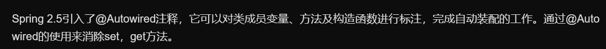

# 1. @Autowired注解

# 2. @Service注解
## 2.1. 例如
首先，在applicationContext.xml文件中加一行：
```
<context:component-scan base-package="xxx"/> 
```
加上这一行以后，将自动扫描路径下面的包，如果一个类带了@Service注解，将自动注册到Spring容器，不需要再在applicationContext.xml文件定义bean了，类似的还包括@Component、@Repository、@Controller
```
@Service("courseDAO")
@Scope("prototype")
public class CourseDAOImpl extends HibernateDaoSupport implements CourseDAO{

    ......
    
}
其作用就相当于applicationContext.xml文件里面的：

<bean id="courseDAO"
         class="com.hzhi.course.dao.CourseDAOImpl" scope="prototype">
         ......    
    </bean>
```
