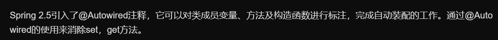

# 1. 注解的本质
一个词就可以描述注解，那就是元数据，即一种描述数据的数据。所以，可以说注解就是源代码的元数据
```
@Override
public String toString() {
    return "This is String Representation of current object.";
}
```

上面的代码中，我重写了toString()方法并使用了@Override注解。但是，即使我不使用@Override注解标记代码，程序也能够正常执行。那么，该注解表示什么？这么写有什么好处吗？事实上，@Override告诉编译器这个方法是一个重写方法(描述方法的元数据)，如果父类中不存在该方法，编译器便会报错，提示该方法没有重写父类中的方法。如果我不小心拼写错误，例如将toString()写成了toStrring(){double r}，而且我也没有使用@Override注解，那程序依然能编译运行。但运行结果会和我期望的大不相同。现在我们了解了什么是注解，并且使用注解有助于阅读程序

Annotation是一种应用于类、方法、参数、变量、构造器及包声明中的特殊修饰符。它是一种由JSR-175标准选择用来描述元数据的一种工具。

# 2. 注解的作用
**支持基本类型、String及枚举类型**
使用Annotation之前(甚至在使用之后)，XML被广泛的应用于描述元数据。不知何时开始一些应用开发人员和架构师发现XML的维护越来越糟糕了。他们希望使用一些和代码紧耦合的东西，而不是像XML那样和代码是松耦合的(在某些情况下甚至是完全分离的)代码描述。如果你在Google中搜索“XML vs. annotations”，会看到许多关于这个问题的辩论。最有趣的是XML配置其实就是为了分离代码和配置而引入的。上述两种观点可能会让你很疑惑，两者观点似乎构成了一种循环，但各有利弊。下面我们通过一个例子来理解这两者的区别。

假如你想为应用设置很多的常量或参数，这种情况下，XML是一个很好的选择，因为它不会同特定的代码相连。如果你想把某个方法声明为服务，那么使用Annotation会更好一些，因为这种情况下需要注解和方法紧密耦合起来，开发人员也必须认识到这点。

另一个很重要的因素是Annotation定义了一种标准的描述元数据的方式。在这之前，开发人员通常使用他们自己的方式定义元数据。例如，使用标记interfaces，注释，transient关键字等等。每个程序员按照自己的方式定义元数据，而不像Annotation这种标准的方式。

许多框架将XML和Annotation两种方式结合使用，平衡两者之间的利弊

```
@Documented –注解是否将包含在JavaDoc中
@Retention –什么时候使用该注解
@Target? –注解用于什么地方
@Inherited – 是否允许子类继承该注解
```

@Documented–一个简单的Annotations标记注解，表示是否将注解信息添加在java文档中。

@Retention– 定义该注解的生命周期。

RetentionPolicy.SOURCE – 在编译阶段丢弃。这些注解在编译结束之后就不再有任何意义，所以它们不会写入字节码。@Override, @SuppressWarnings都属于这类注解。

RetentionPolicy.CLASS – 在类加载的时候丢弃。在字节码文件的处理中有用。注解默认使用这种方式。

RetentionPolicy.RUNTIME– 始终不会丢弃，运行期也保留该注解，因此可以使用反射机制读取该注解的信息。我们自定义的注解通常使用这种方式。

@Target – 表示该注解用于什么地方。如果不明确指出，该注解可以放在任何地方。以下是一些可用的参数。需要说明的是：属性的注解是兼容的，如果你想给7个属性都添加注解，仅仅排除一个属性，那么你需要在定义target包含所有的属性。

ElementType.TYPE:用于描述类、接口或enum声明
ElementType.FIELD:用于描述实例变量
ElementType.METHOD
ElementType.PARAMETER
ElementType.CONSTRUCTOR
ElementType.LOCAL_VARIABLE
ElementType.ANNOTATION_TYPE 另一个注释
ElementType.PACKAGE 用于记录java文件的package信息

@Inherited – 定义该注释和子类的关系
# 3. 自定义注解

# 4. 常见注解
# 5. @Autowired注解

# 6. @Service注解
## 6.1. 例如
首先，在applicationContext.xml文件中加一行：
```
<context:component-scan base-package="xxx"/> 
```
加上这一行以后，将自动扫描路径下面的包，如果一个类带了@Service注解，将自动注册到Spring容器，不需要再在applicationContext.xml文件定义bean了，类似的还包括@Component、@Repository、@Controller
```
@Service("courseDAO")
@Scope("prototype")
public class CourseDAOImpl extends HibernateDaoSupport implements CourseDAO{

    ......
    
}
其作用就相当于applicationContext.xml文件里面的：

<bean id="courseDAO"
         class="com.hzhi.course.dao.CourseDAOImpl" scope="prototype">
         ......    
    </bean>
```

# 7. @Entity
对实体注释。任何Hibernate映射对象都要有这个注释

# 8. @MapperScan
之前是在配置中都是要引入@Mapper这个来给每一个mapper类进行配置，显得有点麻烦和冗余
## 8.1. 配置一个

通过使用@MapperScan可以指定要扫描的Mapper类的包的路径,比如:

```
@SpringBootApplication
@MapperScan("com.ada.web.mapper")
// 添加对mapper包扫描
public class Application {
	public static void main(String[] args) {
		SpringApplication.run(Application.class, args);
	}

}
```
## 8.2. 配置多个
同时,使用@MapperScan注解多个包

```
@SpringBootApplication  
@MapperScan({"com.ada.web","com.ada.user"})  
public class App {  
    public static void main(String[] args) {  
       SpringApplication.run(App.class, args);  
    }  
} 

```
## 8.3. 非常规情况
如果如果mapper类没有在Spring Boot主程序可以扫描的包或者子包下面，可以使用如下方式进行配置

```
@SpringBootApplication  
@MapperScan({"com.ada.*.mapper", "com.ada.*.mapper"})  
public class App {  
    public static void main(String[] args) {  
       SpringApplication.run(App.class, args);  
    }  
} 

```

# 9. @GetMapping
Spring4.3中引进了｛@GetMapping、@PostMapping、@PutMapping、@DeleteMapping、@PatchMapping｝，来帮助简化常用的HTTP方法的映射，并更好地表达被注解方法的语义。
  以@GetMapping为例，Spring官方文档说：
  @GetMapping是一个组合注解，是@RequestMapping(method = RequestMethod.GET)的缩写。该注解将HTTP Get 映射到 特定的处理方法上

# 10. @RequestParam
@RequestParam 和 @PathVariable 注解是用于从request中接收请求的，两个都可以接收参数，关键点不同的是@RequestParam 是从request里面拿取值，而 @PathVariable 是从一个URI模板里面来填充

- @RequestParam
看下面一段代码：

```
http://localhost:8080/springmvc/hello/101?param1=10&param2=20
```

根据上面的这个URL，你可以用这样的方式来进行获取

```
public String getDetails(
    @RequestParam(value="param1", required=true) String param1,
        @RequestParam(value="param2", required=false) String param2){
...
}

```
@RequestParam 支持下面四种参数

defaultValue 如果本次请求没有携带这个参数，或者参数为空，那么就会启用默认值
name 绑定本次参数的名称，要跟URL上面的一样
required 这个参数是不是必须的
value 跟name一样的作用，是name属性的一个别名

# 11. @PathVariable
请求路径上有个id的变量值，可以通过@PathVariable来获取  @RequestMapping(value = "/page/{id}", method = RequestMethod.GET)

# 12. @Param
dao层示例

```
Public User selectUser(@param(“userName”) String name,@param(“userpassword”) String password);
```

xml映射对应示例

```

<select id=" selectUser" resultMap="BaseResultMap">  
   select  *  from user_user_t   where user_name = #{userName，jdbcType=VARCHAR} and user_password=#{userPassword,jdbcType=VARCHAR}  
</select>
```

注意：采用#{}的方式把@Param注解括号内的参数进行引用（括号内参数对应的是形参如 userName对应的是name）；

- @Param注解JavaBean对象

dao层示例

```
public List<user> getUserInformation(@Param("user") User user);

```
xml映射对应示例


```
<select id="getUserInformation" parameterType="com.github.demo.vo.User" resultMap="userMapper">  
        select   
        <include refid="User_Base_Column_List" />  
        from mo_user t where 1=1  
                      <!-- 因为传进来的是对象所以这样写是取不到值得 -->  
            <if test="user.userName!=null  and user.userName!=''">   and   t.user_name = #{user.userName}  </if>  
            <if test="user.userAge!=null  and user.userAge!=''">   and   t.user_age = #{user.userAge}  </if>  
    </select>  

```

- 使用@Param注解

当以下面的方式进行写SQL语句时：

```
    @Select("select column from table where userid = #{userid} ")
    public int selectColumn(int userid);
```

当你使用了使用@Param注解来声明参数时，如果使用 #{} 或 ${} 的方式都可以。

```
    @Select("select column from table where userid = ${userid} ")
    public int selectColumn(@Param("userid") int userid);
```

当你不使用@Param注解来声明参数时，必须使用使用 #{}方式。如果使用 ${} 的方式，会报错。

```
    @Select("select column from table where userid = ${userid} ")
    public int selectColumn(@Param("userid") int userid);

```


- 不使用@Param注解

不使用@Param注解时，参数只能有一个，并且是Javabean。在SQL语句里可以引用JavaBean的属性，而且只能引用JavaBean的属性。

```
    // 这里id是user的属性

    @Select("SELECT * from Table where id = ${id}")
    Enchashment selectUserById(User user);

```

# 13. @Component 
指示自动扫描组件。
# 14. @Repository 
表示在持久层DAO组件。
# 15. @Service 
表示在业务层服务组件。
# 16. @Controller 
表示在表示层控制器组件

# 17. @Autowired  
当不能确定 Spring 容器中一定拥有某个类的 Bean 时，可以在需要自动注入该类 Bean 的地方可以使用 @Autowired(required = false)，这等于告诉 Spring：在找不到匹配 Bean 时也不报错
# 18. @ExceptionHandler
```
源码
@Target({ElementType.METHOD})
@Retention(RetentionPolicy.RUNTIME)
@Documented
public @interface ExceptionHandler {
    Class<? extends Throwable>[] value() default {};
}
```
该注解作用对象为**方法**，并且在运行时有效，value()可以指定异常类。由该注解注释的方法可以具有灵活的输入参数（详细参见Spring API）：

异常参数：包括一般的异常或特定的异常（即自定义异常），如果注解没有指定异常类，会默认进行映射。
请求或响应对象 (Servlet API or Portlet API)： 你可以选择不同的类型，如ServletRequest/HttpServletRequest或PortleRequest/ActionRequest/RenderRequest。
Session对象(Servlet API or Portlet API)： HttpSession或PortletSession。
WebRequest或NativeWebRequest 
Locale
InputStream/Reader 
OutputStream/Writer 
Model
方法返回值可以为：

ModelAndView对象
Model对象
Map对象
View对象
String对象
还有@ResponseBody、HttpEntity<?>或ResponseEntity<?>，以及void
# 19. @ControllerAdvice
 ```
 源码:
 public @interface ControllerAdvice {
    @AliasFor("basePackages")
    String[] value() default {};

    @AliasFor("value")
    String[] basePackages() default {};

    Class<?>[] basePackageClasses() default {};

    Class<?>[] assignableTypes() default {};

    Class<? extends Annotation>[] annotations() default {};
}
 ```
 该注解作用对象为TYPE，包括类、接口和枚举等，在运行时有效，并且可以通过Spring扫描为bean组件。其可以包含由@ExceptionHandler、@InitBinder 和@ModelAttribute标注的方法，可以处理多个Controller类，这样所有控制器的异常可以在一个地方进行处理
# 20. @scheduled 
一种是直接@scheduled（cron=”0 0 0 ? * * “）
参数说明:
一个cron表达式有至少6个（也可能7个）有空格分隔的时间元素。
按顺序依次为
秒（0~59）
分钟（0~59）
小时（0~23）
天（月）（0~31，但是你需要考虑你月的天数）
月（0~11）
天（星期）（1~7 1=SUN 或 SUN，MON，TUE，WED，THU，FRI，SAT）
年份（1970－2099）

其中每个元素可以是一个值(如6),一个连续区间(9-12),一个间隔时间(8-18/4)(/表示每隔4小时),一个列表(1,3,5),通配符。由于”月份中的日期”和”星期中的日期”这两个元素互斥的,必须要对其中一个设置?.

“0 0 10,14,16 * * ?” 每天上午10点，下午2点，4点
“0 0/30 9-17 * * ?” 朝九晚五工作时间内每半小时
“0 0 12 ? * WED” 表示每个星期三中午12点
“0 0 12 * * ?” 每天中午12点触发
“0 15 10 ? * *” 每天上午10:15触发
“0 15 10 * * ?” 每天上午10:15触发
“0 15 10 * * ? *” 每天上午10:15触发
“0 15 10 * * ? 2005” 2005年的每天上午10:15触发
“0 * 14 * * ?” 在每天下午2点到下午2:59期间的每1分钟触发
“0 0/5 14 * * ?” 在每天下午2点到下午2:55期间的每5分钟触发
“0 0/5 14,18 * * ?” 在每天下午2点到2:55期间和下午6点到6:55期间的每5分钟触发
“0 0-5 14 * * ?” 在每天下午2点到下午2:05期间的每1分钟触发
“0 10,44 14 ? 3 WED” 每年三月的星期三的下午2:10和2:44触发
“0 15 10 ? * MON-FRI” 周一至周五的上午10:15触发
“0 15 10 15 * ?” 每月15日上午10:15触发
“0 15 10 L * ?” 每月最后一日的上午10:15触发
“0 15 10 ? * 6L” 每月的最后一个星期五上午10:15触发
“0 15 10 ? * 6L 2002-2005” 2002年至2005年的每月的最后一个星期五上午10:15触发
“0 15 10 ? * 6#3” 每月的第三个星期五上午10:15触发


