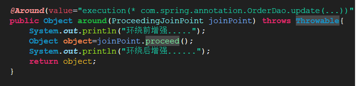
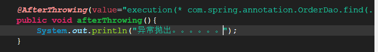

# 1. Spring的AOP（核心）
## 1.1. AOP的概念
	* 面向切面编程是OOP的 扩展和延伸，解决OOP开发遇到的问题
	* AOP采用的是横向抽取机制（代理机制）取代了传统的纵向继承
	* 底层实现的原理：动态代理（
              JDK动态代理，只能对实现 了接口的类产生代理            
              Cglib动态代理，对没有实现接口的类产生代理对象）
              
## 1.2. Spring的AOP开发（AspectJ的XML的方式）
	* Spring的AOP的简介
	* AspectJ是一个AOP的框架  
## 1.3. AOP开发中的术语
	


# 2. Spring的AOP入门（AspectJ的XML的方式）
## 2.1. 需要的Java包（Spring基础包加上以下几个）
aspectjrt.jar
aspectjweaver.jar
aopalliance-1.0.jar,
	
	Spring整合Junit开发


## 2.2. Spring的通知类型
5.2.1前置通知：在目标方法执行之前进行操作
       *可以获得切入点信息
5.2.2后置通知：之后
        获得方法的返回值
5.2.3环绕通知：之前和之后
5.2.4异常抛出通知：在程序出现异常的时候进行操作
5.2.5最终通知：无论代码是否有异常，总是会被执行

## 2.3. 切入点表达式语法
     #语法：（基于execution的函数完成的）
              [访问修饰符] 方法返回值 包名.类名.方法名（参数）
              #public void com.spring.aop.CustomerDao.save(...)
              #*****Dao.save()
              #*com.spring.aop.CustomerDao+.save(..)   ＋表示是子类
              #*com.spring.aop.CustormerDao.*.*(...)
## 2.4. AOP思想


# 3. Spring的AOP的基于AspectJ注解开发 
## 3.1. 新建工程
导入相关的jar包，新建xml文件，然后在applicationContext.xml之中加入
<aop:aspectj-autoproxy />

## 3.2. Spring的注解AOP的通知类型
@Before：前置通知

@afeterReturning:后置通知

@Around：环绕通知

@AfterThrowing：；异常通知

@After：最终通知

# 4. Spring的JDBC的模板的使用
## 4.1. Spring提供的模板


## 4.2. 将连接池和模板交给Spring管理
在applicationContext.xml文件中配置如下
```
连接池
<bean id="dataSource" class="org.springframework.jdbc.datasource.DriverManagerDataSource">
		<property name="driverClassName" value="com.mysql.jdbc.Driver"/>
		<property name="url" value="jdbc:mysql:///test"/>
		<property name="username" value="root"/>
		<property name="password" value="123"/>
	</bean>
	jdbc模板
<bean id="jdbcTemplate" class="org.springframework.jdbc.core.JdbcTemplate">
		<property name="dataSource" ref="dataSource" />
	</bean>
```

# 5. 使用开源的数据库连接池
## 5.1. DBCP的使用
### 5.1.1. 引入jar包

### 5.1.2. 配置applicationContext.xml文件
```<bean id="dataSource" class="org.apache.commons.dbcp.BasicDataSource">
		<property name="driverClassName" value="com.mysql.jdbc.Driver" />
		<property name="url" value="jdbc:mysql:///test" />
		<property name="username" value="root" />
		<property name="password" value="123" />
	</bean>
```

## 5.2. C3P0的使用 
引入Jar包

配置applicationContext.xml文件
```<bean id="dataSource" class="com.mchange.v2.c3p0.ComboPooledDataSource">
		<property name="driverClass" value="${jdbc.driverClass}" />
		<property name="jdbcUrl" value="${jdbc.url}" />
		<property name="user" value="${jdbc.username}" />
		<property name="password" value="${jdbc.password}" />
	</bean>
```
属性文件：
```jdbc.driverClass=com.mysql.jdbc.Driver
jdbc.url=jdbc:mysql:///test
jdbc.username=root
jdbc.password=123
```
引入属性文件
方式一：（很少情况使用）
```
<bean class="org.springframework.beans.factory.config.PropertyPlaceholderConfigurer"> 
		<property name="location" value="classpath:jdbc.properties"/>
```
方式二：
```
<context:property-placeholder location="classpath:jdbc.properties"></context:property-placeholder>
```

