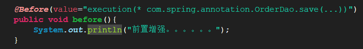
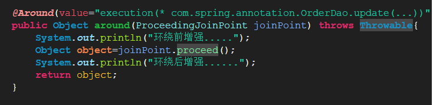
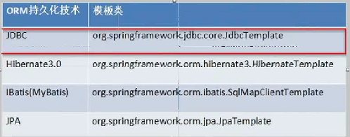
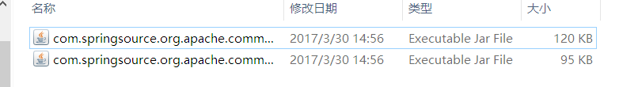

# 1. Spring的AOP的基于AspectJ注解开发 
## 1.1. 新建工程
导入相关的jar包，新建xml文件，然后在applicationContext.xml之中加入
<aop:aspectj-autoproxy />

## 1.2. Spring的注解AOP的通知类型
@Before：前置通知

@afeterReturning:后置通知

@Around：环绕通知

@AfterThrowing：；异常通知

@After：最终通知

# 2. Spring的JDBC的模板的使用
## 2.1. Spring提供的模板


## 2.2. 将连接池和模板交给Spring管理
在applicationContext.xml文件中配置如下
```
连接池
<bean id="dataSource" class="org.springframework.jdbc.datasource.DriverManagerDataSource">
		<property name="driverClassName" value="com.mysql.jdbc.Driver"/>
		<property name="url" value="jdbc:mysql:///test"/>
		<property name="username" value="root"/>
		<property name="password" value="123"/>
	</bean>
	jdbc模板
<bean id="jdbcTemplate" class="org.springframework.jdbc.core.JdbcTemplate">
		<property name="dataSource" ref="dataSource" />
	</bean>
```

# 3. 使用开源的数据库连接池
## 3.1. DBCP的使用
### 3.1.1. 引入jar包

### 3.1.2. 配置applicationContext.xml文件
```<bean id="dataSource" class="org.apache.commons.dbcp.BasicDataSource">
		<property name="driverClassName" value="com.mysql.jdbc.Driver" />
		<property name="url" value="jdbc:mysql:///test" />
		<property name="username" value="root" />
		<property name="password" value="123" />
	</bean>
```

## 3.2. C3P0的使用 
引入Jar包

配置applicationContext.xml文件
```<bean id="dataSource" class="com.mchange.v2.c3p0.ComboPooledDataSource">
		<property name="driverClass" value="${jdbc.driverClass}" />
		<property name="jdbcUrl" value="${jdbc.url}" />
		<property name="user" value="${jdbc.username}" />
		<property name="password" value="${jdbc.password}" />
	</bean>
```
属性文件：
```jdbc.driverClass=com.mysql.jdbc.Driver
jdbc.url=jdbc:mysql:///test
jdbc.username=root
jdbc.password=123
```
引入属性文件
方式一：（很少情况使用）
```
<bean class="org.springframework.beans.factory.config.PropertyPlaceholderConfigurer"> 
		<property name="location" value="classpath:jdbc.properties"/>
```
方式二：
```
<context:property-placeholder location="classpath:jdbc.properties"></context:property-placeholder>
```

# 4. Spring的事务管理
## 4.1. 事务的概念
逻辑上的一组操作，组成这组操作的各个单元，要么全都成功，要么全都失败

## 4.2. 事务的特性
原子性：事务不可以分隔
一致性：事务执行前后数据完整性保持一致
隔离性：一个事务的执行不应该受到其他的事务的干扰
 持久性：一旦事务结束，数据就持久化到数据库
 
## 4.3. 如果不考虑隔离性就会引发安全性问题
### 4.3.1. 读问题
脏读：一个事务读到另一个事务为提交的数据
不可重复读：一个事务读到另一个事务已经提交的update的数据，导致一个事务中多次查询结果不一致
虚读、幻读：一个事务读到另一个事务已经提交的insert数据，导致一个事务多次查询的结果不一致
### 4.3.2. 写问题
丢失更新
### 4.3.3. 解决读问题
设置事务的隔离级别
Read uncommitted:  未提交读，任何读问题解决不了的
**Read committed:  已提交读，解决脏读，但是不可重复读和虚读有可能发生
Repeatable read:**  **重复读，解决脏读和不可重复读，但是虚读有可能发生**
Serializable:  解决所有读问题

## 4.4. Spring的事务管理 
### 4.4.1. 事务管理的API
 PlatformTransactionManager：平台事务管理器
（接口，是Spring用于管理事务的真正对象）
DataSourceTransactionManager：底层使用jdbc管理事务
HibernateTransactionManager：底层使用hibernate管理事务

TransactionDefinition：事务定义信息
事务定义：用于定义事务的相关的信息，隔离级别、超时信息、传播行为，是否只读

 TransactionStatus：事务的状态
事务状态：用于记录在事务管理过程中，事务的状态的对象
### 4.4.2. 事务管理的API的关系
Spring进行事务管理的时候，首先平台事务管理器根据**事务定义信息**进行事务管理，在事务管理过程中，产生各种状态，将这些事务信息记录到事态状态对象中
### 4.4.3. Spring的事务传播行为
Spring的七种传播行为：

保证多个操作在同一个事务之中
**PROPAGATION_REQUIRED(propagetion_required)** 默认值：如果a中有事务，使用a中的事务，如果a没有，创建一个新的事务，将操作包含进来
PROPAGATION_SUPPORTS ：支持事务，如果a中有事务，使用a中的事务，如果a没有事务，不适用事务
PROPAGATION_MANDATORY：如果a中有事务，使用a中事务，如果a中没有事务，抛出异 常

保证多个操作不在同一个事务之中
**PROPAGATION_REQUIRES_NEW**：如果a中有事务，将a中的事务挂起，创建新事务，只包含自身操作，如果a中没有事务，创建一个新事务，包含自身操作
PROPAGATION_NOT_SUPPORTED：如果a中有事务，将a中的事务挂起，不会使用事务
PROPAGATION_NEVER：如果a中有事务，直接报异常

嵌套式事务
**PROPAGATION_NESTED**：嵌套事务，如果a中有事务，按照a的事务执行，执行完成后，设置一个保存点，执行b操作，如果没有异常，执行通过，如果有异常，可以选择回滚到最初始位置或者回滚到保存点
### 4.4.4. Spring的事务类型：
一类：编程式事务（需要手动编写代码）

```
<!--配置平台事务管理器：-->
<bean id="transactionManager"
		class="org.springframework.jdbc.datasource.DataSourceTransactionManager">
		<property name="dataSource" ref="dataSource" />
	</bean>

	<!-- 配置事务管理的模板 -->
	<bean id="transactionTemplate"
		class="org.springframework.transaction.support.TransactionTemplate">
		<property name="transactionManager" ref="transactionManager" />
	</bean>

```

二类：声明式事务管理（通过配置实现）AOP
 1.xml方式的声明式事务管理：
 a.引入AOP的jar包
 b.配置事务管理器
 ```
 <bean id="transactionManager" class="org.springframework.jdbc.datasource.DataSourceTransactionManager">
		<property name="dataSource" ref="dataSource"/>
	</bean>

 ```
 
 	c.配置增强
 	
```
<tx:advice id="txAdvice" transaction-manager="transactionManager">
		<tx:attributes>
		<tx:method name="*" propagation="REQUIRED" read-only="false"/>
		</tx:attributes>
	</tx:advice>
```
d.AOP的配置
```
<aop:config>
		<aop:pointcut expression="execution(* com.itheima.tx.demo2.AccountServiceImpl.*(..))" id="pointcut1"/>
		<aop:advisor advice-ref="txAdvice" pointcut-ref="pointcut1"/>
	</aop:config>
```

 2.注解方式的声明式事务管理：
 a.引入AOP的jar包
 b.配置事务管理器（同上，一定要有，无论是xml还是注解）
 c.开启注解事务
 ```
 <tx:annotation-driven transaction-manager="transactionManager"/>
 ```