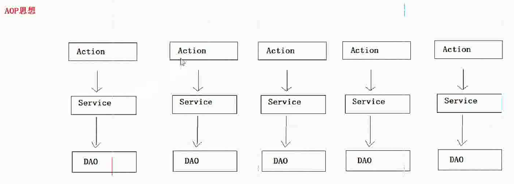

# 1. SpringIOC的注解开发（重点）
## 1.1. IOC注解开发的准备的jar包

## 1.2. IOC引入约束
	* 在src中新建一个xml文件，之后引入约束， 使用注解开发需要引入context约束，约束文件的目录（G:\编程学习\API-JAR\Spring相关JAR包\spring-framework-4.2.4.RELEASE-dist\spring-framework-4.2.4.RELEASE\docs\spring-framework-reference\html\xsd-configuration.html）

## 1.3. 使用注解需要在xml之后配置扫描

# 2. 注解方式设置属性的值
## 2.1. 注解方式
 

# 3. SpringIOC的注解的详解
## 3.1. @Conponent：组件
	修饰一个类，将这个类交给Spring管理
	这个注解有三个衍生的注解（即功能类似)
              @Controller: web层        
              @Service:   service层       
              @Repository:   dao层
## 3.2. 属性注入的注解
	   普通属性：@Value("值")
   	    对象类型属性：@Autowired(但是按照类型完成属性注入  )加上@qualifier（value="名称"）就可以是实现按名称注入
	      对象类型属性：@Resource（name=" 名称"），按照名称完成属性的注入（一般使用这个）
	  
## 3.3. Bean的其他的注解
	* Bean作用范围的注解
         @Scope            
         singleton:默认          
         prototype:多例          
         request:           
         session:             
         globalsession:
         
## 3.4. IOC的xml和注解开发的比较
  

	* xml：适用于任何场景
	* 注解：这个类不是自己提供的

# 4. Spring的AOP（核心）
## 4.1. AOP的概念
	* 面向切面编程是OOP的 扩展和延伸，解决OOP开发遇到的问题
	* AOP采用的是横向抽取机制（代理机制）取代了传统的纵向继承
	* 底层实现的原理：动态代理（
              JDK动态代理，只能对实现 了接口的类产生代理            
              Cglib动态代理，对没有实现接口的类产生代理对象）
              
## 4.2. Spring的AOP开发（AspectJ的XML的方式）
	* Spring的AOP的简介
	* AspectJ是一个AOP的框架  
## 4.3. AOP开发中的术语
	

# 5. Spring的AOP入门（AspectJ的XML的方式）
## 5.1. 需要的Java包（Spring基础包加上以下几个）
aspectjrt.jar
aspectjweaver.jar
aopalliance-1.0.jar,
	
	Spring整合Junit开发

## 5.2. Spring的通知类型
5.2.1前置通知：在目标方法执行之前进行操作
       *可以获得切入点信息
5.2.2后置通知：之后
        获得方法的返回值
5.2.3环绕通知：之前和之后
5.2.4异常抛出通知：在程序出现异常的时候进行操作
5.2.5最终通知：无论代码是否有异常，总是会被执行

## 5.3. 切入点表达式语法
     #语法：（基于execution的函数完成的）
              [访问修饰符] 方法返回值 包名.类名.方法名（参数）
              #public void com.spring.aop.CustomerDao.save(...)
              #*****Dao.save()
              #*com.spring.aop.CustomerDao+.save(..)   ＋表示是子类
              #*com.spring.aop.CustormerDao.*.*(...)
## 5.4. AOP思想

