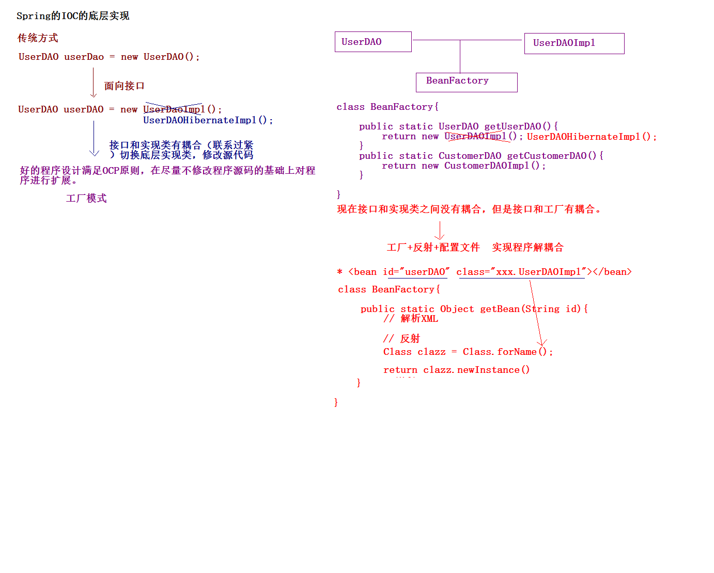
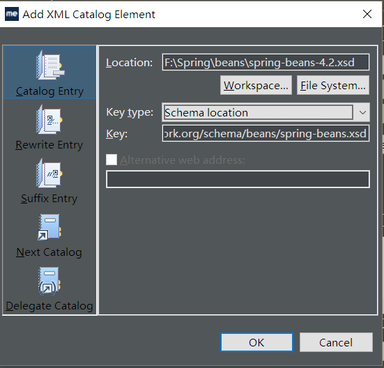
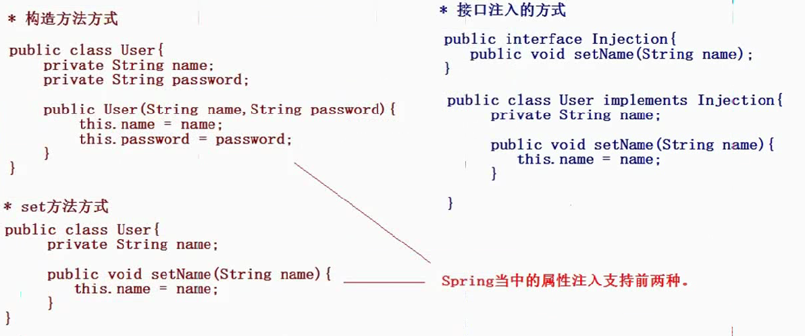
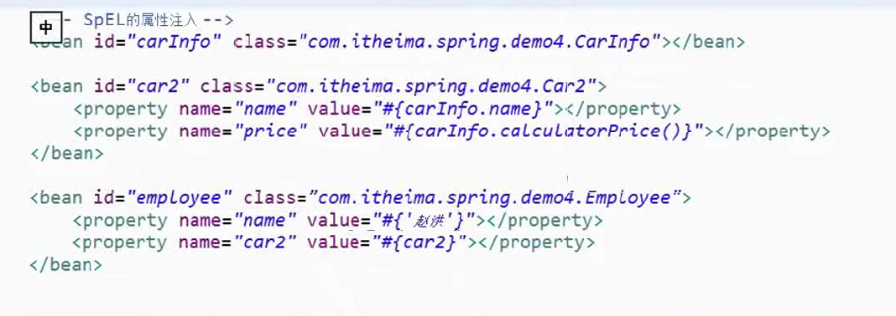

# 1. Spring的概念
EE开发的一站式框架一站式：
有EE或者SE开发的每一层解决方案
a、WEB层：SpringMVC
b、service层（业务层）：Spring的Bean管理。Spring的 声明式事务
c、DAO层：Spring的JDBC模板，Spring的ORM模型

# 2. Spring的IOC（重点）
## 2.1. IOC：控制反转，将对象的创建权反转给Spring
利用工厂+反射+配置文件的方式实现程序的解耦合
IOC和DI ，DI:依赖注入，前提必须要有IOC的环境，Spring管理这个类的时候将类的依赖的属性注入（设置）进来

# 3. Spring的工厂类
BeanFactory：老版本的工厂类
ApplicationContext：新版本的工厂类
ClassPathXmlApplicationContext: 用来加载类路径下的配置文件FileSystemXmlApplicationContext:用来加载文件系统下的配置文件

# 4. Spring的配置
1、XML的提示的相关配置

2.Bean标签的相关配置<bean>标签的id和name的配置

3.Bean生命周期的配置

4.Bean的作用就你范围的配置（重点）

# 5. Spring的属性注入
	1. 给Bean中的属性设置值的方法：

2.（构造方法）设置对象类型的属性（set方法的属性注入）设置对象类型的属性也可以用ref属性设置

3、P名称空间的属性的注入（Spring2.5以后的版本）

步骤：（加载这个之后就可以用了）

4.SpELl的属性注入（Spring3.0以后的版本）
（1）语法：#{表示式}

5.注入复杂类型（数组，集合list，set都可以这么写）map类型可以这么写

6.分模块配置
（1）在代码中引入多个xml文件

（2）在xml中引入其他文件

