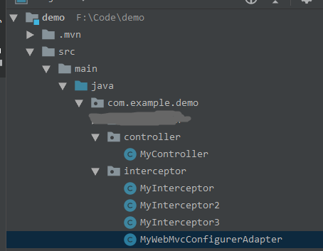
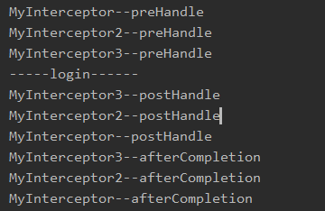
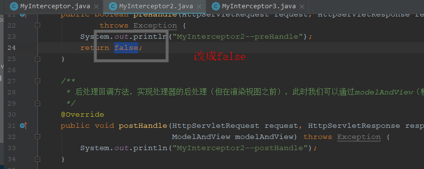
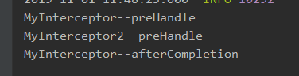

# 1. HandlerInterceptor源码
```
public interface HandlerInterceptor {

    /**
     * 预处理回调方法，实现处理器的预处理（如检查登陆），第三个参数为响应的处理器，自定义Controller
     * 返回值：true表示继续流程（如调用下一个拦截器或处理器）；false表示流程中断（如登录检查失败），不会继续调             
     * 用其他的拦截器或处理器，此时我们需要通过response来产生响应
     */
    default boolean preHandle(HttpServletRequest request, HttpServletResponse response, Object handler) throws Exception {
        return true;
    }

    /**
     * 后处理回调方法，实现处理器的后处理（但在渲染视图之前），此时我们可以通过modelAndView（模型和视图对象） 
     * 对模型数据进行处理或对视图进行处理，modelAndView也可能为null。
     */
    default void postHandle(HttpServletRequest request, HttpServletResponse response, Object handler, @Nullable ModelAndView modelAndView) throws Exception {
    }

   /**
    * 整个请求处理完毕回调方法，即在视图渲染完毕时回调，如性能监控中我们可以在此记录结束时间并输出消耗时间，还可 
    * 以进行一些资源清理，类似于try-catch-finally中的finally，但仅调用处理器执行链中
    */
    default void afterCompletion(HttpServletRequest request, HttpServletResponse response, Object handler, @Nullable Exception ex) throws Exception {
    }
}
```

可以看出来，HandlerInterceptor是一个接口，如果直接实现这个接口的话，必须所有方法都实现
如果我们仅仅想要回调其中一个参数，则可以用下面这个HandlerInterceptorAdapter

# 2. HandlerInterceptorAdapter
```
public abstract class HandlerInterceptorAdapter implements AsyncHandlerInterceptor {
    public HandlerInterceptorAdapter() {
    }

    public boolean preHandle(HttpServletRequest request, HttpServletResponse response, Object handler) throws Exception {
        return true;
    }

    public void postHandle(HttpServletRequest request, HttpServletResponse response, Object handler, @Nullable ModelAndView modelAndView) throws Exception {
    }

    public void afterCompletion(HttpServletRequest request, HttpServletResponse response, Object handler, @Nullable Exception ex) throws Exception {
    }

    public void afterConcurrentHandlingStarted(HttpServletRequest request, HttpServletResponse response, Object handler) throws Exception {
    }
}

```
可以看出 ，HandlerInterceptorAdapter是一个抽象类，如果需要特定的方法，则调用即可，不需要全部都实现
# 3. 执行流程
- 拦截器执行顺序是按照Spring配置文件中定义的顺序而定的。

- 会先按照顺序执行所有拦截器的preHandle方法，一直遇到return false为止，比如第二个preHandle方法是return false，则第三个以及以后所有拦截器都不会执行。若都是return true，则按顺序加载完preHandle方法。

- 然后执行主方法（自己的controller接口），若中间抛出异常，则跟return false效果一致，不会继续执行postHandle，只会倒序执行afterCompletion方法。

- 在主方法执行完业务逻辑（页面还未渲染数据）时，按倒序执行postHandle方法。若第三个拦截器的preHandle方法return false，则会执行第二个和第一个的postHandle方法和afterCompletion（postHandle都执行完才会执行这个，也就是页面渲染完数据后，执行after进行清理工作）方法。（**postHandle和afterCompletion都是倒序执行**）

# 4. 应用
- 日志记录，可以记录请求信息的日志，以便进行信息监控、信息统计等。
- 权限检查：如登陆检测，进入处理器检测是否登陆，如果没有直接返回到登陆页面。
- 性能监控：典型的是慢日志。
# 5. 使用
## 5.1. 测试结构

## 5.2. 代码
- MyInterceptor(MyInterceptor、MyInterceptor2、MyInterceptor3都是一样的，只是输入内容不同)

```
public class MyInterceptor  implements HandlerInterceptor {
    /**
     * 预处理回调方法，实现处理器的预处理（如检查登陆），第三个参数为响应的处理器，自定义Controller
     * 返回值：true表示继续流程（如调用下一个拦截器或处理器）；false表示流程中断（如登录检查失败），不会继续调用其他的拦截器或处理器，此时我们需要通过response来产生响应；
     */
    @Override
    public boolean preHandle(HttpServletRequest request, HttpServletResponse response, Object handler)
            throws Exception {
        System.out.println("MyInterceptor--preHandle");
        return true;
    }

    /**
     * 后处理回调方法，实现处理器的后处理（但在渲染视图之前），此时我们可以通过modelAndView（模型和视图对象）对模型数据进行处理或对视图进行处理，modelAndView也可能为null。
     */
    @Override
    public void postHandle(HttpServletRequest request, HttpServletResponse response, Object handler,
                           ModelAndView modelAndView) throws Exception {
        System.out.println("MyInterceptor--postHandle");
    }

    /**
     * 整个请求处理完毕回调方法，即在视图渲染完毕时回调，如性能监控中我们可以在此记录结束时间并输出消耗时间，还可以进行一些资源清理，类似于try-catch-finally中的finally，但仅调用处理器执行链中
     */
    @Override
    public void afterCompletion(HttpServletRequest request, HttpServletResponse response, Object handler, Exception ex)
            throws Exception {
        System.out.println("MyInterceptor--afterCompletion");
    }

}
```


- MyWebMvcConfigurerAdapter

```
@Configuration
public class MyWebMvcConfigurerAdapter implements WebMvcConfigurer {
    @Override
    public void addInterceptors(InterceptorRegistry registry) {
        registry.addInterceptor(new MyInterceptor());
        registry.addInterceptor(new MyInterceptor2());
        registry.addInterceptor(new MyInterceptor3());
    }
}

```
- MyController
```
@RestController
public class MyController {
    @GetMapping("/login")
    public void login() {
        System.out.println("-----login------");
    }
}
```

## 5.3. 测试结果
访问：http://localhost:8080/login


将MyInterceptor2的preHandle改成false

结果如下：
