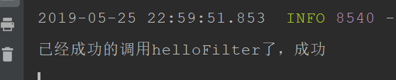

# 1. springboot的定义
Spring Boot是由Pivotal团队提供的全新框架，其设计目的是用来简化新Spring应用的初始搭建以及开发过程。该框架使用了特定的方式来进行配置，从而使开发人员不再需要定义样板化的配置。用我的话来理解，就是spring boot其实不是什么新的框架，它默认配置了很多框架的使用方式，就像maven整合了所有的jar包，spring boot整合了所有的框架（不知道这样比喻是否合适）
# 2. springboot的本质
web应用中嵌了一个servlet容器，使得web应用程序可以转化为可执行的jar文件
# 3. springboot的好处
简单，快速，配置极少
# 4. springboot整合web
## 4.1. 整合json
```
那这样就可以返回json数据
@RestController
public class HelloController {	

    @RequestMapping("/")
    public Map<String ,Object>index() {
        Map<String ,Object> map = new HashMap<String,Object>();
        map.put("msg","test json data");
        return map;
    }
}
```

# 5. springboot整合filter
## 5.1. 使用注解
首先在main方法中添加如下@ServletComponentScan
```
@SpringBootApplication
@ServletComponentScan
public class DemoApplication {
    public static void main(String[] args) {
        SpringApplication.run(DemoApplication.class, args);
    }

}
```

然后在这样写
```
@WebFilter(filterName = "helloFilter",urlPatterns = "/hello")
public class HelloFilter implements Filter {
    @Override
    public void init(FilterConfig filterConfig) throws ServletException {
    }
    
    @Override
    public void doFilter(ServletRequest servletRequest, ServletResponse servletResponse, FilterChain filterChain) throws IOException, ServletException {
        System.out.println("已经成功的调用helloFilter了，成功");
    }

    @Override
    public void destroy() {
    }
}

```

如下图：打印成功

## 5.2. 使用方法
首先，上面的方法还是先写HelloFilter.java方法
```
public class HelloFilter implements Filter {

    @Override
    public void init(FilterConfig filterConfig) throws ServletException {
    }

    @Override
    public void doFilter(ServletRequest servletRequest, ServletResponse servletResponse, FilterChain filterChain) throws IOException, ServletException {
        System.out.println("已经成功的调用myFilter了，成功");
    }

    @Override
    public void destroy() {
    }
}

```

然后main文件里面是这样的：
```
@SpringBootApplication
public class DemoApplication {
    public static void main(String[] args) {
        SpringApplication.run(DemoApplication.class, args);
    }

    @Bean
    public FilterRegistrationBean getFilterRegistrationBean(){
        FilterRegistrationBean bean = new FilterRegistrationBean(new HelloFilter());
        bean.addUrlPatterns("/hell");
        return bean;
    }
}
```

# 6. springboot整合servlet
## 6.1. 使用注解方式
main方法同上：
定义的servlet注解改为
```
@WebServlet(name="xxxx",urlPatterns="xxxx")
```
## 6.2. 使用方法
main方法的方法改为如下，其他注解去掉：
```
@Bean
    public ServletRegistrationBean getServletRegistrationBean(){
        ServletRegistrationBean bean = new ServletRegistrationBean(new SecondServlet());
        bean.addUrlMappings("/servlet");
        return bean ;
    }

```

# 7. springboot整合Listener
## 7.1. 使用注解方式
main方法同上：
定义的Listener注解改为(得继承ServletContextListener)
```
@WebListener
```
## 7.2. 使用方法
main方法的方法改为如下，其他注解去掉：
```
@Bean
    public ServletListenerRegistrationBean getServletListenerRegistrationBean(){
        ServletListenerRegistrationBean bean = new ServletListenerRegistrationBean(new SecondServlet());
        bean.addUrlMappings("/servlet");
        return bean ;
    }

```


