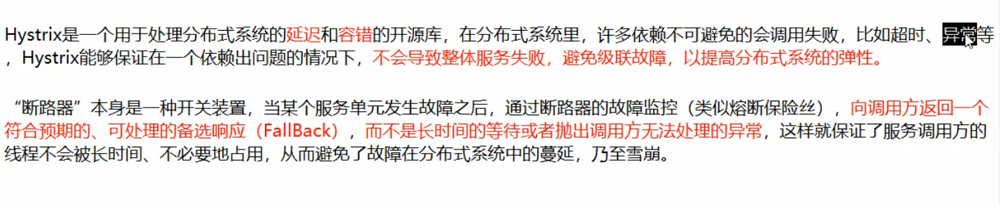
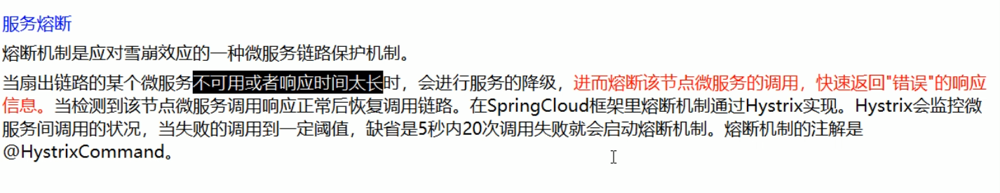
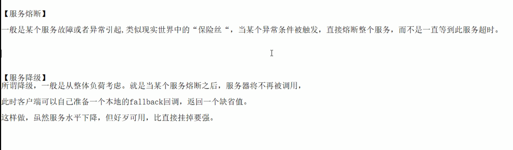
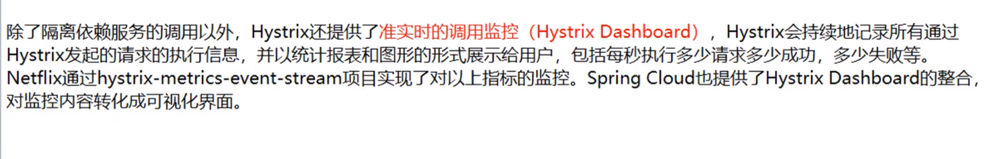

# 1. 基础概念 
## 1.1. 服务雪崩

## 1.2. Hystrix

###1.2.1. 服务熔断

## 1.3. 服务降级

## 1.4. 区别

## 1.5. hystrixDashboard

## 1.6. 依赖隔离
舱壁模式”对于熟悉Docker的读者一定不陌生，Docker通过“舱壁模式”实现进程的隔离，使得容器与容器之间不会互相影响。而Hystrix则使用该模式实现线程池的隔离，它会为每一个Hystrix命令创建一个独立的线程池，这样就算某个在Hystrix命令包装下的依赖服务出现延迟过高的情况，也只是对该依赖服务的调用产生影响，而不会拖慢其他的服务。

通过对依赖服务的线程池隔离实现，可以带来如下优势：

- 应用自身得到完全的保护，不会受不可控的依赖服务影响。即便给依赖服务分配的线程池被填满，也不会影响应用自身的额其余部分。
- 可以有效的降低接入新服务的风险。如果新服务接入后运行不稳定或存在问题，完全不会影响到应用其他的请求。
- 当依赖的服务从失效恢复正常后，它的线程池会被清理并且能够马上恢复健康的服务，相比之下容器级别的清理恢复速度要慢得多。
- 当依赖的服务出现配置错误的时候，线程池会快速的反应出此问题（通过失败次数、延迟、超时、拒绝等指标的增加情况）。同时，我们可以在不影响应用功能的情况下通过实时的动态属性刷新（后续会通过Spring Cloud Config与Spring Cloud Bus的联合使用来介绍）来处理它。
- 当依赖的服务因实现机制调整等原因造成其性能出现很大变化的时候，此时线程池的监控指标信息会反映出这样的变化。同时，我们也可以通过实时动态刷新自身应用对依赖服务的阈值进行调整以适应依赖方的改变。
除了上面通过线程池隔离服务发挥的优点之外，每个专有线程池都提供了内置的并发实现，可以利用它为同步的依赖服务构建异步的访问。
## 1.7. 断路器
“断路器”本身是一种开关装置，用于在电路上保护线路过载，当线路中有电器发生短路时，“断路器”能够及时的切断故障电路，防止发生过载、发热、甚至起火等严重后果。

在分布式架构中，断路器模式的作用也是类似的，当某个服务单元发生故障（类似用电器发生短路）之后，通过断路器的故障监控（类似熔断保险丝），直接切断原来的主逻辑调用。但是，在Hystrix中的断路器除了切断主逻辑的功能之外，还有更复杂的逻辑，下面我们来看看它更为深层次的处理逻辑。