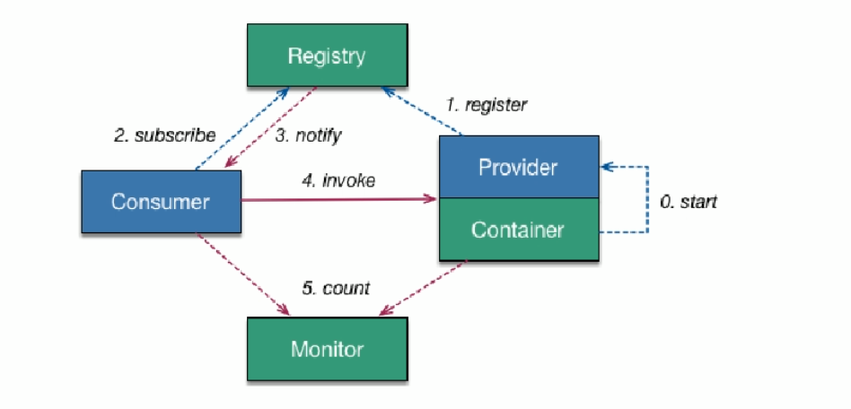

# 1. SpringCloud简介

注：Netflix图中打错
# 2. Eureka
   Eureka是Netflix开发的服务发现框架，本身是一个基于REST的服务，主要用于定位运行在AWS域中的中间层服务，以达到负载均衡和中间层服务故障转移的目的。 SpringCloud将它集成在其子项目spring-cloud-netflix中，以实现SpringCloud的服务发现功能。


## 2.1. 和dubbo之间的的对比





# 3. Nocos 
Nacos系列：基于Nacos的注册中心
## 3.1. 注册中心分类
在现有的技术方案中，注册中心主要分为两类，

- 一类是CP类注册中心，
- 另一类是AP类注册中心，Nacos属于后者
- 为什么会有 CP 和 AP 两种不同类型的注册中心呢？这就不得不提到分布式的一个理论：CAP理论。它是由加州大学的计算机科学家 Eric Brewer 提出，在一个分布式系统中，Consistency（一致性）、Availability（可用性）、Partition tolerance（分区容错性）无法同时满足，正所谓“鱼和熊掌与虾不可兼得也”。
- CP类注册中心更强调一致性，而AP类注册中心更强调可用性，
## 3.2. Nacos 结合 Spring
先来看 Nacos + Spring 的使用：

添加 maven 依赖：
```<dependency>
	<groupId>com.alibaba.nacos</groupId>
	<artifactId>nacos-spring-context</artifactId>
	<version>0.2.2-RC1</version>
</dependency>
```
使用 @EnableNacosDiscovery 开启 Nacos Spring 的服务发现功能
```
@Configuration
@EnableNacosDiscovery(globalProperties = @NacosProperties(serverAddr = "127.0.0.1:8848"))
public class NacosDiscovery {
}

```

使用 @NacosInjected 注入 Nacos 的NamingService实例，通过NamingService的registerInstance() 向 Nacos Server 注册一个名称为applicationName的服务，当然，你也可以通过 Nacos Open API 方式注册：
curl -X PUT 'http://127.0.0.1:8848/nacos/v1/ns/instance?serviceName=XXX&ip=XXX&port=XXX'，这里我们介绍使用代码的方式。
```
@Configuration
@EnableNacosDiscovery(globalProperties = @NacosProperties(serverAddr = "127.0.0.1:8848"))
public class NacosDiscovery {

    @NacosInjected
    private NamingService namingService;

    @Value("${server.port}")
    private int serverPort;

    @Value("${spring.application.name}")
    private String applicationName;

    @PostConstruct
    public void registerInstance() throws NacosException {
        namingService.registerInstance(applicationName, "127.0.0.1", serverPort);
    }
}

```

再写一个Controller来验证服务是否再 Nacos Server 上注册了，代码如下：
```
@RestController
@RequestMapping(value = "discovery")
public class NacosDiscoveryController {

    @NacosInjected
    private NamingService namingService;

    @RequestMapping(value = "/get", method = GET)
    @ResponseBody
    public List<Instance> getInstance(@RequestParam String serviceName) throws NacosException {
        return namingService.getAllInstances(serviceName);
    }
}
```
## 3.3. Nacos结合SpringBoot
添加 Starter 依赖：
```
<dependency>
	<groupId>com.alibaba.boot</groupId>
	<artifactId>nacos-discovery-spring-boot-starter</artifactId>
	<version>0.2.1</version>
</dependency>
```
注意：版本 0.2.x.RELEASE 对应的是 Spring Boot 2.x 版本，版本 0.1.x.RELEASE 对应的是 Spring Boot 1.x 版本。

在application.properties中添加如下配置信息：
```
server.port=8080
spring.application.name=nacos-springboot-discovery
nacos.discovery.server-addr=127.0.0.1:8848
```
添加NacosDiscoveryApplication启动类，使用@NacosInjected注入 Nacos 的 NamingService实例，通过NamingService的registerInstance()向 Nacos Server 注册一个名称为applicationName的服务：
```
@SpringBootApplication
public class NacosDiscoveryApplication {

    @NacosInjected
    private NamingService namingService;

    @Value("${server.port}")
    private int serverPort;

    @Value("${spring.application.name}")
    private String applicationName;

    @PostConstruct
    public void registerInstance() throws NacosException {
        namingService.registerInstance(applicationName, "127.0.0.1", serverPort);
    }

    public static void main(String[] args) {
        SpringApplication.run(NacosDiscoveryApplication.class, args);
    }

}
```
复制代码添加NacosDiscoveryController类：
```
@RestController
@RequestMapping(value = "discovery")
public class NacosDiscoveryController {

    @NacosInjected
    private NamingService namingService;

    @RequestMapping(value = "/get", method = GET)
    @ResponseBody
    public List<Instance> getInstance(@RequestParam String serviceName) throws NacosException {
        return namingService.getAllInstances(serviceName);
    }
}


```
