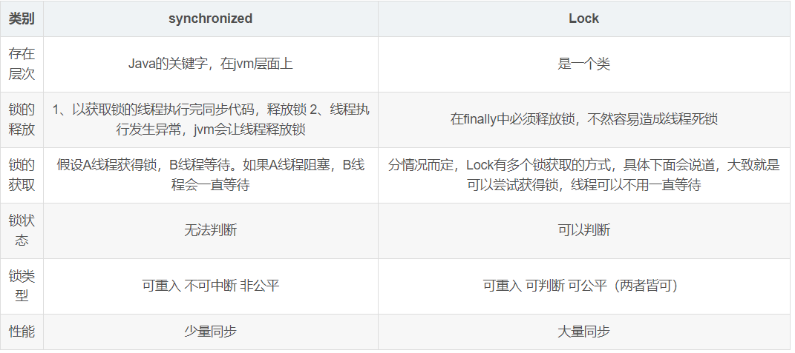
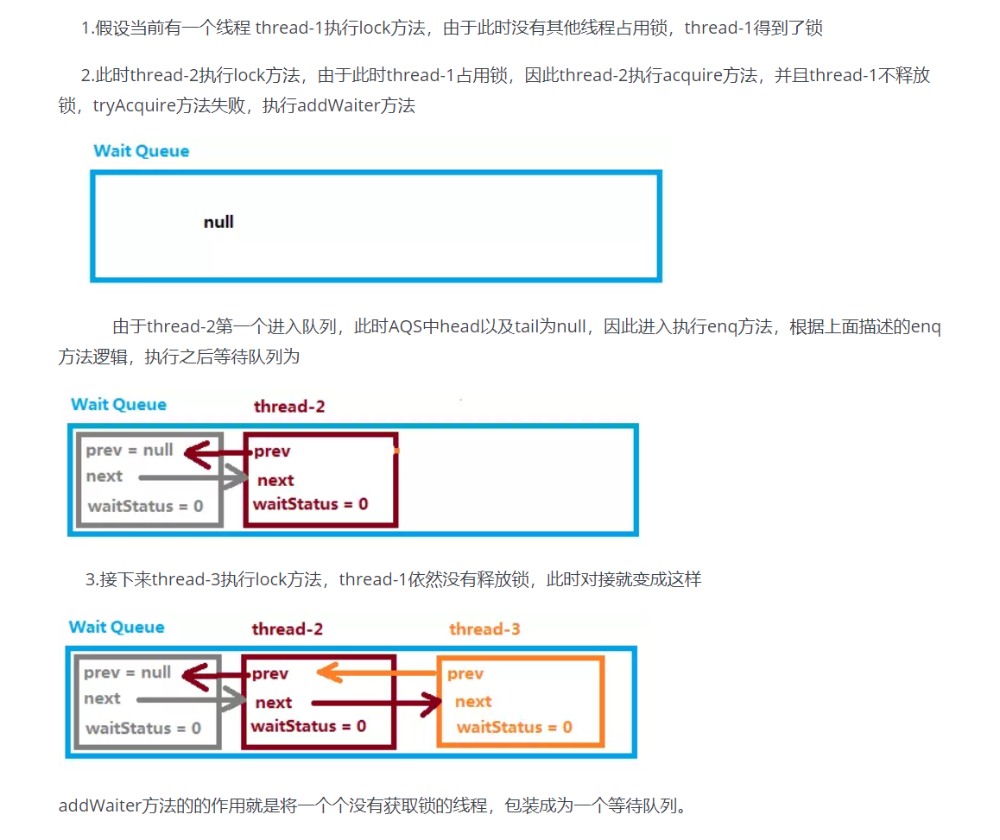
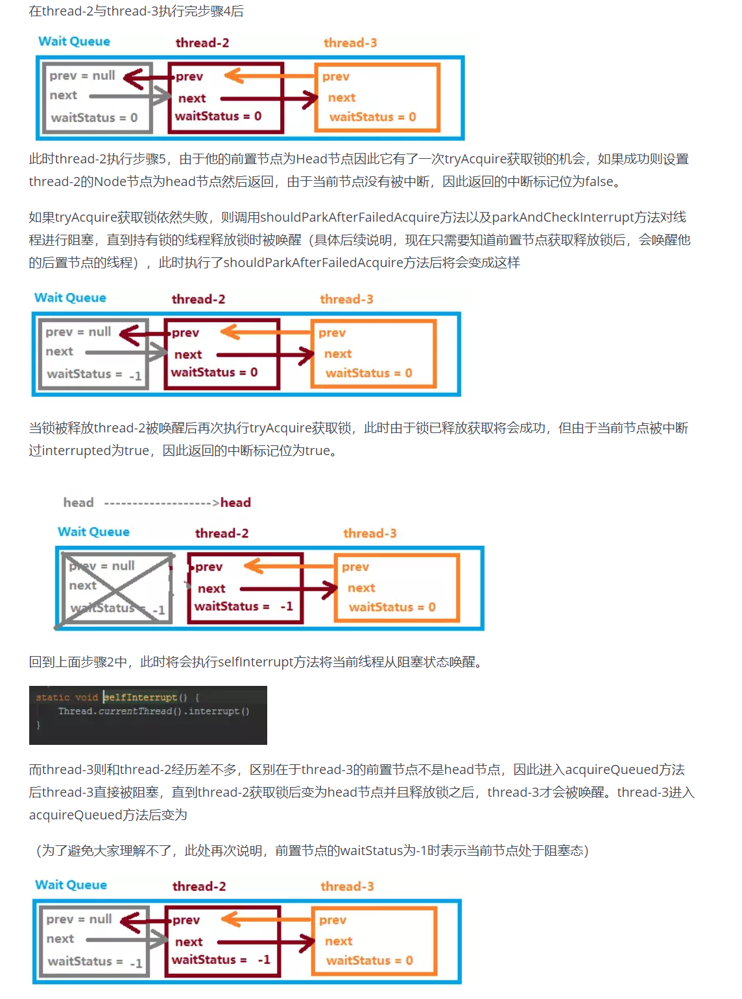

# 1. 锁的本质
锁的本质，就是一种资源，是由操作系统维护的一种专门用于同步的资源
# 2. 线程与进程：

在开始之前先把进程与线程进行区分一下，一个程序最少需要一个进程，而一个进程最少需要一个线程。关系是线程–>进程–>程序的大致组成结构。所以线程是程序执行流的最小单位，而进程是系统进行资源分配和调度的一个独立单位。以下我们所有讨论的都是建立在线程基础之上
# 3. Thread的几个重要方法
- start()方法，调用该方法开始执行该线程
- stop()方法，调用该方法强制结束该线程执行；
- join方法，调用该方法等待该线程结束。
- sleep()方法，调用该方法该线程进入等待。
- run()方法，调用该方法直接执行线程的run()方法，但是线程调用start()方法时也会运行run()方法，区别就是一个是由线程调度运行run()方法，一个是直接调用了线程中的run()方法！！

看到这里，可能有些人就会问啦，那wait()和notify()呢？要注意，其实wait()与notify()方法是Object的方法，不是Thread的方法！！同时，wait()与notify()会配合使用，分别表示线程挂起和线程恢复。

# 4. 锁类型

可重入锁：在执行对象中所有同步方法不用再次获得锁

可中断锁：在等待获取锁过程中可中断

公平锁： 按等待获取锁的线程的等待时间进行获取，等待时间长的具有优先获取锁权利

读写锁：对资源读取和写入的时候拆分为2部分处理，读的时候可以多线程一起读，写的时候必须同步地写
# 5. synchronized与Lock的区别


# 6. lock接口的方法
- lock()：获取锁，如果锁被暂用则一直等待

- unlock():释放锁

- tryLock(): 注意返回类型是boolean，如果获取锁的时候锁被占用就返回false，否则返回true

- tryLock(long time, TimeUnit unit)：比起tryLock()就是给了一个时间期限，保证等待参数时间

- lockInterruptibly()：用该锁的获得方式，如果线程在获取锁的阶段进入了等待，那么可以中断此线程，先去做别的事

# 7. 两种锁的底层实现
## 7.1. synchronized

如上就是这段代码段字节码指令，没你想的那么难吧。言归正传，我们可以清晰段看到，其实synchronized映射成字节码指令就是增加来两个指令：monitorenter和monitorexit。当一条线程进行执行的遇到monitorenter指令的时候，它会去尝试获得锁，如果获得锁那么锁计数+1（为什么会加一呢，因为它是一个可重入锁，所以需要用这个锁计数判断锁的情况），如果没有获得锁，那么阻塞。当它遇到monitorexit的时候，锁计数器-1，当计数器为0，那么就释放锁。

那么有的朋友看到这里就疑惑了，那图上有2个monitorexit呀？马上回答这个问题：上面我以前写的文章也有表述过，synchronized锁释放有两种机制，一种就是执行完释放；另外一种就是发送异常，虚拟机释放。图中第二个monitorexit就是发生异常时执行的流程，这就是我开头说的“会有2个流程存在“。而且，从图中我们也可以看到在第10行，有一个goto指令，也就是说如果正常运行结束会跳转到22行执行

## 7.2. lock

Lock：Lock实现和synchronized不一样，后者是一种悲观锁，它胆子很小，它很怕有人和它抢吃的，所以它每次吃东西前都把自己关起来。而Lock呢底层其实是CAS乐观锁的体现，它无所谓，别人抢了它吃的，它重新去拿吃的就好啦，所以它很乐观。具体底层怎么实现，博主不在细述，有机会的话，我会对concurrent包下面的机制好好和大家说说，如果面试问起，你就说底层主要靠`volatile和CAS操作实现的`。
## 7.3. lock的加锁
首先是ReentrantLock的非公平锁的加锁方法lock()

- 第一步，加锁lock()
- acquire方法
获取独占模式，忽略中断。通过调用至少一次tryAcquire方法，成功则返回。否则，线程可能排队。重复阻塞和解除阻塞，调用tryAcquire直到成功
- tryAcquire方法
- addWaiter方法
- 

## 7.4. synchronized优化
- 线程自旋和适应性自旋 
我们知道，java’线程其实是映射在内核之上的，线程的挂起和恢复会极大的影响开销。并且jdk官方人员发现，很多线程在等待锁的时候，在很短的一段时间就获得了锁，所以它们在线程等待的时候，并不需要把线程挂起，而是让他无目的的循环，一般设置10次。这样就避免了线程切换的开销，极大的提升了性能。 
而适应性自旋，是赋予了自旋一种学习能力，它并不固定自旋10次一下。他可以根据它前面线程的自旋情况，从而调整它的自旋，甚至是不经过自旋而直接挂起。

- 锁消除 
什么叫锁消除呢？就是把不必要的同步在编译阶段进行移除。 
那么有的小伙伴又迷糊了，我自己写的代码我会不知道这里要不要加锁？我加了锁就是表示这边会有同步呀？ 
并不是这样，这里所说的锁消除并不一定指代是你写的代码的锁消除，我打一个比方： 
在jdk1.5以前，我们的String字符串拼接操作其实底层是StringBuffer来实现的（这个大家可以用我前面介绍的方法，写一个简单的demo，然后查看class文件中的字节码指令就清楚了），而在jdk1.5之后，那么是用StringBuilder来拼接的。我们考虑前面的情况，比如如下代码：

```
String str1="qwe";
String str2="asd";
String str3=str1+str2;
```

底层实现会变成这样：

```
StringBuffer sb = new StringBuffer();
sb.append("qwe");
sb.append("asd");
```

我们知道，StringBuffer是一个线程安全的类，也就是说两个append方法都会同步，通过指针逃逸分析（就是变量不会外泄），我们发现在这段代码并不存在线程安全问题，这个时候就会把这个同步锁消除。

- 锁粗化 
在用synchronized的时候，我们都讲究为了避免大开销，尽量同步代码块要小。那么为什么还要加粗呢？ 
我们继续以上面的字符串拼接为例，我们知道在这一段代码中，每一个append都需要同步一次，那么我可以把锁粗化到第一个append和最后一个append（这里不要去纠结前面的锁消除，我只是打个比方）

- 轻量级锁（Lightweight Locking）
这种锁实现的背后基于这样一种假设，即在真实的情况下我们程序中的大部分同步代码一般都处于无锁竞争状态（即单线程执行环境），在无锁竞争的情况下完全可以避免调用操作系统层面的重量级互斥锁，取而代之的是在monitorenter和monitorexit中只需要依靠一条CAS原子指令就可以完成锁的获取及释放。当存在锁竞争的情况下，执行CAS指令失败的线程将调用操作系统互斥锁进入到阻塞状态，当锁被释放的时候被唤醒。

- 偏向锁（Biased Locking）：
是为了在无锁竞争的情况下避免在锁获取过程中执行不必要的CAS原子指令，因为CAS原子指令虽然相对于重量级锁来说开销比较小但还是存在非常可观的本地延迟。

