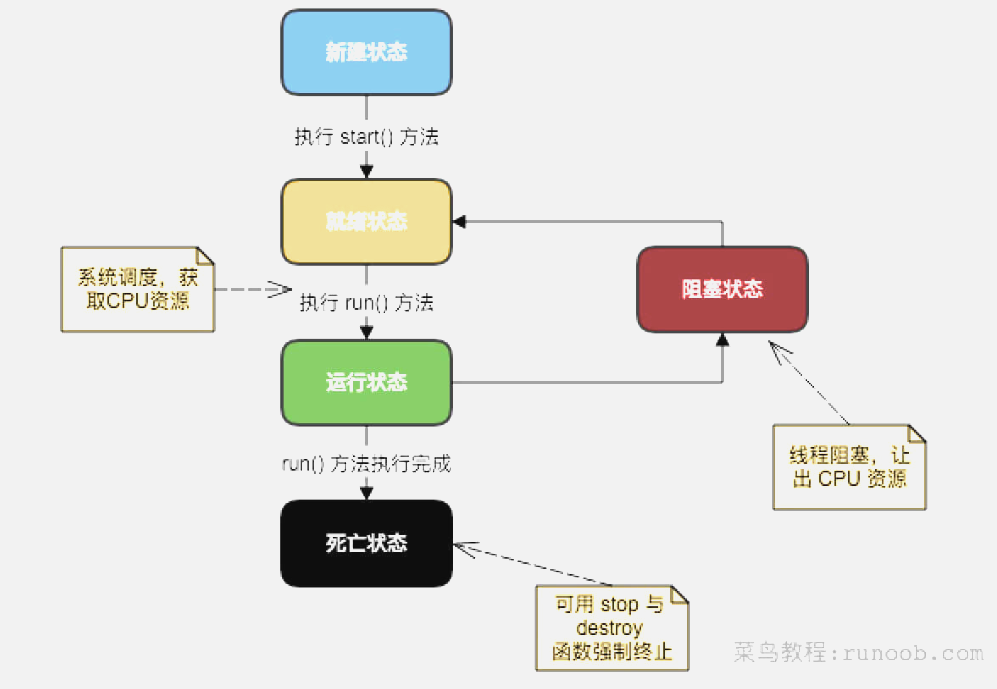
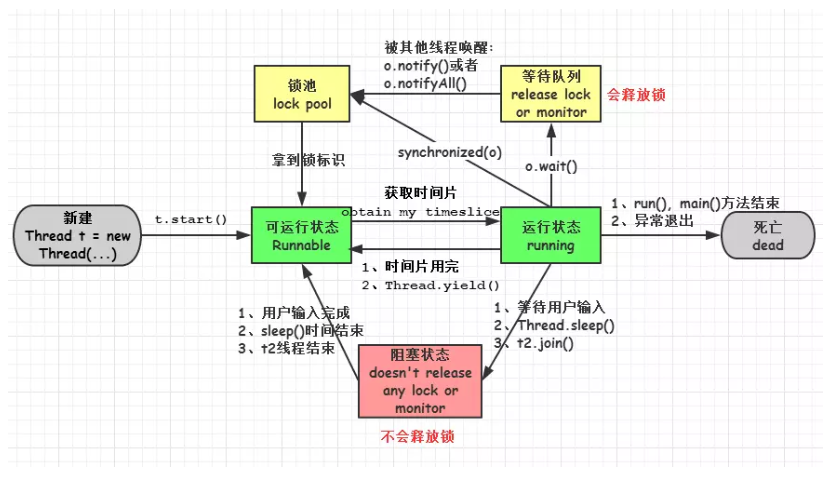
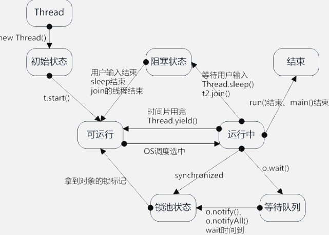

# 1. 概念
 - 进程：一个进程包括由操作系统分配的内存空间，包含一个或多个线程。一个线程不能独立的存在，它必须是进程的一部分。一个进程一直运行，直到所有的非守护线程都结束运行后才能结束。
## 1.1. 目的
多线程能满足程序员编写高效率的程序来达到充分利用 CPU 的目的
# 2. 线程的生命周期




- 新建状态:
使用 new 关键字和 Thread 类或其子类建立一个线程对象后，该线程对象就处于新建状态。它保持这个状态直到程序 start() 这个线程。

- 就绪状态:
当线程对象调用了start()方法之后，该线程就进入就绪状态。就绪状态的线程处于就绪队列中，要等待JVM里线程调度器的调度。

- 运行状态:
如果就绪状态的线程获取 CPU 资源，就可以执行 run()，此时线程便处于运行状态。处于运行状态的线程最为复杂，它可以变为阻塞状态、就绪状态和死亡状态。

- 阻塞状态:
如果一个线程执行了sleep（睡眠）、suspend（挂起）等方法，失去所占用资源之后，该线程就从运行状态进入阻塞状态。在睡眠时间已到或获得设备资源后可以重新进入就绪状态。可以分为三种：

        等待阻塞：运行状态中的线程执行 wait() 方法，使线程进入到等待阻塞状态。

        同步阻塞：线程在获取 synchronized 同步锁失败(因为同步锁被其他线程占用)。        

        其他阻塞：通过调用线程的 sleep() 或 join() 发出了 I/O 请求时，线程就会进入到阻塞状态。当sleep() 状态超时，join() 等待线程终止或超时，或者 I/O 处理完毕，线程重新转入就绪状态。

- 死亡状态:
一个运行状态的线程完成任务或者其他终止条件发生时，该线程就切换到终止状态。
# 3. 线程的创建
## 3.1. 通过实现 Runnable 接口来创建线程
- 为了实现 Runnable，一个类只需要执行一个方法调用 run()，声明如下：
  public void run()
- 新线程创建之后，你调用它的 start() 方法它才会运行。
void start();
## 3.2. 通过继承Thread来创建线程
- 创建一个线程的第二种方法是创建一个新的类，该类继承 Thread 类，然后创建一个该类的实例。

- 继承类必须重写 run() 方法，该方法是新线程的入口点。它也必须调用 start() 方法才能执行。
## 3.3. 通过 Callable 和 Future 创建线程
- 创建 Callable 接口的实现类，并实现 call() 方法，该 call() 方法将作为线程执行体，并且有返回值。

-  创建 Callable 实现类的实例，使用 FutureTask 类来包装 Callable 对象，该 FutureTask 对象封装了该 Callable 对象的 call() 方法的返回值。

-  使用 FutureTask 对象作为 Thread 对象的 target 创建并启动新线程。

-  调用 FutureTask 对象的 get() 方法来获得子线程执行结束后的返回值
```public class CallableThreadTest implements Callable<Integer> {
    public static void main(String[] args)  
    {  
        CallableThreadTest ctt = new CallableThreadTest();  
        FutureTask<Integer> ft = new FutureTask<>(ctt);  
        for(int i = 0;i < 100;i++)  
        {  
            System.out.println(Thread.currentThread().getName()+" 的循环变量i的值"+i);  
            if(i==20)  
            {  
                new Thread(ft,"有返回值的线程").start();  
            }  
        }  
        try  
        {  
            System.out.println("子线程的返回值："+ft.get());  
        } catch (InterruptedException e)  
        {  
            e.printStackTrace();  
        } catch (ExecutionException e)  
        {  
            e.printStackTrace();  
        }  
  
    }
    @Override  
    public Integer call() throws Exception  
    {  
        int i = 0;  
        for(;i<100;i++)  
        {  
            System.out.println(Thread.currentThread().getName()+" "+i);  
        }  
        return i;  
    }  
}
```

# 4. 扩展
先看一下 Runnable 和 Callable 的源码
```
public interface Runnable {
    public void run();
}

public interface Callable<V> {
    V call() throws Exception;
}

```
可以得出：
1）Callable 接口下的方法是 call()，Runnable 接口的方法是 run()。
2）Callable 的任务执行后可返回值，而 Runnable 的任务是不能返回值的。
3）call() 方法可以抛出异常，run()方法不可以的。
4）运行 Callable 任务可以拿到一个 Future 对象，表示异步计算的结果。它提供了检查计算是否完成的方法，以等待计算的完成，并检索计算的结果。通过 Future 对象可以了解任务执行情况，可取消任务的执行，还可获取执行结果。
但是，但是，凡事都有但是嘛...
单独使用 Callable，无法在新线程中(new Thread(Runnable r))使用，Thread 类只支持 Runnable。不过 Callable 可以使用 ExecutorService (又抛出一个概念，这个概念将在下面的线程池中说明)。
上面又提到了 Future，看一下 Future 接口：
```
public interface Future<V> {

    boolean cancel(boolean mayInterruptIfRunning);

    boolean isCancelled();

    boolean isDone();

    V get() throws InterruptedException, ExecutionException;

    V get(long timeout, TimeUnit unit)
        throws InterruptedException, ExecutionException, TimeoutException;
}

```
Future 定义了5个方法：
1）boolean cancel(boolean mayInterruptIfRunning)：试图取消对此任务的执行。如果任务已完成、或已取消，或者由于某些其他原因而无法取消，则此尝试将失败。当调用 cancel() 时，如果调用成功，而此任务尚未启动，则此任务将永不运行。如果任务已经启动，则 mayInterruptIfRunning 参数确定是否应该以试图停止任务的方式来中断执行此任务的线程。此方法返回后，对 isDone() 的后续调用将始终返回 true。如果此方法返回 true，则对 isCancelled() 的后续调用将始终返回 true。

2）boolean isCancelled()：如果在任务正常完成前将其取消，则返回 true。

3）boolean isDone()：如果任务已完成，则返回 true。 可能由于正常终止、异常或取消而完成，在所有这些情况中，此方法都将返回 true。

4）V get()throws InterruptedException,ExecutionException：如有必要，等待计算完成，然后获取其结果。

5）V get(long timeout,TimeUnit unit) throws  InterruptedException, ExecutionException, TimeoutException： 如有必要，最多等待为使计算完成所给定的时间之后，获取其结果（如果结果可用）。

看来 Future 接口也不能用在线程中，那怎么用，谁实现了 Future 接口呢？答：FutureTask。
```
public class FutureTask<V> implements RunnableFuture<V> {
    ...
}

public interface RunnableFuture<V> extends Runnable, Future<V> {
    void run();
}

```

FutureTask 实现了 Runnable 和 Future，所以兼顾两者优点，既可以在 Thread 中使用，又可以在 ExecutorService 中使用。
看完上面啰哩啰嗦的介绍后，下面我们具体看一下具体使用的示例：
```
Callable<String> callable = new Callable<String>() {
    @Override
    public String call() throws Exception {
        return "个人博客：sunfusheng.com";
    }
};

FutureTask<String> task = new FutureTask<String>(callable);

Thread t = new Thread(task);
t.start(); // 启动线程
task.cancel(true); // 取消线程
```

使用 FutureTask 的好处是 FutureTask 是为了弥补 Thread 的不足而设计的，它可以让程序员准确地知道线程什么时候执行完成并获得到线程执行完成后返回的结果。FutureTask 是一种可以取消的异步的计算任务，它的计算是通过 Callable 实现的，它等价于可以携带结果的 Runnable，并且有三个状态：等待、运行和完成。完成包括所有计算以任意的方式结束，包括正常结束、取消和异常。

# 5. Thread中的run（）和start（）
- start（）方法来启动线程，真正实现了多线程运行。这时无需等待run方法体代码执行完毕，可以直接继续执行下面的代码；通过调用Thread类的start()方法来启动一个线程， 这时此线程是处于就绪状态， 并没有运行。 然后通过此Thread类调用方法run()来完成其运行操作的， 这里方法run()称为线程体，它包含了要执行的这个线程的内容， Run方法运行结束， 此线程终止。然后CPU再调度其它线程。
- run（）方法当作普通方法的方式调用。程序还是要顺序执行，要等待run方法体执行完毕后，才可继续执行下面的代码； 程序中只有主线程——这一个线程， 其程序执行路径还是只有一条， 这样就没有达到写线程的目的
# 6. Java多线程分类
## 6.1. 7.1 多线程分类
用户线程：运行在前台，执行具体的任务，如程序的主线程、连接网络的子线程等都是用户线程
守护线程：运行在后台，为其他前台线程服务.也可以说守护线程是JVM中非守护线程的 “佣人”。
特点：一旦所有用户线程都结束运行，守护线程会随JVM一起结束工作
应用：数据库连接池中的检测线程，JVM虚拟机启动后的检测线程
最常见的守护线程：垃圾回收线程
## 6.2. 如何设置守护线程？
可以通过调用Thead类的setDaemon(true)方法设置当前的线程为守护线程
注意事项：
1.  setDaemon(true)必须在start（）方法前执行，否则会抛出IllegalThreadStateException异常
2. 在守护线程中产生的新线程也是守护线程
3. 不是所有的任务都可以分配给守护线程来执行，比如读写操作或者计算逻辑
MyThread.java：
```
public class MyThread extends Thread {
	private int i = 0;

	@Override
	public void run() {
		try {
			while (true) {
				i++;
				System.out.println("i=" + (i));
				Thread.sleep(100);
			}
		} catch (InterruptedException e) {
			// TODO Auto-generated catch block
			e.printStackTrace();
		}
	}
}
```
复制代码 Run.java：
```
public class Run {
	public static void main(String[] args) {
		try {
			MyThread thread = new MyThread();
			thread.setDaemon(true);
			thread.start();
			Thread.sleep(5000);
			System.out.println("我离开thread对象也不再打印了，也就是停止了！");
		} catch (InterruptedException e) {
			// TODO Auto-generated catch block
			e.printStackTrace();
		}
	}
}

```


