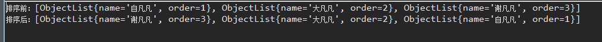
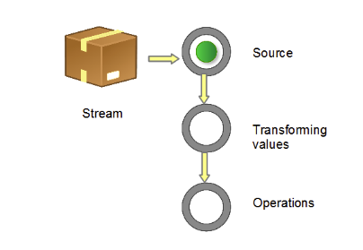

# 1. lambda表示式
## 1.1. 背景
java的匿名内部类允许我们通过简洁的方式实现一个类或者一个类的方法，它没有名字，只使用一次。比如下面的代码：

```
JButton testButton = new JButton("Test Button");

testButton.addActionListener(new ActionListener(){
    @Override public void actionPerformed(ActionEvent ae){
        System.out.println("Click Detected by Anon Class");
    }
});
```

上面的例子表示一个button增加一个监听器。而ActionListener是一个接口，并且它只有一个方法。它的定义如下所示：

```
package java.awt.event;
import java.util.EventListener;

public interface ActionListener extends EventListener {

    public void actionPerformed(ActionEvent e);
}
```

注意：上面这种接口类型有一个特点，那就是一个接口中只定义了一个方法。这一点对于lambda表达式特别重要

## 1.2. 语法
一个Lambda表达式由三部分组成：

```
参数列表	            箭头	      Body
(int x, int y)	   ->	        x + y
```
body部分可以是单个表达式，也可以是一个代码块。所以body相当于匿名内部类中的方法体。如果body中只有一个表达式，比如上面所示的x+y，那么相当于return x+y，return是可以被省略的。

看下面例子：

```
(int x, int y) -> x + y  //第一个表达式有两个形参，分别是x和y，函数的作用是返回x+y的值。

() -> 42  //第二个表达式没有参数，函数的作用是直接返回42

(String s) -> { System.out.println(s); }  //第三个表达式有一个字符串类型的参数，函数的作用是打印该字符串
```
## 1.3. 例子
```
List<ObjectListSort> list = new ArrayList<>();
		ObjectListSort a1 = new ObjectListSort();
		a1.setName("自凡凡");
		a1.setOrder(1);
		ObjectListSort a2 = new ObjectListSort();
		a2.setName("大凡凡");
		a2.setOrder(2);
		ObjectListSort a3 = new ObjectListSort();
		a3.setName("谢凡凡");
		a3.setOrder(3);
		list.add(a1);
		list.add(a2);
		list.add(a3);
		System.out.println("排序前：" + list.toString());

		/*
		 * JDK1.8之前
		 */

		Collections.sort(list, new Comparator<ObjectListSort>() {

			@Override
			public int compare(ObjectListSort o1, ObjectListSort o2) { // TODO
				return o2.getOrder().compareTo(o1.getOrder());
			}
			
     System.out.println("排序后：" + list.toString());
		});
```
结果：


而使用lambda表示式，则将上面的注释的代码换成
```
Collections.sort(list, (o1, o2) -> o2.getOrder().compareTo(o1.getOrder()));
```

# 2. Streams API 
## 2.1. 简介
Stream 作为 Java 8 的一大亮点，它与 java.io 包里的 InputStream 和 OutputStream 是完全不同的概念。它也不同于 StAX 对 XML 解析的 Stream，也不是 Amazon Kinesis 对大数据实时处理的 Stream。

Java 8 中的 Stream 是对集合（Collection）对象功能的增强，它专注于对集合对象进行各种非常便利、高效的聚合操作（aggregate operation），或者大批量数据操作 (bulk data operation)。Stream API 借助于同样新出现的 Lambda 表达式，极大的提高编程效率和程序可读性。同时它提供串行和并行两种模式进行汇聚操作，并发模式能够充分利用多核处理器的优势，使用 fork/join 并行方式来拆分任务和加速处理过程。

通常编写并行代码很难而且容易出错, 但使用 Stream API 无需编写一行多线程的代码，就可以很方便地写出高性能的并发程序。所以说，Java 8 中首次出现的 java.util.stream 是一个函数式语言+多核时代综合影响的产物。

## 2.2. 什么是聚合操作
在传统的 J2EE 应用中，Java 代码经常不得不依赖于关系型数据库的聚合操作来完成诸如：

客户每月平均消费金额
最昂贵的在售商品
本周完成的有效订单（排除了无效的）
取十个数据样本作为首页推荐
这类的操作

## 2.3. 什么是流
Stream 不是集合元素，它不是数据结构并不保存数据，它是有关算法和计算的，它更像一个高级版本的 Iterator。原始版本的 Iterator，用户只能显式地一个一个遍历元素并对其执行某些操作；高级版本的 Stream，用户只要给出需要对其包含的元素执行什么操作，比如 “过滤掉长度大于 10 的字符串”、“获取每个字符串的首字母”等，Stream 会隐式地在内部进行遍历，做出相应的数据转换。

Stream 就如同一个迭代器（Iterator），单向，不可往复，数据只能遍历一次，遍历过一次后即用尽了，就好比流水从面前流过，一去不复返。

而和迭代器又不同的是，Stream 可以并行化操作，迭代器只能命令式地、串行化操作。顾名思义，当使用串行方式去遍历时，每个 item 读完后再读下一个 item。而使用并行去遍历时，数据会被分成多个段，其中每一个都在不同的线程中处理，然后将结果一起输出。Stream 的并行操作依赖于 Java7 中引入的 Fork/Join 框架（JSR166y）来拆分任务和加速处理过程。Java 的并行 API 演变历程基本如下：

1.0-1.4 中的 java.lang.Thread
5.0 中的 java.util.concurrent
6.0 中的 Phasers 等
7.0 中的 Fork/Join 框架
8.0 中的 Lambda
Stream 的另外一大特点是，数据源本身可以是无限的

## 2.4. 流的构成
当我们使用一个流的时候，通常包括三个基本步骤：

### 2.4.1. 数据源
获取一个数据源（source）→ 数据转换→执行操作获取想要的结果，每次转换原有 Stream 对象不改变，返回一个新的 Stream 对象（可以有多次转换），这就允许对其操作可以像链条一样排列，变成一个管道，如下图所示。

图 1. 流管道 (Stream Pipeline) 的构成

有多种方式生成 Stream Source：

- 从 Collection 和数组
```
Collection.stream()
Collection.parallelStream()
Arrays.stream(T array) or Stream.of()
从 BufferedReader
java.io.BufferedReader.lines()
```
- 静态工厂
```
java.util.stream.IntStream.range()
java.nio.file.Files.walk()
```
- 自己构建
```
java.util.Spliterator
```
- 其它
```
Random.ints()
BitSet.stream()
Pattern.splitAsStream(java.lang.CharSequence)
JarFile.stream()
```

### 2.4.2. 操作类型
流的操作类型分为两种：

- Intermediate： 
一个流可以后面跟随零个或多个 intermediate 操作。其目的主要是打开流，做出某种程度的数据映射/过滤，然后返回一个新的流，交给下一个操作使用。这类操作都是惰性化的（lazy），就是说，仅仅调用到这类方法，并没有真正开始流的遍历。

- Terminal：
一个流只能有一个 terminal 操作，当这个操作执行后，流就被使用“光”了，无法再被操作。所以这必定是流的最后一个操作。Terminal 操作的执行，才会真正开始流的遍历，并且会生成一个结果，或者一个 side effect。
在对于一个 Stream 进行多次转换操作 (Intermediate 操作)，每次都对 Stream 的每个元素进行转换，而且是执行多次，这样时间复杂度就是 N（转换次数）个 for 循环里把所有操作都做掉的总和吗？其实不是这样的，转换操作都是 lazy 的，多个转换操作只会在 Terminal 操作的时候融合起来，一次循环完成。我们可以这样简单的理解，Stream 里有个操作函数的集合，每次转换操作就是把转换函数放入这个集合中，在 Terminal 操作的时候循环 Stream 对应的集合，然后对每个元素执行所有的函数。

- 还有一种操作被称为 short-circuiting。用以指：

对于一个 intermediate 操作，如果它接受的是一个无限大（infinite/unbounded）的 Stream，但返回一个有限的新 Stream。
对于一个 terminal 操作，如果它接受的是一个无限大的 Stream，但能在有限的时间计算出结果。
当操作一个无限大的 Stream，而又希望在有限时间内完成操作，则在管道内拥有一个 short-circuiting 操作是必要非充分条件。

清单 3. 一个流操作的示例
```
int sum = widgets.stream()
.filter(w -> w.getColor() == RED)
 .mapToInt(w -> w.getWeight())
 .sum();
```
stream() 获取当前小物件的 source，filter 和 mapToInt 为 intermediate 操作，进行数据筛选和转换，最后一个 sum() 为 terminal 操作，对符合条件的全部小物件作重量求和。

## 2.5. 流的使用
