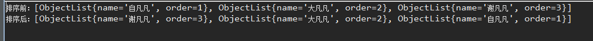

# 1. lambda表示式
## 1.1. 背景
java的匿名内部类允许我们通过简洁的方式实现一个类或者一个类的方法，它没有名字，只使用一次。比如下面的代码：

```
JButton testButton = new JButton("Test Button");

testButton.addActionListener(new ActionListener(){
    @Override public void actionPerformed(ActionEvent ae){
        System.out.println("Click Detected by Anon Class");
    }
});
```

上面的例子表示一个button增加一个监听器。而ActionListener是一个接口，并且它只有一个方法。它的定义如下所示：

```
package java.awt.event;
import java.util.EventListener;

public interface ActionListener extends EventListener {

    public void actionPerformed(ActionEvent e);
}
```

注意：上面这种接口类型有一个特点，那就是一个接口中只定义了一个方法。这一点对于lambda表达式特别重要

## 1.2. 语法
一个Lambda表达式由三部分组成：

```
参数列表	            箭头	      Body
(int x, int y)	   ->	        x + y
```
body部分可以是单个表达式，也可以是一个代码块。所以body相当于匿名内部类中的方法体。如果body中只有一个表达式，比如上面所示的x+y，那么相当于return x+y，return是可以被省略的。

看下面例子：

```
(int x, int y) -> x + y  //第一个表达式有两个形参，分别是x和y，函数的作用是返回x+y的值。

() -> 42  //第二个表达式没有参数，函数的作用是直接返回42

(String s) -> { System.out.println(s); }  //第三个表达式有一个字符串类型的参数，函数的作用是打印该字符串
```
## 1.3. 例子
```
List<ObjectListSort> list = new ArrayList<>();
		ObjectListSort a1 = new ObjectListSort();
		a1.setName("自凡凡");
		a1.setOrder(1);
		ObjectListSort a2 = new ObjectListSort();
		a2.setName("大凡凡");
		a2.setOrder(2);
		ObjectListSort a3 = new ObjectListSort();
		a3.setName("谢凡凡");
		a3.setOrder(3);
		list.add(a1);
		list.add(a2);
		list.add(a3);
		System.out.println("排序前：" + list.toString());

		/*
		 * JDK1.8之前
		 */

		Collections.sort(list, new Comparator<ObjectListSort>() {

			@Override
			public int compare(ObjectListSort o1, ObjectListSort o2) { // TODO
				return o2.getOrder().compareTo(o1.getOrder());
			}
			
     System.out.println("排序后：" + list.toString());
		});
```
结果：


而使用lambda表示式，则将上面的注释的代码换成
```
Collections.sort(list, (o1, o2) -> o2.getOrder().compareTo(o1.getOrder()));
```

