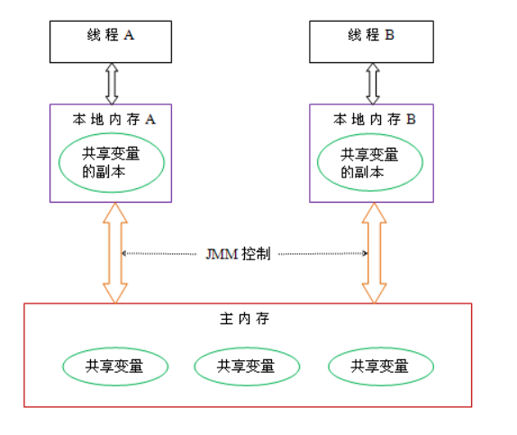
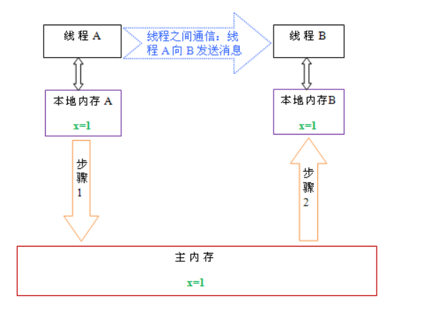
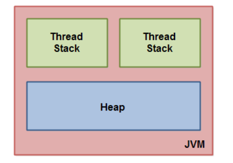
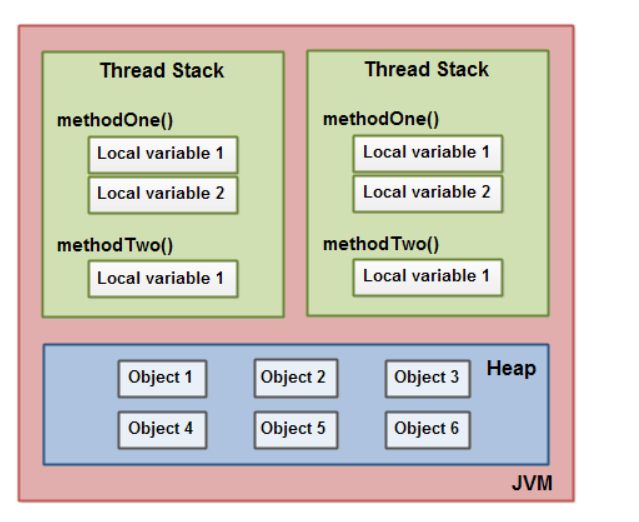
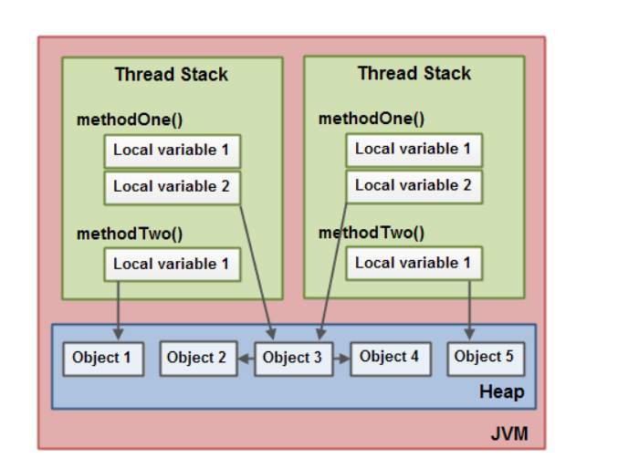

# 1. Java内存模型
Java Memory Model，简称JMM。JMM定义了Java 虚拟机(JVM)在计算机内存(RAM)中的工作方式。JVM是整个计算机虚拟模型，所以JMM是隶属于JVM的。

如果我们要想深入了解Java并发编程，就要先理解好Java内存模型。Java内存模型定义了多线程之间共享变量的可见性以及如何在需要的时候对共享变量进行同步。原始的Java内存模型效率并不是很理想，因此Java1.5版本对其进行了重构，现在的Java8仍沿用了Java1.5的版本。

# 2. 并发编程
在并发编程领域，有两个关键问题：线程之间的通信和同步。

## 2.1. 线程之间的通信
线程的通信是指线程之间以何种机制来交换信息。在命令式编程中，线程之间的通信机制有两种`共享内存`和`消息传递`。

- 共享内存
的并发模型里，线程之间共享程序的公共状态，线程之间通过写-读内存中的公共状态来隐式进行通信，典型的共享内存通信方式就是通过共享对象进行通信。

- 消息传递
的并发模型里，线程之间没有公共状态，线程之间必须通过明确的发送消息来显式进行通信，在java中典型的消息传递方式就是wait()和notify()。

关于Java线程之间的通信，可以参考线程之间的通信（thread signal）。

## 2.2. 线程之间的同步
同步是指程序用于控制不同线程之间操作发生相对顺序的机制。

在共享内存并发模型里，同步是显式进行的。程序员必须显式指定某个方法或某段代码需要在线程之间互斥执行。

在消息传递的并发模型里，由于消息的发送必须在消息的接收之前，因此同步是隐式进行的。

Java的并发采用的是共享内存模型
Java线程之间的通信总是隐式进行，整个通信过程对程序员完全透明。如果编写多线程程序的Java程序员不理解隐式进行的线程之间通信的工作机制，很可能会遇到各种奇怪的内存可见性问题
# 3. Java内存模型
上面讲到了Java线程之间的通信采用的是过共享内存模型，这里提到的共享内存模型指的就是Java内存模型(简称JMM)，JMM决定一个线程对共享变量的写入何时对另一个线程可见。从抽象的角度来看，JMM定义了线程和主内存之间的抽象关系：线程之间的共享变量存储在主内存（main memory）中，每个线程都有一个私有的本地内存（local memory），本地内存中存储了该线程以读/写共享变量的副本。本地内存是JMM的一个抽象概念，并不真实存在。它涵盖了缓存，写缓冲区，寄存器以及其他的硬件和编译器优化。


从上图来看，线程A与线程B之间如要通信的话，必须要经历下面2个步骤：

```
首先，线程A把本地内存A中更新过的共享变量刷新到主内存中去。
然后，线程B到主内存中去读取线程A之前已更新过的共享变量。 

```
下面通过示意图来说明这两个步骤： 


如上图所示，本地内存A和B有主内存中共享变量x的副本。假设初始时，这三个内存中的x值都为0。线程A在执行时，把更新后的x值（假设值为1）临时存放在自己的本地内存A中。当线程A和线程B需要通信时，线程A首先会把自己本地内存中修改后的x值刷新到主内存中，此时主内存中的x值变为了1。随后，线程B到主内存中去读取线程A更新后的x值，此时线程B的本地内存的x值也变为了1。

从整体来看，这两个步骤实质上是线程A在向线程B发送消息，而且这个通信过程必须要经过主内存。JMM通过控制主内存与每个线程的本地内存之间的交互，来为java程序员提供内存可见性保证。

上面也说到了，Java内存模型只是一个抽象概念，那么它在Java中具体是怎么工作的呢？为了更好的理解上Java内存模型工作方式，下面就JVM对Java内存模型的实现、硬件内存模型及它们之间的桥接做详细介绍

# 4. JVM对Java内存模型的实现 
在JVM内部，Java内存模型把内存分成了两部分：线程栈区和堆区，下图展示了Java内存模型在JVM中的逻辑视图：

JVM中运行的每个线程都拥有自己的线程栈，线程栈包含了当前线程执行的方法调用相关信息，我们也把它称作调用栈。随着代码的不断执行，调用栈会不断变化。

线程栈还包含了当前方法的所有本地变量信息。一个线程只能读取自己的线程栈，也就是说，线程中的本地变量对其它线程是不可见的。即使两个线程执行的是同一段代码，它们也会各自在自己的线程栈中创建本地变量，因此，每个线程中的本地变量都会有自己的版本。

所有原始类型(boolean,byte,short,char,int,long,float,double)的本地变量都直接保存在线程栈当中，对于它们的值各个线程之间都是独立的。对于原始类型的本地变量，一个线程可以传递一个副本给另一个线程，当它们之间是无法共享的。

堆区包含了Java应用创建的所有对象信息，不管对象是哪个线程创建的，其中的对象包括原始类型的封装类（如Byte、Integer、Long等等）。不管对象是属于一个成员变量还是方法中的本地变量，它都会被存储在堆区。

下图展示了调用栈和本地变量都存储在栈区，对象都存储在堆区：


一个本地变量如果是原始类型，那么它会被完全存储到栈区。 
一个本地变量也有可能是一个对象的引用，这种情况下，这个本地引用会被存储到栈中，但是对象本身仍然存储在堆区。

对于一个对象的成员方法，这些方法中包含本地变量，仍需要存储在栈区，即使它们所属的对象在堆区。 
对于一个对象的成员变量，不管它是原始类型还是包装类型，都会被存储到堆区。

Static类型的变量以及类本身相关信息都会随着类本身存储在堆区。

堆中的对象可以被多线程共享。如果一个线程获得一个对象的应用，它便可访问这个对象的成员变量。如果两个线程同时调用了同一个对象的同一个方法，那么这两个线程便可同时访问这个对象的成员变量，但是对于本地变量，每个线程都会拷贝一份到自己的线程栈中。

下图展示了上面描述的过程:

