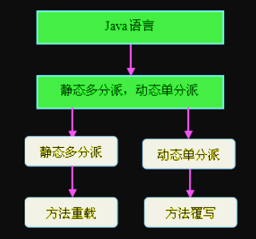

# 1. 方法解析
   Class文件的编译过程中不包含传统编译中的连接步骤，一切方法调用在Class文件里面存储的都只是符号引用，而不是方法在实际运行时内存布局中的入口地址。这个特性给Java带来了更强大的动态扩展能力，使得可以在类运行期间才能确定某些目标方法的直接引用，称为动态连接，也有一部分方法的符号引用在类加载阶段或第一次使用时转化为直接引用，这种转化称为静态解析。这在前面的“Java内存区域与内存溢出”一文中有提到。

   静态解析成立的前提是：方法在程序真正执行前就有一个可确定的调用版本，并且这个方法的调用版本在运行期是不可改变的。换句话说，调用目标在编译器进行编译时就必须确定下来，这类方法的调用称为解析。

   在Java语言中，符合“编译器可知，运行期不可变”这个要求的方法主要有静态方法和私有方法两大类，前者与类型直接关联，后者在外部不可被访问，这两种方法都不可能通过继承或别的方式重写出其他的版本，因此它们都适合在类加载阶段进行解析。

   Java虚拟机里共提供了四条方法调用字节指令，分别是：

invokestatic：调用静态方法。
invokespecial：调用实例构造器<init>方法、私有方法和父类方法。
invokevirtual：调用所有的虚方法。
invokeinterface：调用接口方法，会在运行时再确定一个实现此接口的对象。
    只要能被invokestatic和invokespecial指令调用的方法，都可以在解析阶段确定唯一的调用版本，符合这个条件的有静态方法、私有方法、实例构造器和父类方法四类，它们在类加载时就会把符号引用解析为该方法的直接引用。这些方法可以称为非虚方法（还包括final方法），与之相反，其他方法就称为虚方法（final方法除外）。这里要特别说明下final方法，虽然调用final方法使用的是invokevirtual指令，但是由于它无法覆盖，没有其他版本，所以也无需对方发接收者进行多态选择。Java语言规范中明确说明了final方法是一种非虚方法。
    解析调用一定是个静态过程，在编译期间就完全确定，在类加载的解析阶段就会把涉及的符号引用转化为可确定的直接引用，不会延迟到运行期再去完成。而分派调用则可能是静态的也可能是动态的，根据分派依据的宗量数（方法的调用者和方法的参数统称为方法的宗量）又可分为单分派和多分派。两类分派方式两两组合便构成了静态单分派、静态多分派、动态单分派、动态多分派四种分派情况。
    
# 2. 静态分派   
  
  所有依赖静态类型来定位方法执行版本的分派动作，都称为静态分派，静态分派的最典型应用就是多态性中的方法重载。静态分派发生在编译阶段，因此确定静态分配的动作实际上不是由虚拟机来执行的。下面通过一段方法重载的示例程序来更清晰地说明这种分派机制：


```
class Human{
}  
class Man extends Human{
}
class Woman extends Human{
}
 
public class StaticPai{
 
	public void say(Human hum){
		System.out.println("I am human");
	}
	public void say(Man hum){
		System.out.println("I am man");
	}
	public void say(Woman hum){
		System.out.println("I am woman");
	}
 
	public static void main(String[] args){
		Human man = new Man();
		Human woman = new Woman();
		StaticPai sp = new StaticPai();
		sp.say(man);
		sp.say(woman);
	}
}
```
    上面代码的执行结果如下：
    I am human
    I am human

   以上结果的得出应该不难分析。在分析为什么会选择参数类型为Human的重载方法去执行之前，先看如下代码：

Human man = new Man（）;
    我们把上面代码中的“Human”称为变量的静态类型，后面的“Man”称为变量的实际类型。静态类型和实际类型在程序中都可以发生一些变化，区别是静态类型的变化仅仅在使用时发生，变量本身的静态类型不会被改变，并且最终的静态类型是在编译期可知的，而实际类型变化的结果在运行期才可确定。
    回到上面的代码分析中，在调用say（）方法时，方法的调用者（回忆上面关于宗量的定义，方法的调用者属于宗量）都为sp的前提下，使用哪个重载版本，完全取决于传入参数的数量和数据类型（方法的参数也是数据宗量）。代码中刻意定义了两个静态类型相同、实际类型不同的变量，可见编译器（不是虚拟机，因为如果是根据静态类型做出的判断，那么在编译期就确定了）在重载时是通过参数的静态类型而不是实际类型作为判定依据的。并且静态类型是编译期可知的，所以在编译阶段，Javac编译器就根据参数的静态类型决定使用哪个重载版本。这就是静态分派最典型的应用。

# 3. 动态分派  
   动态分派与多态性的另一个重要体现——方法覆写有着很紧密的关系。向上转型后调用子类覆写的方法便是一个很好地说明动态分派的例子。这种情况很常见，因此这里不再用示例程序进行分析。很显然，在判断执行父类中的方法还是子类中覆盖的方法时，如果用静态类型来判断，那么无论怎么进行向上转型，都只会调用父类中的方法，但实际情况是，根据对父类实例化的子类的不同，调用的是不同子类中覆写的方法，很明显，这里是要根据变量的实际类型来分派方法的执行版本的。而实际类型的确定需要在程序运行时才能确定下来，这种在运行期根据实际类型确定方法执行版本的分派过程称为动态分派。
 

# 4. 单分派和多分派
   前面给出：方法的接受者（亦即方法的调用者）与方法的参数统称为方法的宗量。但分派是根据一个宗量对目标方法进行选择，多分派是根据多于一个宗量对目标方法进行选择。

   为了方便理解，下面给出一段示例代码：
```
class Eat{
}
class Drink{
}
 
class Father{
	public void doSomething(Eat arg){
		System.out.println("爸爸在吃饭");
	}
	public void doSomething(Drink arg){
		System.out.println("爸爸在喝水");
	}
}
 
class Child extends Father{
	public void doSomething(Eat arg){
		System.out.println("儿子在吃饭");
	}
	public void doSomething(Drink arg){
		System.out.println("儿子在喝水");
	}
}
 
public class SingleDoublePai{
	public static void main(String[] args){
		Father father = new Father();
		Father child = new Child();
		father.doSomething(new Eat());
		child.doSomething(new Drink());
	}
}
```

   运行结果应该很容易预测到，如下：
    爸爸在吃饭
    儿子在喝水
    我们首先来看编译阶段编译器的选择过程，即静态分派过程。这时候选择目标方法的依据有两点：一是方法的接受者（即调用者）的静态类型是Father还是Child，二是方法参数类型是Eat还是Drink。因为是根据两个宗量进行选择，所以Java语言的静态分派属于多分派类型。
    再来看运行阶段虚拟机的选择，即动态分派过程。由于编译期已经了确定了目标方法的参数类型（编译期根据参数的静态类型进行静态分派），因此唯一可以影响到虚拟机选择的因素只有此方法的接受者的实际类型是Father还是Child。因为只有一个宗量作为选择依据，所以Java语言的动态分派属于单分派类型。




   根据以上论证，我们可以总结如下：目前的Java语言（JDK1.6）是一门静态多分派、动态单分派的语言。


