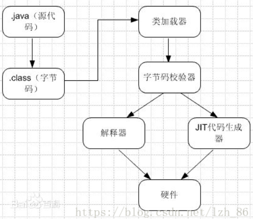
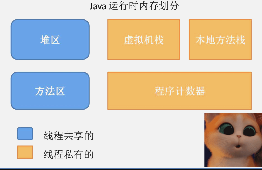
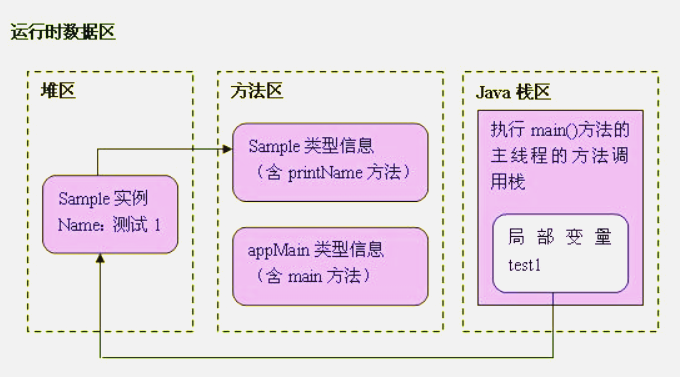
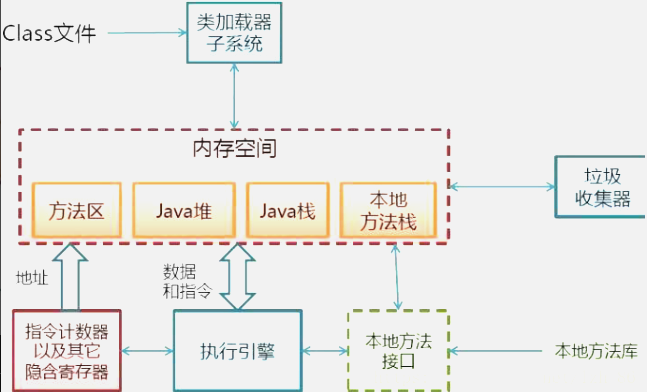

# 1. JVM原理
- JVM是java的核心和基础，在java编译器和os平台之间的虚拟处理器。它是一种利用软件方法实现的抽象的计算机基于下层的操作系统和硬件平台，可以在上面执行java的字节码程序

- 由于Java程序是交由JVM执行的，所以我们在谈Java内存区域划分的时候事实上是指JVM内存区域划分
- Java程序具体执行的过程

# 2. JVM运行时



```
Sample test1=new Sample("测试1");
```
- Java虚拟机一看，不就是建立一个Sample实例吗,于是就直奔方法区而去，先找到Sample类的类型信息再说。结果呢，嘿嘿，没找到@@，这会儿的方法区里还没有Sample类呢。可Java虚拟机也不是一根筋的笨蛋，于是，它发扬“自己动手，丰衣足食”的作风，立马加载了Sample类，把Sample类的类型信息存放在方法区里。

- Java虚拟机做的第一件事情就是在堆区中为一个新的Sample实例分配内存, 这个Sample实例持有着指向方法区的Sample类的类型信息的引用。这里所说的引用，实际上指的是Sample类的类型信息在方法区中的内存地址，其实，就是有点类似于C语言里的指针啦~~，而这个地址呢，就存放了在Sample实例的数据区里。

- 在JAVA虚拟机进程中，每个线程都会拥有一个方法调用栈，用来跟踪线程运行中一系列的方法调用过程，栈中的每一个元素就被称为栈帧，每当线程调用一个方法的时候就会向方法栈压入一个新帧。这里的帧用来存储方法的参数、局部变量和运算过程中的临时数据

- 位于“=”前的Test1是一个在main()方法中定义的变量，可见，它是一个局部变量，因此，它被会添加到了执行main()方法的主线程的JAVA方法调用栈中。而“=”将把这个test1变量指向堆区中的Sample实例，也就是说，它持有指向Sample实例的引用。


- JAVA虚拟机将继续执行后续指令，在堆区里继续创建另一个Sample实例，然后依次执行它们的printName()方法。当JAVA虚拟机执行test1.printName()方法时，JAVA虚拟机根据局部变量test1持有的引用，定位到堆区中的Sample实例，再根据Sample实例持有的引用，定位到方法去中Sample类的类型信息，从而获得printName()方法的字节码，接着执行printName()方法包含的指令
## 2.1. 扩展
### 2.1.1. 程序计数器
也有称作为PC寄存器
- 在汇编语言中，程序计数器是指CPU中的寄存器，它保存的是程序当前执行的指令的地址（也可以说保存下一条指令的所在存储单元的地址），当CPU需要执行指令时，需要从程序计数器中得到当前需要执行的指令所在存储单元的地址，然后根据得到的地址获取到指令，在得到指令之后，程序计数器便自动加1或者根据转移指针得到下一条指令的地址，如此循环，直至执行完所有的指令。

- 虽然JVM中的程序计数器并不像汇编语言中的程序计数器一样是物理概念上的CPU寄存器，
但是JVM中的程序计数器的功能跟汇编语言中的程序计数器的功能在逻辑上是等同的，也就是说是用来指示 执行哪条指令的。

- 由于在JVM中，多线程是通过线程轮流切换来获得CPU执行时间的，因此，在任一具体时刻，一个CPU的内核只会执行一条线程中的指令,因此，为了能够使得每个线程都在线程切换后能够恢复在切换之前的程序执行位置，每个线程都需要有自己独立的程序计数器，并且不能互相被干扰，否则就会影响到程序的正常执行次序
- 可以这么说，程序计数器是每个线程所私有的。

- 在JVM规范中规定，如果线程执行的是非native方法，则程序计数器中保存的是当前需要执行的指令的地址；如果线程执行的是native方法，则程序计数器中的值是undefined。

 - 由于程序计数器中存储的数据所占空间的大小不会随程序的执行而发生改变，因此，对于程序计数器是不会发生内存溢出现象(OutOfMemory)的。
### 2.1.2. Java栈
也称作虚拟机栈（Java Vitual Machine Stack）
事实上，Java栈是Java方法执行的内存模型。为什么这么说呢？下面就来解释一下其中的原因。

Java栈中存放的是一个个的栈帧，每个栈帧对应一个被调用的方法，在栈帧中包括

- 局部变量表(Local Variables)、
- 操作数栈(Operand Stack)、
- 指向当前方法所属的类的运行时常量池（运行时常量池的概念在方法区部分会谈到）的引用
- 方法返回地址(Return Address)和一些额外的附加信息

当线程执行一个方法时，就会随之创建一个对应的栈帧，并将建立的栈帧压栈。当方法执行完毕之后，便会将栈帧出栈,因此可知，线程当前执行的方法所对应的栈帧必定位于Java栈的顶部。

- 这部分空间的分配和释放都是由系统自动实施的。

- 下图表示了一个Java栈的模型：


- 局部变量表，顾名思义，想必不用解释大家应该明白它的作用了吧。就是用来存储方法中的局部变量（包括在方法中声明的非静态变量以及函数形参）。
对于基本数据类型的变量（java中定义的八种数据类型：boolean、int等），则直接存储它的值，对于引用类型的变量，则存的是指向对象的引用。局部变量表的大小在编译器就可以确定其大小了，因此在程序执行期间局部变量表的大小是不会改变的。

- 操作数栈，想必学过数据结构中的栈的朋友想必对表达式求值问题不会陌生，栈最典型的一个应用就是用来对表达式求值。想想一个线程执行方法的过程中，
实际上就是不断执行语句的过程，而归根到底就是进行计算的过程。因此可以这么说，程序中的所有计算过程都是在借助于操作数栈来完成的。

- 指向运行时常量池的引用，因为在方法执行的过程中有可能需要用到类中的常量，所以必须要有一个引用指向运行时常量。

- 方法返回地址，当一个方法执行完毕之后，要返回之前调用它的地方，因此在栈帧中必须保存一个方法返回地址。

- 由于每个线程正在执行的方法可能不同，因此每个线程都会有一个自己的Java栈，它的生命周期也与线程相同，互不干扰

### 2.1.3. 堆
- Java中的堆是用来存储对象本身的以及数组（当然，数组引用是存放在Java栈中的）

- 堆是被所有线程共享的，因此在其上进行对象内存分配均需要进行枷锁，这也导致了new对象的开销是比较大的，在JVM中只有一个堆。但是，Sun Hotspot JVM为了提升对象内存分配的效率，对于所创建的线程都会分配一块独立的空间TLAB（Thread Local Allocation Buffer），其大小由JVM根据运行的情况计算而得，在TLAB上分配对象时不需要加锁，因此JVM在给线程的对象分配内存时会尽量的在TLAB上分配，在这种情况下JVM中分配对象内存的性能和C基本是一样高效的

### 2.1.4. 方法区
- 方法区在JVM中也是一个非常重要的区域，它与堆一样，是被线程共享的区域

- 在方法区中，存储了每个类的信息（包括类的名称、方法信息、字段信息）、静态变量、定义为final类型的常量以及编译器编译后的代码等。在Class文件中除了类的字段、方法、接口等描述信息外，还有一项信息是常量池，用来存储编译期间生成的字面量和符号引用。

- 在方法区中有一个非常重要的部分就是运行时常量池，
它是每一个类或接口的常量池的运行时表示形式，在类和接口被加载到JVM后，对应的运行时常量池就被创建出来。当然并非Class文件常量池中的内容才能进入运行时常量池，在运行期间也可将新的常量放入运行时常量池中，比如String的intern方法。

- 在JVM规范中，没有强制要求方法区必须实现垃圾回收。很多人习惯将方法区称为“永久代”，是因为HotSpot虚拟机以永久代来实现方法区，从而JVM的垃圾收集器可以像管理堆区一样管理这部分区域
，从而不需要专门为这部分设计垃圾回收机制。不过自从JDK7之后，Hotspot虚拟机便将运行时常量池从永久代移除了。


# 3. JVM执行程序的过程
- 加载.class文件
-  管理并分配内存
-  执行垃圾收集
JRE（java运行时环境）由JVM构造的java程序的运行环，也是Java程序运行的环境，但是他同时一个操作系统的一个应用程序一个进程，因此他也有他自己的运行的生命周期，也有自己的代码和数据空间。JVM在整个jdk中处于最底层，负责于操作系统的交互，用来屏蔽操作系统环境，提供一个完整的Java运行环境，因此也就虚拟计算机。
操作系统装入JVM是通过jdk中Java.exe来完成，通过下面4步来完成JVM环境：
- 创建JVM装载环境和配置 
- 装载JVM.dll 
- 初始化JVM.dll并挂界到JNIENV(JNI调用接口)实例
- 调用JNIEnv实例装载并处理class类
# 4. JVM体系

- 类装载器（ClassLoader）（类加载器的作用就是加载类文件到内存中，编写了一个HelloWord.java程序，通过javadoc编译成class文件，然后加载到内存中）
- 执行引擎（负责解释命令，提交到操作系统执行）
- 本地接口（融合不同的编程语言为java所使用，初衷是融合C/C++程序，于是在内存中开辟了一块标记为native的代码。目前该方法使用的越来越少，除非是与硬件相关的操作，比如通过java程序驱动打印机，或者java系统管理生产设备） 
- 运行时数据区（方法区、堆、java栈、PC寄存器、本地方法栈）

# 5. JVM的生命周期
-  启动。启动一个Java程序时，一个JVM实例就产生了，任何一个拥有public static void
main(String[] args)函数的class都可以作为JVM实例运行的起点
- 运行。main()作为该程序初始线程的起点，任何其他线程均由该线程启动。JVM内部有两种线程：守护线程和非守护线程，main()属于非守护线程，守护线程通常由JVM自己使用，java程序也可以表明自己创建的线程是守护线程
-  消亡。当程序中的所有非守护线程都终止时，JVM才退出；若安全管理器允许，程序也可以使用Runtime类或者System.exit()来退出
- 备注： JVM实例对应了一个独立运行的java程序它是进程级别
 JVM执行引擎实例则对应了属于用户运行程序的线程它是线程级别的
 
