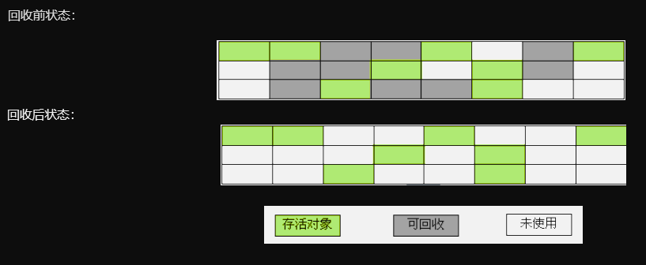
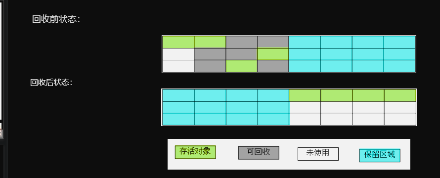
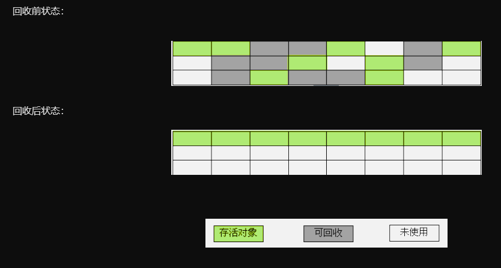

# 1. 对象引用
   Java中的垃圾回收一般是在Java堆中进行，因为堆中几乎存放了Java中所有的对象实例。谈到Java堆中的垃圾回收，自然要谈到引用。在JDK1.2之前，Java中的引用定义很很纯粹：如果reference类型的数据中存储的数值代表的是另外一块内存的起始地址，就称这块内存代表着一个引用。但在JDK1.2之后，Java对引用的概念进行了扩充，将其分为强引用（Strong Reference）、软引用（Soft Reference）、弱引用（Weak Reference）、虚引用（Phantom Reference）四种，引用强度依次减弱。

- 强引用：如“Object obj = new Object（）”，这类引用是Java程序中最普遍的。只要强引用还存在，垃圾收集器就永远不会回收掉被引用的对象。

- 软引用：它用来描述一些可能还有用，但并非必须的对象。在系统内存不够用时，这类引用关联的对象将被垃圾收集器回收。JDK1.2之后提供了SoftReference类来实现软引用。

-弱引用：它也是用来描述非需对象的，但它的强度比软引用更弱些，被弱引用关联的对象只能生存岛下一次垃圾收集发生之前。当垃圾收集器工作时，无论当前内存是否足够，都会回收掉只被弱引用关联的对象。在JDK1.2之后，提供了WeakReference类来实现弱引用。

- 虚引用：最弱的一种引用关系，完全不会对其生存时间构成影响，也无法通过虚引用来取得一个对象实例。为一个对象设置虚引用关联的唯一目的是希望能在这个对象被收集器回收时收到一个系统通知。JDK1.2之后提供了PhantomReference类来实现虚引用。


# 2. 垃圾对象的判定
   Java堆中存放着几乎所有的对象实例，垃圾收集器对堆中的对象进行回收前，要先确定这些对象是否还有用，判定对象是否为垃圾对象有如下算法：

## 2.1. 引用计数算法
   给对象添加一个引用计数器，每当有一个地方引用它时，计数器值就加1，当引用失效时，计数器值就减1，任何时刻计数器都为0的对象就是不可能再被使用的。

  引用计数算法的实现简单，判定效率也很高，在大部分情况下它都是一个不错的选择，当Java语言并没有选择这种算法来进行垃圾回收，主要原因是它很难解决对象之间的相互循环引用问题。

## 2.2. 根搜索算法
   Java和C#中都是采用根搜索算法来判定对象是否存活的。这种算法的基本思路是通过一系列名为“GC Roots”的对象作为起始点，从这些节点开始向下搜索，搜索所走过的路径称为引用链，当一个对象到GC Roots没有任何引用链相连时，就证明此对象是不可用的。在Java语言里，可作为GC Roots的兑现包括下面几种：

虚拟机栈（栈帧中的本地变量表）中引用的对象。
方法区中的类静态属性引用的对象。
方法区中的常量引用的对象。
本地方法栈中JNI（Native方法）的引用对象。


   实际上，在根搜索算法中，要真正宣告一个对象死亡，至少要经历两次标记过程：如果对象在进行根搜索后发现没有与GC Roots相连接的引用链，那它会被第一次标记并且进行一次筛选，筛选的条件是此对象是否有必要执行finalize（）方法。当对象没有覆盖finalize（）方法，或finalize（）方法已经被虚拟机调用过，虚拟机将这两种情况都视为没有必要执行。如果该对象被判定为有必要执行finalize（）方法，那么这个对象将会被放置在一个名为F-Queue队列中，并在稍后由一条由虚拟机自动建立的、低优先级的Finalizer线程去执行finalize（）方法。finalize（）方法是对象逃脱死亡命运的最后一次机会（因为一个对象的finalize（）方法最多只会被系统自动调用一次），稍后GC将对F-Queue中的对象进行第二次小规模的标记，如果要在finalize（）方法中成功拯救自己，只要在finalize（）方法中让该对象重引用链上的任何一个对象建立关联即可。而如果对象这时还没有关联到任何链上的引用，那它就会被回收掉。


# 3. 垃圾收集算法
 判定除了垃圾对象之后，便可以进行垃圾回收了。下面介绍一些垃圾收集算法，由于垃圾收集算法的实现涉及大量的程序细节，因此这里主要是阐明各算法的实现思想，而不去细论算法的具体实现。

## 3.1. 标记—清除算法
   标记—清除算法是最基础的收集算法，它分为“标记”和“清除”两个阶段：首先标记出所需回收的对象，在标记完成后统一回收掉所有被标记的对象，它的标记过程其实就是前面的根搜索算法中判定垃圾对象的标记过程。标记—清除算法的执行情况如下图所示：



 
   该算法有如下缺点：

标记和清除过程的效率都不高。
标记清除后会产生大量不连续的内存碎片，空间碎片太多可能会导致，当程序在以后的运行过程中需要分配较大对象时无法找到足够的连续内存而不得不触发另一次垃圾收集动作。
## 3.2. 复制算法
   复制算法是针对标记—清除算法的缺点，在其基础上进行改进而得到的，它讲课用内存按容量分为大小相等的两块，每次只使用其中的一块，当这一块的内存用完了，就将还存活着的对象复制到另外一块内存上面，然后再把已使用过的内存空间一次清理掉。复制算法有如下优点：

每次只对一块内存进行回收，运行高效。
只需移动栈顶指针，按顺序分配内存即可，实现简单。
内存回收时不用考虑内存碎片的出现。
    它的缺点是：可一次性分配的最大内存缩小了一半。
    复制算法的执行情况如下图所示：



## 3.3. 标记—整理算法(老年代)
   复制算法比较适合于新生代，在老年代中，对象存活率比较高，如果执行较多的复制操作，效率将会变低，所以老年代一般会选用其他算法，如标记—整理算法。该算法标记的过程与标记—清除算法中的标记过程一样，但对标记后出的垃圾对象的处理情况有所不同，它不是直接对可回收对象进行清理，而是让所有的对象都向一端移动，然后直接清理掉端边界以外的内存。标记—整理算法的回收情况如下所示：

   


## 3.4. 分代收集
   当前商业虚拟机的垃圾收集 都采用分代收集，它根据对象的存活周期的不同将内存划分为几块，一般是把Java堆分为新生代和老年代。在新生代中，每次垃圾收集时都会发现有大量对象死去，只有少量存活，因此可选用复制算法来完成收集，而老年代中因为对象存活率高、没有额外空间对它进行分配担保，就必须使用标记—清除算法或标记—整理算法来进行回收。


# 4. 垃圾收集器
   垃圾收集器是内存回收算法的具体实现，Java虚拟机规范中对垃圾收集器应该如何实现并没有任何规定，因此不同厂商、不同版本的虚拟机所提供的垃圾收集器都可能会有很大的差别。Sun  HotSpot虚拟机1.6版包含了如下收集器：Serial、ParNew、Parallel Scavenge、CMS、Serial Old、Parallel Old。这些收集器以不同的组合形式配合工作来完成不同分代区的垃圾收集工作。


# 5. 垃圾回收分析   
   在用代码分析之前，我们对内存的分配策略明确以下三点：
   
- 对象优先在Eden分配。
- 大对象直接进入老年代。
- 长期存活的对象将进入老年代。
    对垃圾回收策略说明以下两点：
新生代GC（Minor GC）：发生在新生代的垃圾收集动作，因为Java对象大多都具有朝生夕灭的特性，因此Minor GC非常频繁，一般回收速度也比较快。
老年代GC（Major GC/Full GC）：发生在老年代的GC，出现了Major GC，经常会伴随至少一次Minor GC。由于老年代中的对象生命周期比较长，因此Major GC并不频繁，一般都是等待老年代满了后才进行Full GC，而且其速度一般会比Minor GC慢10倍以上。另外，如果分配了Direct Memory，在老年代中进行Full GC时，会顺便清理掉Direct Memory中的废弃对象。
    下面我们来看如下代码:


```
public class SlotGc{
	public static void main(String[] args){
		byte[] holder = new byte[32*1024*1024];
		System.gc();
	}
}
```
    代码很简单，就是向内存中填充了32MB的数据，然后通过虚拟机进行垃圾收集。在Javac编译后，我们执行如下指令：java -verbose:gc SlotGc来查看垃圾收集的结果，得到如下输出信息：
```

    [GC 208K->134K(5056K), 0.0017306 secs]

    [Full GC 134K->134K(5056K), 0.0121194 secs]

    [Full GC 32902K->32902K(37828K), 0.0094149 sec
```

   注意第三行，“->”之前的数据表示垃圾回收前堆中存活对象所占用的内存大小，“->”之后的数据表示垃圾回收堆中存活对象所占用的内存大小，括号中的数据表示堆内存的总容量，0.0094149 sec 表示垃圾回收所用的时间。

   从结果中可以看出，System.gc(（）运行后并没有回收掉这32MB的内存，这应该是意料之中的结果，因为变量holder还处在作用域内，虚拟机自然不会回收掉holder引用的对象所占用的内存。

   我们把代码修改如下：

```
public class SlotGc{
	public static void main(String[] args){
		{
		byte[] holder = new byte[32*1024*1024];
		}
		System.gc();
	}
}
```
    加入花括号后，holder的作用域被限制在了花括号之内，因此，在执行System.gc（）时，holder引用已经不能再被访问，逻辑上来讲，这次应该会回收掉holder引用的对象所占的内存。但查看垃圾回收情况时，输出信息如下：
```

    [GC 208K->134K(5056K), 0.0017100 secs]

    [Full GC 134K->134K(5056K), 0.0125887 secs]

    [Full GC 32902K->32902K(37828K), 0.0089226 secs]
```
    很明显，这32MB的数据并没有被回收。下面我们再做如下修改：

```
public class SlotGc{
	public static void main(String[] args){
		{
		byte[] holder = new byte[32*1024*1024];
		holder = null;
		}
		System.gc();
	}
}
```
    这次得到的垃圾回收信息如下：

```
    [GC 208K->134K(5056K), 0.0017194 secs]

    [Full GC 134K->134K(5056K), 0.0124656 secs]

    [Full GC 32902K->134K(37828K), 0.0091637 secs]

```
    说明这次holder引用的对象所占的内存被回收了。我们慢慢来分析。

    首先明确一点：holder能否被回收的根本原因是局部变量表中的Slot是否还存有关于holder数组对象的引用。

在第一次修改中，虽然在holder作用域之外进行回收，但是在此之后，没有对局部变量表的读写操作，holder所占用的Slot还没有被其他变量所复用（回忆Java内存区域与内存溢出一文中关于Slot的讲解），所以作为GC Roots一部分的局部变量表仍保持者对它的关联。这种关联没有被及时打断，因此GC收集器不会将holder引用的对象内存回收掉。 在第二次修改中，在GC收集器工作前，手动将holder设置为null值，就把holder所占用的局部变量表中的Slot清空了，因此，这次GC收集器工作时将holder之前引用的对象内存回收掉了。

   当然，我们也可以用其他方法来将holder引用的对象内存回收掉，只要复用holder所占用的slot即可，比如在holder作用域之外执行一次读写操作。

   为对象赋null值并不是控制变量回收的最好方法，以恰当的变量作用域来控制变量回收时间才是最优雅的解决办法。另外，赋null值的操作在经过虚拟机JIT编译器优化后会被消除掉，经过JIT编译后，System.gc（）执行时就可以正确地回收掉内存，而无需赋null值。


# 6. 性能调优 
   Java虚拟机的内存管理与垃圾收集是虚拟机结构体系中最重要的组成部分，对程序（尤其服务器端）的性能和稳定性有着非常重要的影响。性能调优需要具体情况具体分析，而且实际分析时可能需要考虑的方面很多，这里仅就一些简单常用的情况作简要介绍。   

我们可以通过给Java虚拟机分配超大堆（前提是物理机的内存足够大）来提升服务器的响应速度，但分配超大堆的前提是有把握把应用程序的Full GC频率控制得足够低，因为一次Full GC的时间造成比较长时间的停顿。控制Full GC频率的关键是保证应用中绝大多数对象的生存周期不应太长，尤其不能产生批量的、生命周期长的大对象，这样才能保证老年代的稳定。
Direct Memory在堆内存外分配，而且二者均受限于物理机内存，且成负相关关系，因此分配超大堆时，如果用到了NIO机制分配使用了很多的Direct Memory，则有可能导致Direct Memory的OutOfMemoryError异常，这时可以通过-XX:MaxDirectMemorySize参数调整Direct Memory的大小。
除了Java堆和永久代以及直接内存外，还要注意下面这些区域也会占用较多的内存，这些内存的总和会受到操作系统进程最大内存的限制：

1、线程堆栈：可通过-Xss调整大小，内存不足时抛出StackOverflowError（纵向无法分配，即无法分配新的栈帧）或OutOfMemoryError（横向无法分配，即无法建立新的线程）。

2、Socket缓冲区：每个Socket连接都有Receive和Send两个缓冲区，分别占用大约37KB和25KB的内存。如果无法分配，可能会抛出IOException：Too many open files异常。关于Socket缓冲区的详细介绍参见我的Java网络编程系列中深入剖析Socket的几篇文章。

3、JNI代码：如果代码中使用了JNI调用本地库，那本地库使用的内存也不在堆中。

4、虚拟机和GC：虚拟机和GC的代码执行也要消耗一定的内存。
