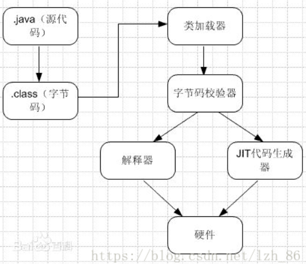
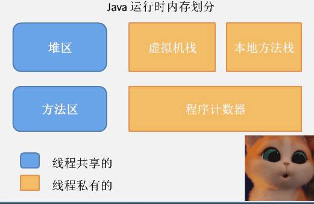
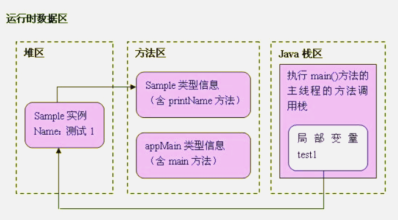
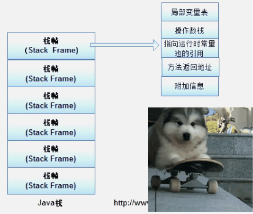
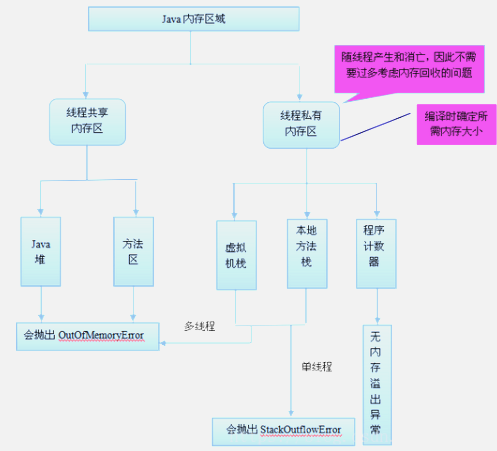

# 1. JVM原理
JVM是java的核心和基础，在java编译器和os平台之间的虚拟处理器。它是一种利用软件方法实现的抽象的计算机基于下层的操作系统和硬件平台，可以在上面执行java的字节码程序

由于Java程序是交由JVM执行的，所以我们在谈Java内存区域划分的时候事实上是指JVM内存区域划分。在讨论JVM内存区域划分之前，先来看一下Java程序具体执行的过程

# 2. JVM运行时


例如：
如下图：

```
Sample test1=new Sample("测试1");
```

语句很简单啦，就是让java虚拟机创建一个Sample实例，并且呢，使引用变量test1引用这个实例。貌似小case一桩哦，就让我们来跟踪一下Java虚拟机，看看它究竟是怎么来执行这个任务的：

- Java虚拟机一看，不就是建立一个Sample实例吗，简单，于是就直奔方法区而去，先找到Sample类的类型信息再说。结果呢，嘿嘿，没找到@@，这会儿的方法区里还没有Sample类呢。可Java虚拟机也不是一根筋的笨蛋，于是，它发扬“自己动手，丰衣足食”的作风，立马加载了Sample类，把Sample类的类型信息存放在方法区里。

- 好啦，资料找到了，下面就开始干活啦。Java虚拟机做的第一件事情就是在堆区中为一个新的Sample实例分配内存, 这个Sample实例持有着指向方法区的Sample类的类型信息的引用。这里所说的引用，实际上指的是Sample类的类型信息在方法区中的内存地址，其实，就是有点类似于C语言里的指针啦~~，而这个地址呢，就存放了在Sample实例的数据区里。

- 在JAVA虚拟机进程中，每个线程都会拥有一个方法调用栈，用来跟踪线程运行中一系列的方法调用过程，栈中的每一个元素就被称为栈帧，每当线程调用一个方法的时候就会向方法栈压入一个新帧。这里的帧用来存储方法的参数、局部变量和运算过程中的临时数据。OK，原理讲完了，就让我们来继续我们的跟踪行动！位于“=”前的Test1是一个在main()方法中定义的变量，可见，它是一个局部变量，因此，它被会添加到了执行main()方法的主线程的JAVA方法调用栈中。而“=”将把这个test1变量指向堆区中的Sample实例，也就是说，它持有指向Sample实例的引用。

OK，到这里为止呢，JAVA虚拟机就完成了这个简单语句的执行任务。参考我们的行动向导图，我们终于初步摸清了JAVA虚拟机的一点点底细了，COOL！
接下来，JAVA虚拟机将继续执行后续指令，在堆区里继续创建另一个Sample实例，然后依次执行它们的printName()方法。当JAVA虚拟机执行test1.printName()方法时，JAVA虚拟机根据局部变量test1持有的引用，定位到堆区中的Sample实例，再根据Sample实例持有的引用，定位到方法去中Sample类的类型信息，从而获得printName()方法的字节码，接着执行printName()方法包含的指令
## 2.1. 扩展
```
**程序计数器（Program Counter Register），**也有称作为PC寄存器。
在汇编语言中，程序计数器是指CPU中的寄存器，它保存的是程序当前执行的指令的地址（也可以说保存下一条指令的所在存储单元的地址），
当CPU需要执行指令时，需要从程序计数器中得到当前需要执行的指令所在存储单元的地址，然后根据得到的地址获取到指令，
在得到指令之后，程序计数器便自动加1或者根据转移指针得到下一条指令的地址，如此循环，直至执行完所有的指令。

虽然JVM中的程序计数器并不像汇编语言中的程序计数器一样是物理概念上的CPU寄存器，
但是JVM中的程序计数器的功能跟汇编语言中的程序计数器的功能在逻辑上是等同的，也就是说是用来指示 执行哪条指令的。

由于在JVM中，多线程是通过线程轮流切换来获得CPU执行时间的，因此，在任一具体时刻，一个CPU的内核只会执行一条线程中的指令
因此，为了能够使得每个线程都在线程切换后能够恢复在切换之前的程序执行位置，每个线程都需要有自己独立的程序计数器，并且不能互相被干扰，否则就会影响到程序的正常执行次序。
因此，可以这么说，程序计数器是每个线程所私有的。

在JVM规范中规定，如果线程执行的是非native方法，则程序计数器中保存的是当前需要执行的指令的地址；如果线程执行的是native方法，则程序计数器中的值是undefined。

由于程序计数器中存储的数据所占空间的大小不会随程序的执行而发生改变，
因此，对于程序计数器是不会发生内存溢出现象(OutOfMemory)的。
```

```
Java栈也称作虚拟机栈（Java Vitual Machine Stack）
事实上，Java栈是Java方法执行的内存模型。为什么这么说呢？下面就来解释一下其中的原因。

Java栈中存放的是一个个的栈帧，每个栈帧对应一个被调用的方法，在栈帧中包括
局部变量表(Local Variables)、
操作数栈(Operand Stack)、
指向当前方法所属的类的运行时常量池（运行时常量池的概念在方法区部分会谈到）的引用(Reference to runtime constant pool)、
方法返回地址(Return Address)和一些额外的附加信息。
当线程执行一个方法时，就会随之创建一个对应的栈帧，并将建立的栈帧压栈。当方法执行完毕之后，便会将栈帧出栈。
因此可知，线程当前执行的方法所对应的栈帧必定位于Java栈的顶部。
讲到这里，大家就应该会明白为什么 在 使用 递归方法的时候容易导致栈内存溢出的现象了以及为什么栈区的空间不用程序员去管理了
这部分空间的分配和释放都是由系统自动实施的。
对于所有的程序设计语言来说，栈这部分空间对程序员来说是不透明的。
下图表示了一个Java栈的模型：
```


```
- 局部变量表，顾名思义，想必不用解释大家应该明白它的作用了吧。就是用来存储方法中的局部变量（包括在方法中声明的非静态变量以及函数形参）。
对于基本数据类型的变量（java中定义的八种数据类型：boolean、int等），则直接存储它的值，对于引用类型的变量，则存的是指向对象的引用。局部变量表的大小在编译器就可以确定其大小了，因此在程序执行期间局部变量表的大小是不会改变的。

- 操作数栈，想必学过数据结构中的栈的朋友想必对表达式求值问题不会陌生，栈最典型的一个应用就是用来对表达式求值。想想一个线程执行方法的过程中，
实际上就是不断执行语句的过程，而归根到底就是进行计算的过程。因此可以这么说，程序中的所有计算过程都是在借助于操作数栈来完成的。

指向运行时常量池的引用，因为在方法执行的过程中有可能需要用到类中的常量，所以必须要有一个引用指向运行时常量。

方法返回地址，当一个方法执行完毕之后，要返回之前调用它的地方，因此在栈帧中必须保存一个方法返回地址。

由于每个线程正在执行的方法可能不同，因此每个线程都会有一个自己的Java栈，它的生命周期也与线程相同，互不干扰
```

```
堆

在C语言中，堆这部分空间是唯一一个程序员可以管理的内存区域。程序员可以通过malloc函数和free函数在堆上申请和释放空间。那么在Java中是怎么样的呢？

Java中的堆是用来存储对象本身的以及数组（当然，数组引用是存放在Java栈中的）。
只不过和C语言中的不同，在Java中，程序员基本不用去关心空间释放的问题，Java的垃圾回收机制会自动进行处理。
因此这部分空间也是Java垃圾收集器管理的主要区域。
另外，堆是被所有线程共享的，因此在其上进行对象内存分配均需要进行枷锁，这也导致了new对象的开销是比较大的，在JVM中只有一个堆。
但是，Sun Hotspot JVM为了提升对象内存分配的效率，对于所创建的线程都会分配一块独立的空间TLAB（Thread Local Allocation Buffer），
其大小由JVM根据运行的情况计算而得，在TLAB上分配对象时不需要加锁，
因此JVM在给线程的对象分配内存时会尽量的在TLAB上分配，在这种情况下JVM中分配对象内存的性能和C基本是一样高效的，
但如果对象过大的话则仍然是直接使用堆空间分配。
```
```
方法区

方法区在JVM中也是一个非常重要的区域，它与堆一样，是被线程共享的区域。
在方法区中，存储了每个类的信息（包括类的名称、方法信息、字段信息）、静态变量、定义为final类型的常量以及编译器编译后的代码等。

在Class文件中除了类的字段、方法、接口等描述信息外，还有一项信息是常量池，用来存储编译期间生成的字面量和符号引用。

在方法区中有一个非常重要的部分就是运行时常量池，
它是每一个类或接口的常量池的运行时表示形式，在类和接口被加载到JVM后，对应的运行时常量池就被创建出来。
当然并非Class文件常量池中的内容才能进入运行时常量池，在运行期间也可将新的常量放入运行时常量池中，比如String的intern方法。

在JVM规范中，没有强制要求方法区必须实现垃圾回收。
很多人习惯将方法区称为“永久代”，是因为HotSpot虚拟机以永久代来实现方法区，从而JVM的垃圾收集器可以像管理堆区一样管理这部分区域
，从而不需要专门为这部分设计垃圾回收机制。
不过自从JDK7之后，Hotspot虚拟机便将运行时常量池从永久代移除了。
```

# 3. JVM执行程序的过程
- 加载.class文件
-  管理并分配内存
-  执行垃圾收集
JRE（java运行时环境）由JVM构造的java程序的运行环，也是Java程序运行的环境，但是他同时一个操作系统的一个应用程序一个进程，因此他也有他自己的运行的生命周期，也有自己的代码和数据空间。JVM在整个jdk中处于最底层，负责于操作系统的交互，用来屏蔽操作系统环境，提供一个完整的Java运行环境，因此也就虚拟计算机。
操作系统装入JVM是通过jdk中Java.exe来完成，通过下面4步来完成JVM环境：
- 创建JVM装载环境和配置 
- 装载JVM.dll 
- 初始化JVM.dll并挂界到JNIENV(JNI调用接口)实例
- 调用JNIEnv实例装载并处理class类
# 4. JVM体系

- 类装载器（ClassLoader）（类加载器的作用就是加载类文件到内存中，编写了一个HelloWord.java程序，通过javadoc编译成class文件，然后加载到内存中）
- 执行引擎（负责解释命令，提交到操作系统执行）
- 本地接口（融合不同的编程语言为java所使用，初衷是融合C/C++程序，于是在内存中开辟了一块标记为native的代码。目前该方法使用的越来越少，除非是与硬件相关的操作，比如通过java程序驱动打印机，或者java系统管理生产设备） 
- 运行时数据区（方法区、堆、java栈、PC寄存器、本地方法栈）

# 5. JVM的生命周期
|-- JVM实例对应了一个独立运行的java程序它是进程级别
-  启动。启动一个Java程序时，一个JVM实例就产生了，任何一个拥有public static void
main(String[] args)函数的class都可以作为JVM实例运行的起点
- 运行。main()作为该程序初始线程的起点，任何其他线程均由该线程启动。JVM内部有两种线程：守护线程和非守护线程，main()属于非守护线程，守护线程通常由JVM自己使用，java程序也可以表明自己创建的线程是守护线程
-  消亡。当程序中的所有非守护线程都终止时，JVM才退出；若安全管理器允许，程序也可以使用Runtime类或者System.exit()来退出
 
|--  JVM执行引擎实例则对应了属于用户运行程序的线程它是线程级别的
 
# 6. JAVA内存区域与内存溢出
cc
JAVA虚拟机栈：

 - 如果线程请求的栈深度大于虚拟机所允许的深度，将抛出StackOverflowError异常。

 - 如果虚拟机在动态扩展栈时无法申请到足够的内存空间，则抛出OutOfMemoryError异常。

 -  这两种情况存在着一些互相重叠的地方：
  当栈空间无法继续分配时，到底是内存太小，还是已使用的栈空间太大，其本质上只是对同一件事情的两种描述而已。
 在单线程的操作中，无论是由于栈帧太大，还是虚拟机栈空间太小，当栈空间无法分配时，虚拟机抛出的都是StackOverflowError异常，而不会得到OutOfMemoryError异常。
 而在多线程环境下，则会抛出OutOfMemoryError异常。


 另外，由于Java堆内也可能发生内存泄露（Memory Leak），这里简要说明一下内存泄露和内存溢出的区别：
 
内存泄露
- 是指分配出去的内存没有被回收回来，由于失去了对该内存区域的控制，因而造成了资源的浪费。 Java中一般不会产生内存泄露，因为有垃圾回收器自动回收垃圾，但这也不绝对，当我们new了对象，并保存了其引用，但是后面一直没用它，而垃圾回收器又不会去回收它，这边会造成内存泄露，

内存溢出
-  是指程序所需要的内存超出了系统所能分配的内存（包括动态扩展）的上限
