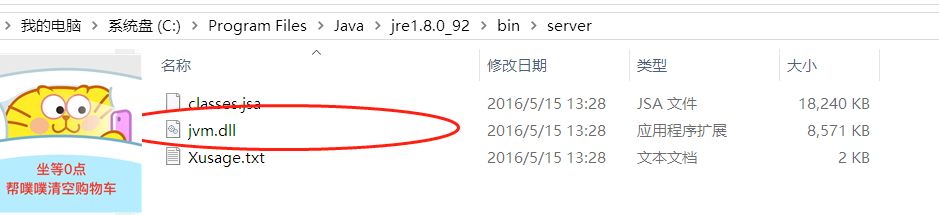

# 1. JRE
　JRE是Java Runtime Environment的缩写
　顾名思义是java运行时环境，包含了java虚拟机，java基础类库
　是使用java语言编写的程序运行所需要的软件环境，是提供给想运行java程序的用户使用的，还有所有的Java类库的class文件，都在lib目录下，并且都打包成了jar
　
　至于在Windows上的虚拟机是哪个文件呢？就是<JRE安装目录>/bin/client中的jvm.dll。
　
　