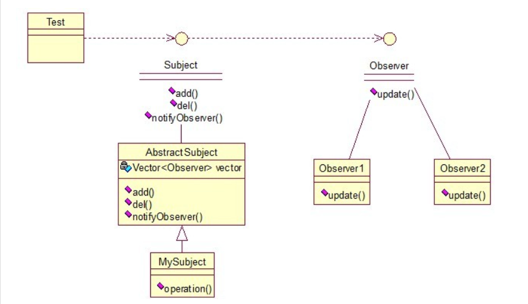

观察者模式（Observer）
包括这个模式在内的接下来的四个模式，都是类和类之间的关系，不涉及到继承，学的时候应该 记得归纳，记得本文最开始的那个图。观察者模式很好理解，类似于邮件订阅和RSS订阅，当我们浏览一些博客或wiki时，经常会看到RSS图标，就这的意思是，当你订阅了该文章，如果后续有更新，会及时通知你。其实，简单来讲就一句话：当一个对象变化时，其它依赖该对象的对象都会收到通知，并且随着变化！对象之间是一种一对多的关系。先来看看关系图

我解释下这些类的作用：MySubject类就是我们的主对象，Observer1和Observer2是依赖于MySubject的对象，当MySubject变化时，Observer1和Observer2必然变化。AbstractSubject类中定义着需要监控的对象列表，可以对其进行修改：增加或删除被监控对象，且当MySubject变化时，负责通知在列表内存在的对象。我们看实现代码：


```

一个Observer接口：

[java] view plaincopy
public interface Observer {  
    public void update();  
}  
两个实现类：

[java] view plaincopy
public class Observer1 implements Observer {  
  
    @Override  
    public void update() {  
        System.out.println("observer1 has received!");  
    }  
}  
[java] view plaincopy
public class Observer2 implements Observer {  
  
    @Override  
    public void update() {  
        System.out.println("observer2 has received!");  
    }  
  
}  
Subject接口及实现类：

[java] view plaincopy
public interface Subject {  
      
    /*增加观察者*/  
    public void add(Observer observer);  
      
    /*删除观察者*/  
    public void del(Observer observer);  
      
    /*通知所有的观察者*/  
    public void notifyObservers();  
      
    /*自身的操作*/  
    public void operation();  
}  
[java] view plaincopy
public abstract class AbstractSubject implements Subject {  
  
    private Vector<Observer> vector = new Vector<Observer>();  
    @Override  
    public void add(Observer observer) {  
        vector.add(observer);  
    }  
  
    @Override  
    public void del(Observer observer) {  
        vector.remove(observer);  
    }  
  
    @Override  
    public void notifyObservers() {  
        Enumeration<Observer> enumo = vector.elements();  
        while(enumo.hasMoreElements()){  
            enumo.nextElement().update();  
        }  
    }  
}  
[java] view plaincopy
public class MySubject extends AbstractSubject {  
  
    @Override  
    public void operation() {  
        System.out.println("update self!");  
        notifyObservers();  
    }  
  
}  

测试类：

[java] view plaincopy
public class ObserverTest {  
  
    public static void main(String[] args) {  
        Subject sub = new MySubject();  
        sub.add(new Observer1());  
        sub.add(new Observer2());  
          
        sub.operation();  
    }  
  
}  
输出：

update self!
observer1 has received!
observer2 has received!

```
 这些东西，其实不难，只是有些抽象，不太容易整体理解，建议读者：根据关系图，新建项目，自己写代码（或者参考我的代码）,按照总体思路走一遍，这样才能体会它的思想，理解起来容易！