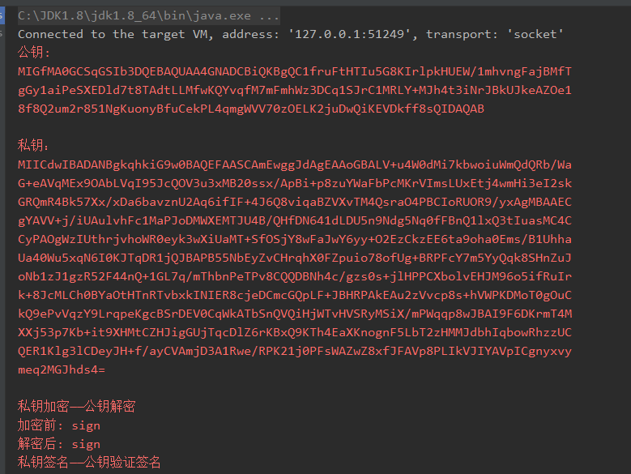
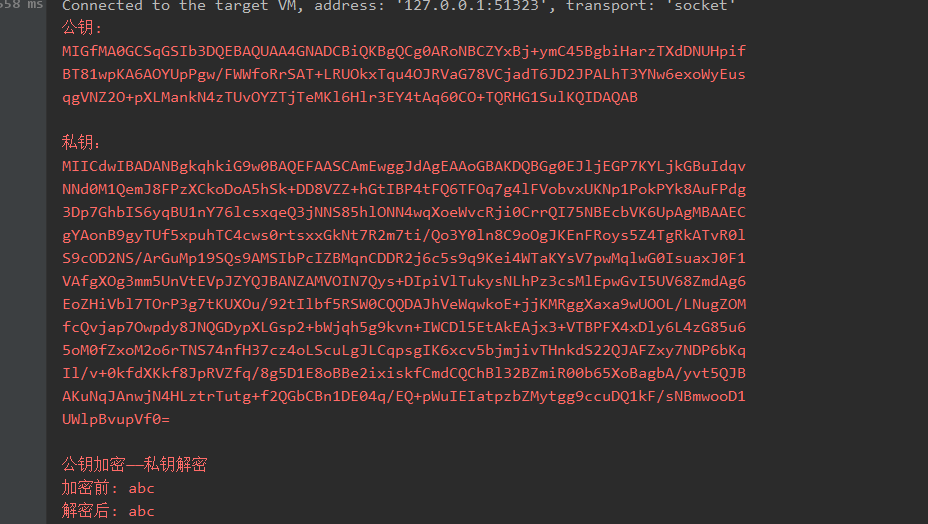

# 1. 非对称加密算法RSA
   这种算法1978年就出现了，它是第一个既能用于数据加密也能用于数字签名的算法。它易于理解和操作，也很流行。算法的名字以发明者的名字命名：Ron Rivest, AdiShamir 和Leonard Adleman。
    这种加密算法的特点主要是密钥的变化，DES只有一个密钥。相当于只有一把钥匙，如果这把钥匙丢了，数据也就不安全了。RSA同时有两把钥匙，公钥与私钥。同时支持数字签名。数字签名的意义在于，对传输过来的数据进行校验。确保数据在传输工程中不被修改。

# 2. 流程分析：
- 甲方构建密钥对儿，将公钥公布给乙方，将私钥保留。
- 甲方使用私钥加密数据，然后用私钥对加密后的数据签名，发送给乙方签名以及加密后的数据；乙方使用公钥、签名来验证待
解密数据是否有效，如果有效使用公钥对数据解密。
- 乙方使用公钥加密数据，向甲方发送经过加密后的数据；甲方获得加密数据，通过私钥解密
# 3. 测试代码

```
package com.example.demo.security;

import org.junit.Before;
import org.junit.Test;

import java.util.Map;

import static junit.framework.TestCase.assertTrue;
import static org.junit.Assert.assertEquals;

/**
 * @ClassName:TestRSACoder
 * @author: Ada
 * @date 2019/10/18 15:11
 * @Description:
 */
public class TestRSACoder {
    private String publicKey;
    private String privateKey;

    @Before
    public void setUp() throws Exception {
        Map<String, Object> keyMap = RSACoder.initKey();

        publicKey = RSACoder.getPublicKey(keyMap);
        privateKey = RSACoder.getPrivateKey(keyMap);
        System.err.println("公钥: \n\r" + publicKey);
        System.err.println("私钥： \n\r" + privateKey);
    }
    @Test
    public void test() throws  Exception{
        System.err.println("公钥加密——私钥解密");
        String inputStr = "abc";
        byte[] data = inputStr.getBytes();

        byte[] encodedData = RSACoder.encryptByPublicKey(data, publicKey);

        byte[] decodedData = RSACoder.decryptByPrivateKey(encodedData,
                privateKey);

        String outputStr = new String(decodedData);
        System.err.println("加密前: " + inputStr + "\n\r" + "解密后: " + outputStr);
        assertEquals(inputStr, outputStr);
    }

    @Test
    public void testSign() throws Exception {
        System.err.println("私钥加密——公钥解密");
        String inputStr = "sign";
        byte[] data = inputStr.getBytes();

        byte[] encodedData = RSACoder.encryptByPrivateKey(data, privateKey);

        byte[] decodedData = RSACoder
                .decryptByPublicKey(encodedData, publicKey);

        String outputStr = new String(decodedData);
        System.err.println("加密前: " + inputStr + "\n\r" + "解密后: " + outputStr);
        assertEquals(inputStr, outputStr);

        System.err.println("私钥签名——公钥验证签名");
        // 产生签名
        String sign = RSACoder.sign(encodedData, privateKey);
        System.err.println("签名:\r" + sign);

        // 验证签名
        boolean status = RSACoder.verify(encodedData, publicKey, sign);
        System.err.println("状态:\r" + status);
        assertTrue(status);

    }

}

```
## 3.1. 结果


# 4. 附件
```
package com.example.demo.security;

import javax.crypto.Cipher;
import java.security.*;
import java.security.interfaces.RSAPrivateKey;
import java.security.interfaces.RSAPublicKey;
import java.security.spec.PKCS8EncodedKeySpec;
import java.security.spec.X509EncodedKeySpec;
import java.util.HashMap;
import java.util.Map;

/**
 * @ClassName:RSACoder
 * @author: Ada
 * @date 2019/10/18 15:09
 * @Description:
 */
public class RSACoder extends Coder {
    public static final String KEY_ALGORITHM = "RSA";
    public static final String SIGNATURE_ALGORITHM = "MD5withRSA";

    private static final String PUBLIC_KEY = "RSAPublicKey";
    private static final String PRIVATE_KEY = "RSAPrivateKey";

    /**
     * 用私钥生成数字签名
     */
    public static String sign(byte[] data, String privateKey) throws Exception {
        //解密由base64编码的私钥
        byte[] keyBytes = decryptBASE64(privateKey);
        // 构造PKCS8EncodedKeySpec对象
        PKCS8EncodedKeySpec pkcs8KeySpec = new PKCS8EncodedKeySpec(keyBytes);
        // KEY_ALGORITHM 指定的加密算法
        KeyFactory keyFactory = KeyFactory.getInstance(KEY_ALGORITHM);
        // 取私钥匙对象
        PrivateKey priKey = keyFactory.generatePrivate(pkcs8KeySpec);

        // 用私钥对信息生成数字签名
        Signature signature = Signature.getInstance(SIGNATURE_ALGORITHM);
        signature.initSign(priKey);
        signature.update(data);
        return encryptBASE64(signature.sign());
    }

    /**
     * 校验数字签名
     */
    public static boolean verify(byte[] data, String publicKey, String sign) throws Exception {
        // 解密由base64编码的公钥
        byte[] keyBytes = decryptBASE64(publicKey);
        // 构造X509EncodedKeySpec对象
        X509EncodedKeySpec keySpec = new X509EncodedKeySpec(keyBytes);
        // KEY_ALGORITHM 指定的加密算法
        KeyFactory keyFactory = KeyFactory.getInstance(KEY_ALGORITHM);
        // 取公钥匙对象
        PublicKey pubKey = keyFactory.generatePublic(keySpec);

        Signature signature = Signature.getInstance(SIGNATURE_ALGORITHM);
        signature.initVerify(pubKey);
        signature.update(data);
        return signature.verify(decryptBASE64(sign));
    }

    /**
     * 用私钥解密
     */
    public static byte[] decryptByPrivateKey(byte[] data, String key) throws Exception {
        //对密钥解密
        byte[] keyBytes = decryptBASE64(key);
        //获取私钥
        PKCS8EncodedKeySpec pkcs8KeySpec = new PKCS8EncodedKeySpec(keyBytes);
        KeyFactory keyFactory = KeyFactory.getInstance(KEY_ALGORITHM);
        Key privateKey = keyFactory.generatePrivate(pkcs8KeySpec);
        //对数据解密
        Cipher cipher = Cipher.getInstance(keyFactory.getAlgorithm());
        cipher.init(Cipher.DECRYPT_MODE, privateKey);
        return cipher.doFinal(data);
    }

    /**
     * 用公钥解密
     */
    public static byte[] decryptByPublicKey(byte[] data, String key)
            throws Exception {
        // 对密钥解密
        byte[] keyBytes = decryptBASE64(key);

        // 取得公钥
        X509EncodedKeySpec x509KeySpec = new X509EncodedKeySpec(keyBytes);
        KeyFactory keyFactory = KeyFactory.getInstance(KEY_ALGORITHM);
        Key publicKey = keyFactory.generatePublic(x509KeySpec);

        // 对数据解密
        Cipher cipher = Cipher.getInstance(keyFactory.getAlgorithm());
        cipher.init(Cipher.DECRYPT_MODE, publicKey);

        return cipher.doFinal(data);
    }

    /**
     * 用私钥加密
     */
    public static byte[] encryptByPublicKey(byte[] data, String key)
            throws Exception {
        // 对公钥解密
        byte[] keyBytes = decryptBASE64(key);

        // 取得公钥
        X509EncodedKeySpec x509KeySpec = new X509EncodedKeySpec(keyBytes);
        KeyFactory keyFactory = KeyFactory.getInstance(KEY_ALGORITHM);
        Key publicKey = keyFactory.generatePublic(x509KeySpec);

        // 对数据加密
        Cipher cipher = Cipher.getInstance(keyFactory.getAlgorithm());
        cipher.init(Cipher.ENCRYPT_MODE, publicKey);

        return cipher.doFinal(data);
    }

    /**
     * 用公钥加密
     */
    public static byte[] encryptByPrivateKey(byte[] data, String key)
            throws Exception {
        // 对密钥解密
        byte[] keyBytes = decryptBASE64(key);

        // 取得私钥
        PKCS8EncodedKeySpec pkcs8KeySpec = new PKCS8EncodedKeySpec(keyBytes);
        KeyFactory keyFactory = KeyFactory.getInstance(KEY_ALGORITHM);
        Key privateKey = keyFactory.generatePrivate(pkcs8KeySpec);

        // 对数据加密
        Cipher cipher = Cipher.getInstance(keyFactory.getAlgorithm());
        cipher.init(Cipher.ENCRYPT_MODE, privateKey);

        return cipher.doFinal(data);
    }

    /**
     * 取得私钥
     */
    public static String getPrivateKey(Map<String, Object> keyMap)
            throws Exception {
        Key key = (Key) keyMap.get(PRIVATE_KEY);

        return encryptBASE64(key.getEncoded());
    }

    /**
     * 取得公钥
     */
    public static String getPublicKey(Map<String, Object> keyMap)
            throws Exception {
        Key key = (Key) keyMap.get(PUBLIC_KEY);

        return encryptBASE64(key.getEncoded());
    }

    /**
     * 初始化
     */
    public static Map<String, Object> initKey() throws Exception {
        KeyPairGenerator keyPairGen = KeyPairGenerator
                .getInstance(KEY_ALGORITHM);
        keyPairGen.initialize(1024);

        KeyPair keyPair = keyPairGen.generateKeyPair();
        // 公钥
        RSAPublicKey publicKey = (RSAPublicKey) keyPair.getPublic();

        // 私钥
        RSAPrivateKey privateKey = (RSAPrivateKey) keyPair.getPrivate();
        Map<String, Object> keyMap = new HashMap<String, Object>(2);

        keyMap.put(PUBLIC_KEY, publicKey);
        keyMap.put(PRIVATE_KEY, privateKey);
        return keyMap;
    }

}

```