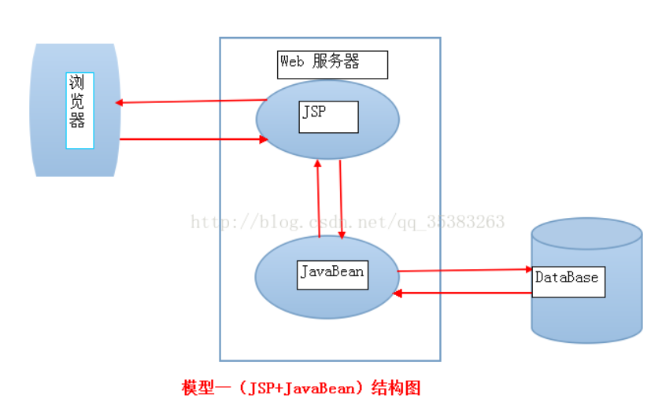

# 1. mvc思想
MVC架构模式（Model、View、Controller）：将一个应用分成模型、视图、控制器三部分来构建的思想被称为MVC架构模式。

三部分：

- 模型（Model）：应用程序中处理数据逻辑的部分。模型对象负责在数据库中存取数据。

- 视图（页面View）：应用程序中处理数据显示的部分。视图是依据模型数据创建的。

- 控制器（Controller）：应用程序中处理用户交互的部分。控制器负责从视图读取数据，控制用户输入，并向模型发送数据。

对于JavaEE的Web应用，Model可以使用JavaSE、EJB、WebService等实现，View可以使用JSP、FreeMarker、Velocity等实现，Controller可以使用Servlet、Filter等实现。

# 2. JavaWeb的开发模式
## 2.1. 模型一

## 2.2. 模型二
模型1使用JSP+JavaBean技术将页面显示和业务逻辑分开，由JSP实现页面显示，JavaBean对象保存数据和实现业务逻辑。

客户端（浏览器）直接向JSP发出请求，JSP做出响应，并调用JavaBean对象来处理数据，然后在返回JSP并由JSP生成最后的结果。

（其中JavaBean就是通过JDBC访问企业数据库）

模型2就是MVC设计思想下的架构，Servlet是控制器，JSP是视图，JavaBean是模型。

浏览器的请求都提交给Servlet，Servlet实例化JavaBean的处理请求，并根据处理结果返回不同的JSP到客户端浏览器。

（其中JavaBean使用JDBC访问企业数据库）

## 2.3. MVC模式的优点：

- MVC模式中模型、视图、控制器在一定程度上是相互独立的，所以降低了他们之间的耦合度。

- 模型和视图不是严格对应的，可以对一个模型创建多个不同的视图，从而一个模型就可以有不同的表现形式。

- 模型是独立于视图的，所以可以对模型进行移植。即可复用。

## 2.4. 缺点：

有时会使简单的事情复杂化，如果一个简单的系统非要遵守MVC模式的话，会使结构变得很复杂。

